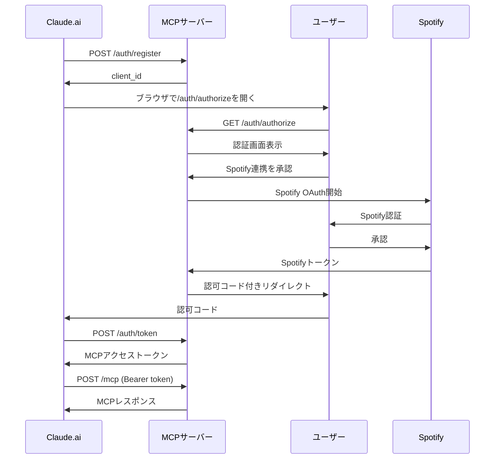

# ADR-0002: OAuth 2.0準拠のMCP認証実装

## ステータス
承認済み

## コンテキスト
Claude.aiなどのMCPクライアントからSpotify MCPサーバーに接続する際、以下の問題が発生した：
- `Incompatible auth server: does not support dynamic client registration`エラー
- MCPクライアントは標準的なOAuth 2.0フローを期待している
- 現在の実装はSpotify OAuth（ユーザー認証）とMCP認証が混在している

## 決定
Cloudflare Workers OAuth Providerライブラリを使用して、標準的なOAuth 2.0仕様（RFC 6749）およびMCP仕様に準拠した認証システムを実装する。

### 設計原則
1. **OAuth 2.0標準準拠**
   - `/authorize`エンドポイントはリソースオーナー（ユーザー）の認証
   - 動的クライアント登録（RFC 7591）のサポート
   - PKCEによる認証フロー（client_secretなし）

2. **2つの認証レイヤーの明確な分離**
   - **レイヤー1**: MCPクライアント認証（Claude.ai → MCPサーバー）
   - **レイヤー2**: Spotify認証（エンドユーザー → Spotify）

### エンドポイント設計
```
GET  /.well-known/oauth-authorization-server  # OAuth discovery
POST /auth/register                           # 動的クライアント登録
GET  /auth/authorize                          # 認可エンドポイント
POST /auth/token                              # トークンエンドポイント
```

### 認証フロー


### データ構造
```typescript
// MCPクライアント
type MCPClient = {
  clientId: string;
  clientName: string;
  redirectUris: string[];
  createdAt: number;
};

// 認可コード
type MCPAuthorizationCode = {
  code: string;
  clientId: string;
  redirectUri: string;
  codeChallenge: string;
  userId?: string;
  spotifyTokens?: {
    accessToken: SpotifyAccessToken;
    refreshToken: SpotifyRefreshToken;
    expiresAt: number;
  };
  expiresAt: number;
};

// アクセストークン
type MCPAccessToken = {
  token: string;
  clientId: string;
  userId?: string;
  spotifyTokens?: {
    accessToken: SpotifyAccessToken;
    refreshToken: SpotifyRefreshToken;
    expiresAt: number;
  };
  scope: string;
  expiresAt: number;
};
```

## 結果

### 正の結果
- MCPクライアントとの標準的な接続が可能に
- OAuth 2.0仕様準拠により将来の拡張が容易
- セキュリティの向上（PKCE使用）

### 負の結果
- 実装の複雑性が増加
- 既存のセッションベース認証との後方互換性の考慮が必要

## 代替案

### 1. セッションベース認証の継続
- 現在の実装を維持
- 利点：シンプル
- 欠点：標準非準拠、MCPクライアントとの互換性問題

### 2. 完全な自前実装
- OAuth 2.0プロバイダーを自前で実装
- 利点：完全なコントロール
- 欠点：実装の複雑性、バグのリスク

## 選択理由
Cloudflare Workers OAuth Providerを選択した理由：
1. Cloudflareが公式に提供・メンテナンス
2. MCPとの統合が考慮された設計
3. セキュリティのベストプラクティスが組み込まれている
4. 動的クライアント登録など必要な機能が揃っている

## 参考
- [RFC 6749 - The OAuth 2.0 Authorization Framework](https://datatracker.ietf.org/doc/html/rfc6749)
- [RFC 7591 - OAuth 2.0 Dynamic Client Registration Protocol](https://datatracker.ietf.org/doc/html/rfc7591)
- [MCP Authorization Specification](https://spec.modelcontextprotocol.io/specification/draft/basic/authorization/)
- [Cloudflare MCP Authorization](https://developers.cloudflare.com/agents/model-context-protocol/authorization)