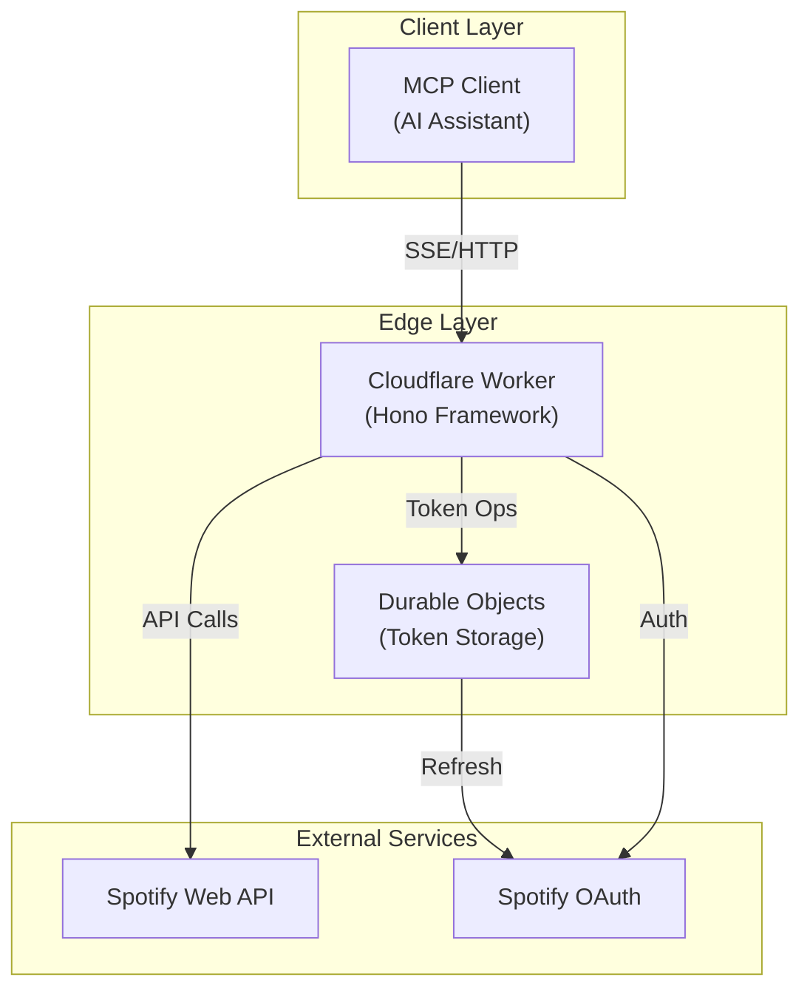
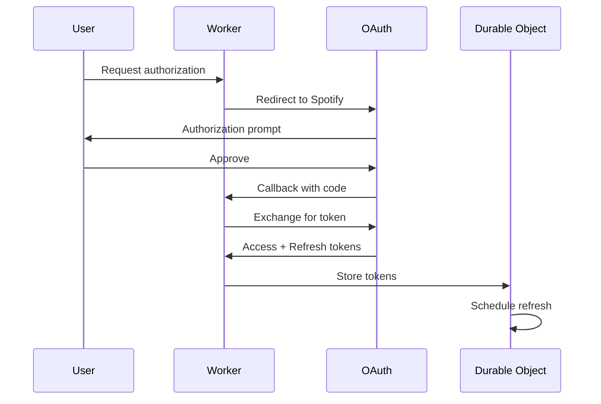
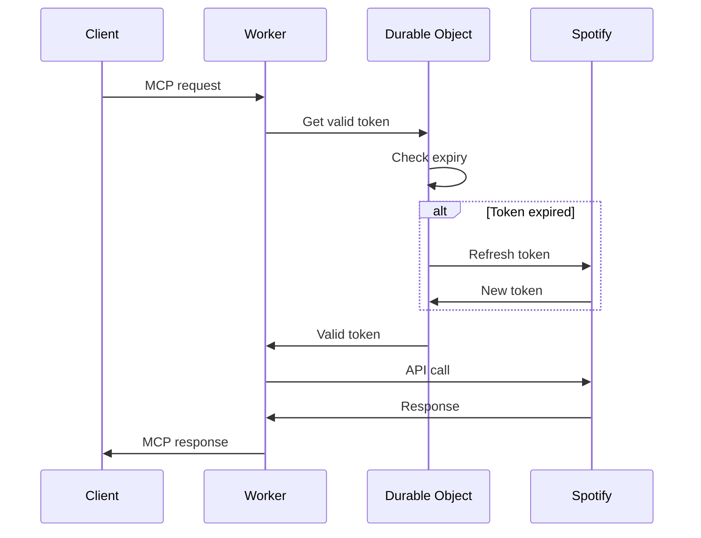
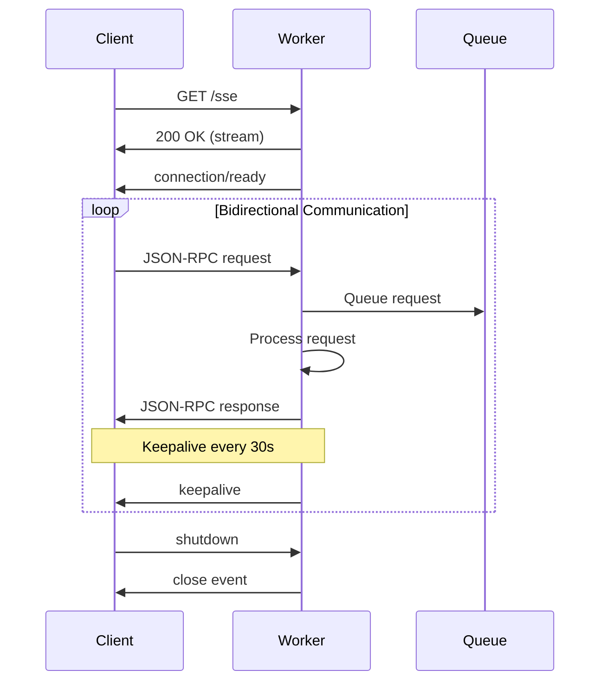
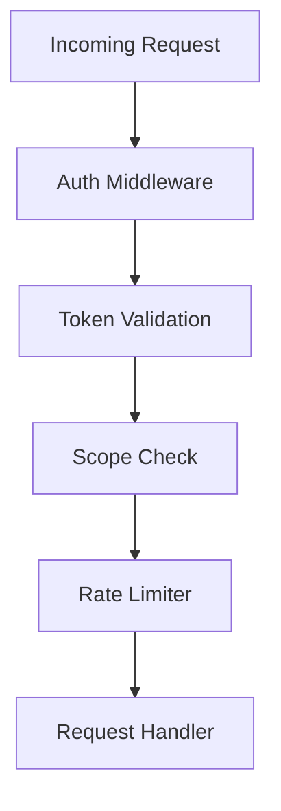
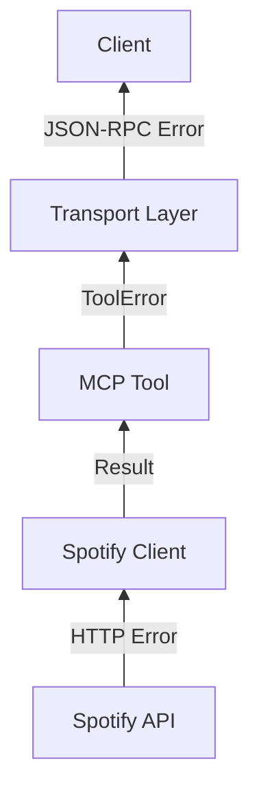
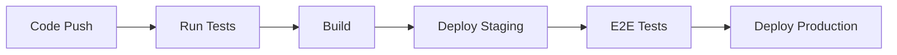

# Spotify MCP Server Architecture

## System Overview

The Spotify MCP Server is a distributed system designed to run on Cloudflare Workers with Durable Objects. It provides AI assistants with the ability to control Spotify playback through the Model Context Protocol (MCP).



## Modular Architecture

The system follows a declarative, domain-driven architecture with clear separation of concerns:

```
src/
├── external/          # External API integrations (使うAPI)
│   └── spotify/       # Spotify Web API operations
├── api/               # Exposed APIs (使われるAPI)
│   ├── oauth/         # Authentication & token management  
│   └── mcp/           # MCP protocol implementation
├── infrastructure/    # Cross-cutting concerns
│   ├── middleware/    # Request/response processing
│   ├── routes/        # HTTP endpoint handlers
│   ├── storage/       # Data persistence abstractions
│   └── types/         # Shared type definitions
└── platforms/         # Deployment targets
    ├── server.ts      # Node.js/Hono server
    ├── worker.ts      # Cloudflare Workers
    └── durableObjects.ts # Cloudflare storage
```

## Component Architecture

### 1. Cloudflare Worker (Main Entry Point)

The Worker handles all incoming requests and routes them appropriately:

```typescript
// Hono application structure
app.get('/sse', sseHandler)         // MCP SSE endpoint
app.post('/rpc', rpcHandler)        // JSON-RPC endpoint
app.get('/oauth/callback', oauthCallback)
app.get('/health', healthCheck)
```

**Responsibilities**:
- Request routing and middleware
- SSE connection management
- MCP protocol implementation
- Rate limiting and security
- Error handling and logging

### 2. Durable Objects (Token Management)

Durable Objects provide distributed, consistent storage for user tokens:

```typescript
class SpotifyTokenDurableObject {
  private state: DurableObjectState
  private storage: DurableObjectStorage
  private refreshTimer?: number
  
  // Automatic refresh every 50 minutes
  async fetch(request: Request): Promise<Response>
}
```

**Features**:
- Automatic token refresh (50-minute intervals)
- Per-user isolation
- Distributed consistency
- Failure recovery
- Metrics collection

### 3. MCP Server Implementation

The MCP server exposes tools, resources, and prompts:

```typescript
interface MCPServer {
  tools: Map<string, Tool>
  resources: Map<string, Resource>
  prompts: Map<string, Prompt>
  
  handleRequest(request: JsonRpcRequest): Promise<JsonRpcResponse>
}
```

**Components**:
- **Tools**: Executable functions (search, control, etc.)
- **Resources**: Data access (tracks, playlists)
- **Prompts**: Pre-built workflows
- **Transport**: SSE message handling

### 4. Spotify API Client

Type-safe wrapper around Spotify Web API:

```typescript
class SpotifyClient {
  constructor(private token: string)
  
  // All methods return Result<T, E> (neverthrow)
  searchTracks(query: string): Promise<Result<SearchResult, SpotifyError>>
  getPlaybackState(): Promise<Result<PlaybackState, SpotifyError>>
  controlPlayback(action: Action): Promise<Result<void, SpotifyError>>
}
```

**Error Handling**:
- No exceptions thrown
- Explicit error types
- Automatic retry logic
- Rate limit handling

## Data Flow

### 1. Authentication Flow



### 2. Request Flow



### 3. SSE Connection Flow



## Scalability Architecture

### 1. Global Distribution

- **Cloudflare Workers**: Run at 200+ edge locations
- **Automatic routing**: Requests routed to nearest edge
- **Zero cold starts**: Workers stay warm
- **Global anycast**: Single IP, global reach

### 2. Durable Objects Placement

- **Automatic placement**: Objects created near users
- **Migration**: Objects move based on access patterns
- **Consistency**: Strong consistency within object
- **Isolation**: Each user gets dedicated object

### 3. Connection Management

```typescript
class ConnectionManager {
  private connections: Map<string, SSEConnection>
  private queues: Map<string, MessageQueue>
  
  // Per-connection state
  // Message ordering
  // Backpressure handling
}
```

### 4. Caching Strategy

- **Token caching**: In Durable Object state
- **API response caching**: 1-minute TTL
- **Static asset caching**: Edge cache
- **Query deduplication**: In-flight request merging

## Security Architecture

### 1. Authentication Layers



### 2. Token Security

- **Storage**: Encrypted in Durable Objects
- **Transport**: TLS only
- **Validation**: Every request
- **Rotation**: Automatic refresh
- **Revocation**: Immediate effect

### 3. Rate Limiting

```typescript
interface RateLimiter {
  // Sliding window algorithm
  checkLimit(userId: string, resource: string): Result<void, RateLimitError>
  
  // Distributed counters in Durable Objects
  increment(userId: string, resource: string): Promise<void>
  
  // Automatic reset
  resetCounters(): Promise<void>
}
```

## Error Handling Architecture

### 1. Error Types

```typescript
type SystemError =
  | NetworkError
  | AuthError
  | RateLimitError
  | ValidationError
  | SpotifyAPIError
  | InternalError
```

### 2. Error Propagation



### 3. Recovery Strategies

- **Automatic retry**: Exponential backoff
- **Circuit breaker**: Fail fast on repeated errors
- **Fallback**: Graceful degradation
- **Monitoring**: Error metrics and alerts

## Monitoring & Observability

### 1. Metrics Collection

```typescript
interface Metrics {
  // Request metrics
  requestCount: Counter
  requestDuration: Histogram
  errorRate: Gauge
  
  // Token metrics
  tokenRefreshCount: Counter
  tokenRefreshErrors: Counter
  
  // Connection metrics
  activeConnections: Gauge
  messageRate: Counter
}
```

### 2. Logging Strategy

- **Structured logging**: JSON format
- **Correlation IDs**: Request tracing
- **Log levels**: ERROR, WARN, INFO, DEBUG
- **Sampling**: Reduce volume in production

### 3. Health Checks

```typescript
interface HealthCheck {
  // Component health
  worker: 'healthy' | 'degraded' | 'unhealthy'
  durableObjects: 'healthy' | 'degraded' | 'unhealthy'
  spotifyAPI: 'healthy' | 'degraded' | 'unhealthy'
  
  // Latency checks
  p50Latency: number
  p95Latency: number
  p99Latency: number
}
```

## Deployment Architecture

### 1. Environment Configuration

```yaml
# Production
production:
  workers: auto-scale
  durableObjects: global
  cache: aggressive
  monitoring: full

# Staging
staging:
  workers: 2 regions
  durableObjects: 1 region
  cache: minimal
  monitoring: verbose
```

### 2. CI/CD Pipeline



### 3. Rollback Strategy

- **Blue-green deployment**: Instant rollback
- **Gradual rollout**: 10% → 50% → 100%
- **Feature flags**: Runtime control
- **Version pinning**: Durable Object compatibility

## Performance Optimization

### 1. Request Path Optimization

- **Edge termination**: TLS at edge
- **Request coalescing**: Dedupe identical requests
- **Parallel processing**: Non-blocking I/O
- **Response streaming**: SSE chunked encoding

### 2. Memory Management

```typescript
class MemoryOptimizedHandler {
  // Stream large responses
  streamResponse(data: AsyncIterable<Chunk>): Response
  
  // Garbage collection hints
  cleanupAfterRequest(): void
  
  // Memory limits
  checkMemoryUsage(): MemoryStats
}
```

### 3. Latency Optimization

- **Preconnect**: Spotify API connection pooling
- **Prefetch**: Token refresh ahead of expiry
- **Compression**: Gzip responses
- **CDN**: Static asset caching

## Future Architecture Considerations

### 1. Multi-Region Active-Active

- Durable Object replication
- Cross-region consistency
- Conflict resolution
- Global load balancing

### 2. WebSocket Support

- Bidirectional real-time updates
- Lower latency than SSE
- Binary protocol support
- Connection multiplexing

### 3. Plugin Architecture

```typescript
interface Plugin {
  name: string
  version: string
  
  // Lifecycle hooks
  onInit(server: MCPServer): Promise<void>
  onRequest(req: Request): Promise<Request>
  onResponse(res: Response): Promise<Response>
  onError(error: Error): Promise<void>
  
  // Extension points
  tools?: Tool[]
  resources?: Resource[]
  prompts?: Prompt[]
}
```

### 4. Advanced Caching

- Predictive prefetching
- User behavior analysis
- Smart cache invalidation
- Edge-side includes