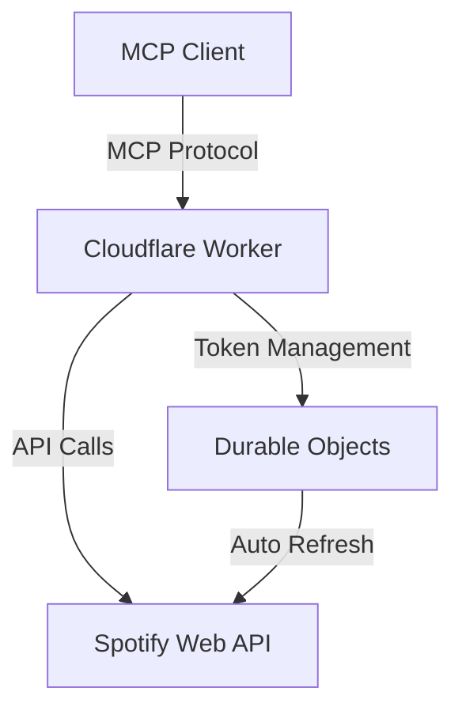

# Spotify MCP Server Final Specification

## Overview

The Spotify MCP Server is a Model Context Protocol (MCP) server that provides AI assistants with the ability to control Spotify playback and search for music. It runs on Cloudflare Workers with Durable Objects for distributed token management.

## Architecture

### Core Components



### Technology Stack

- **Runtime**: Cloudflare Workers with Durable Objects
- **Protocol**: MCP (Model Context Protocol) over SSE
- **Authentication**: OAuth 2.0 with PKCE
- **Language**: TypeScript
- **Error Handling**: neverthrow (no exceptions)

## MCP Tools Specification

### 1. Search Tool

**Name**: `search`

**Description**: Search for tracks on Spotify

**Input Schema**:
```typescript
{
  query: string      // Search query
  type?: 'track'     // Search type (currently only tracks)
  limit?: number     // Number of results (1-50, default: 10)
  offset?: number    // Pagination offset (default: 0)
}
```

**Output Schema**:
```typescript
{
  tracks: Array<{
    id: string
    name: string
    artist: string
    album: string
    uri: string
    external_url: string
    duration_ms: number
    explicit: boolean
    popularity: number
    preview_url: string | null
  }>
  total: number
  offset: number
  limit: number
  next: string | null
  previous: string | null
}
```

**Error Cases**:
- `INVALID_QUERY`: Empty or invalid search query
- `RATE_LIMITED`: Spotify API rate limit exceeded
- `UNAUTHORIZED`: Invalid or expired token
- `API_ERROR`: Spotify API error

### 2. Player State Tool

**Name**: `player_state`

**Description**: Get current playback state

**Input Schema**: None

**Output Schema**:
```typescript
{
  is_playing: boolean
  device: {
    id: string
    name: string
    type: string
    volume_percent: number
    is_active: boolean
  } | null
  track: {
    id: string
    name: string
    artist: string
    album: string
    uri: string
    duration_ms: number
    progress_ms: number
    external_url: string
  } | null
  repeat_state: 'off' | 'track' | 'context'
  shuffle_state: boolean
  context: {
    type: 'album' | 'playlist' | 'show' | 'collection'
    uri: string
    external_url: string
  } | null
}
```

**Error Cases**:
- `NO_ACTIVE_DEVICE`: No active Spotify device
- `UNAUTHORIZED`: Invalid or expired token
- `API_ERROR`: Spotify API error

### 3. Player Control Tool

**Name**: `player_control`

**Description**: Control Spotify playback

**Input Schema**:
```typescript
{
  action: 'play' | 'pause' | 'next' | 'previous' | 'seek' | 'volume' | 'repeat' | 'shuffle' | 'transfer'
  
  // For 'play' action
  uri?: string              // Track/album/playlist URI to play
  context_uri?: string      // Context URI (album/playlist)
  offset?: {
    position?: number       // Track number in context (0-based)
    uri?: string           // Track URI to start from
  }
  position_ms?: number      // Start position in track
  
  // For 'seek' action
  position_ms?: number      // Position to seek to
  
  // For 'volume' action
  volume_percent?: number   // Volume level (0-100)
  
  // For 'repeat' action
  state?: 'off' | 'track' | 'context'
  
  // For 'shuffle' action
  state?: boolean
  
  // For 'transfer' action
  device_id?: string        // Target device ID
  play?: boolean           // Start playback on new device
}
```

**Output Schema**:
```typescript
{
  success: boolean
  message: string
}
```

**Error Cases**:
- `INVALID_ACTION`: Unknown action
- `INVALID_PARAMETERS`: Missing or invalid parameters for action
- `NO_ACTIVE_DEVICE`: No active Spotify device
- `DEVICE_NOT_FOUND`: Target device not found (for transfer)
- `UNAUTHORIZED`: Invalid or expired token
- `API_ERROR`: Spotify API error

### 4. Playlist Create Tool

**Name**: `playlist_create`

**Description**: Create a new playlist

**Input Schema**:
```typescript
{
  name: string              // Playlist name
  description?: string      // Playlist description
  public?: boolean         // Public visibility (default: true)
  collaborative?: boolean   // Collaborative playlist (default: false)
}
```

**Output Schema**:
```typescript
{
  id: string
  name: string
  description: string | null
  uri: string
  external_url: string
  public: boolean
  collaborative: boolean
  owner: {
    id: string
    display_name: string
  }
}
```

### 5. Playlist Modify Tool

**Name**: `playlist_modify`

**Description**: Add/remove tracks from playlist

**Input Schema**:
```typescript
{
  playlist_id: string
  action: 'add' | 'remove' | 'reorder'
  
  // For 'add' action
  uris?: string[]           // Track URIs to add
  position?: number         // Position to insert (default: end)
  
  // For 'remove' action
  tracks?: Array<{
    uri: string
    positions?: number[]    // Specific positions to remove
  }>
  
  // For 'reorder' action
  range_start?: number      // Start position of tracks to move
  range_length?: number     // Number of tracks to move
  insert_before?: number    // Position to insert before
}
```

### 6. Recommendations Tool

**Name**: `recommendations`

**Description**: Get track recommendations

**Input Schema**:
```typescript
{
  seed_artists?: string[]   // Artist IDs (max 5 seeds total)
  seed_tracks?: string[]    // Track IDs (max 5 seeds total)
  seed_genres?: string[]    // Genre names (max 5 seeds total)
  
  // Tuneable attributes (all optional, 0-1 scale unless specified)
  acousticness?: number
  danceability?: number
  energy?: number
  instrumentalness?: number
  liveness?: number
  loudness?: number         // In decibels
  speechiness?: number
  valence?: number          // Musical positivity
  tempo?: number            // BPM
  
  // Min/max/target for each attribute
  min_*?: number
  max_*?: number
  target_*?: number
  
  limit?: number            // Number of recommendations (1-100, default: 20)
}
```

### 7. Audio Features Tool

**Name**: `audio_features`

**Description**: Get audio features for tracks

**Input Schema**:
```typescript
{
  track_ids: string[]       // Track IDs (max 100)
}
```

**Output Schema**:
```typescript
{
  tracks: Array<{
    id: string
    acousticness: number
    danceability: number
    energy: number
    instrumentalness: number
    key: number             // 0-11 (C, C♯, D, etc.)
    liveness: number
    loudness: number        // In decibels
    mode: number            // 0 = minor, 1 = major
    speechiness: number
    tempo: number           // BPM
    time_signature: number
    valence: number
  }>
}
```

### 8. Devices Tool

**Name**: `devices`

**Description**: Get available Spotify devices

**Input Schema**: None

**Output Schema**:
```typescript
{
  devices: Array<{
    id: string
    name: string
    type: string            // Computer, Smartphone, Speaker, etc.
    volume_percent: number
    is_active: boolean
    is_private_session: boolean
    is_restricted: boolean
  }>
}
```

## MCP Resources Specification

### Track Resource

**URI Pattern**: `spotify:track:{track_id}`

**Schema**:
```typescript
{
  id: string
  name: string
  artists: Array<{
    id: string
    name: string
  }>
  album: {
    id: string
    name: string
    images: Array<{
      url: string
      width: number
      height: number
    }>
  }
  duration_ms: number
  explicit: boolean
  popularity: number
  preview_url: string | null
  external_urls: {
    spotify: string
  }
  audio_features?: AudioFeatures  // If requested
}
```

### Playlist Resource

**URI Pattern**: `spotify:playlist:{playlist_id}`

**Schema**:
```typescript
{
  id: string
  name: string
  description: string | null
  owner: {
    id: string
    display_name: string
  }
  tracks: {
    total: number
    items: Array<{
      track: Track
      added_at: string
      added_by: {
        id: string
      }
    }>
  }
  public: boolean
  collaborative: boolean
  followers: {
    total: number
  }
}
```

## MCP Prompts Specification

### 1. Music Discovery Prompt

**Name**: `music_discovery`

**Description**: Discover new music based on preferences

**Arguments**:
```typescript
{
  mood?: string
  genre?: string
  energy?: 'low' | 'medium' | 'high'
  popularity?: 'underground' | 'mainstream' | 'mixed'
}
```

**Workflow**:
1. Analyze current listening history
2. Generate recommendations based on parameters
3. Create a discovery playlist
4. Provide track analysis and descriptions

### 2. Playlist Generator Prompt

**Name**: `playlist_generator`

**Description**: Generate playlists for specific occasions

**Arguments**:
```typescript
{
  occasion: string          // workout, party, focus, sleep, etc.
  duration_minutes: number
  variety: 'low' | 'medium' | 'high'
}
```

### 3. Music Analysis Prompt

**Name**: `music_analysis`

**Description**: Analyze listening patterns and provide insights

**Arguments**: None

**Output**: Detailed analysis of listening habits, favorite genres, audio feature preferences, and personalized recommendations.

## Authentication Specification

### OAuth 2.0 with PKCE Flow

1. **Authorization Request**:
   ```
   GET https://accounts.spotify.com/authorize
   Parameters:
   - client_id: Application client ID
   - response_type: 'code'
   - redirect_uri: Callback URL
   - code_challenge: Base64URL(SHA256(code_verifier))
   - code_challenge_method: 'S256'
   - scope: Space-separated list of scopes
   - state: Random state for CSRF protection
   ```

2. **Token Exchange**:
   ```
   POST https://accounts.spotify.com/api/token
   Body:
   - grant_type: 'authorization_code'
   - code: Authorization code
   - redirect_uri: Same as authorization
   - client_id: Application client ID
   - code_verifier: Original random string
   ```

3. **Token Refresh**:
   ```
   POST https://accounts.spotify.com/api/token
   Body:
   - grant_type: 'refresh_token'
   - refresh_token: Stored refresh token
   - client_id: Application client ID
   ```

### Required Scopes

- `user-read-playback-state`: Read playback state
- `user-modify-playback-state`: Control playback
- `user-read-currently-playing`: Get current track
- `playlist-read-private`: Read private playlists
- `playlist-modify-public`: Create/modify public playlists
- `playlist-modify-private`: Create/modify private playlists
- `user-library-read`: Read saved tracks/albums
- `user-library-modify`: Save/remove tracks/albums
- `user-read-recently-played`: Read listening history
- `user-top-read`: Read top artists/tracks

## Token Management Specification

### Durable Objects Architecture

```typescript
class SpotifyTokenDurableObject {
  // Automatic token refresh every 50 minutes
  // Tokens expire after 60 minutes
  
  async fetch(request: Request): Promise<Response> {
    // GET /token/{userId} - Get valid token
    // POST /token/{userId} - Store new token
    // PUT /token/{userId}/refresh - Force refresh
    // DELETE /token/{userId} - Revoke token
    // GET /token/{userId}/status - Get token status
  }
}
```

### Token Storage Schema

```typescript
{
  userId: string
  accessToken: string
  refreshToken: string
  expiresAt: number         // Unix timestamp
  scopes: string[]
  lastRefreshed: number     // Unix timestamp
  refreshCount: number      // Total refresh count
  errorCount: number        // Consecutive error count
}
```

### Auto-Refresh Logic

1. Check token expiry on every request
2. Refresh if expires in < 5 minutes
3. Exponential backoff on refresh failures
4. Revoke token after 5 consecutive failures
5. Emit metrics for monitoring

## Error Handling Specification

### Error Types

```typescript
type SpotifyMCPError = 
  | { type: 'AUTH_ERROR'; code: string; message: string }
  | { type: 'API_ERROR'; status: number; message: string }
  | { type: 'RATE_LIMIT'; retryAfter: number }
  | { type: 'INVALID_REQUEST'; field: string; message: string }
  | { type: 'NETWORK_ERROR'; cause: string }
  | { type: 'TOKEN_ERROR'; reason: string }
```

### Error Response Format

```typescript
{
  error: {
    type: string
    message: string
    details?: any
    retryable: boolean
    retryAfter?: number
  }
}
```

## Transport Specification

### SSE (Server-Sent Events) Protocol

**Endpoint**: `/sse`

**Message Format**:
```
event: message
data: {"jsonrpc":"2.0","method":"tools/list","id":"1"}

event: message
data: {"jsonrpc":"2.0","result":{...},"id":"1"}

event: keepalive
data: {"timestamp":1234567890}
```

**Connection Management**:
- Automatic reconnection with exponential backoff
- Message queuing during disconnection
- Request/response correlation via JSON-RPC id
- Heartbeat every 30 seconds

## Security Specification

### Rate Limiting

- Per-user rate limits in Durable Objects
- 100 requests per minute per user
- 1000 requests per hour per user
- Burst allowance for 10 rapid requests

### Request Validation

- CORS validation for browser clients
- Request signature verification
- Token scope validation per endpoint
- Input sanitization and validation

### Data Protection

- No storage of sensitive user data
- Token encryption at rest
- TLS for all external communications
- Audit logging for security events

## Performance Specification

### Response Time Targets

- Tool execution: < 500ms (p95)
- Token refresh: < 200ms (p95)
- SSE message delivery: < 100ms (p95)

### Scalability

- Cloudflare Workers global distribution
- Durable Objects for distributed state
- Connection pooling for Spotify API
- Response caching where appropriate

### Monitoring

- Request/response metrics
- Error rate tracking
- Token refresh success rate
- API quota usage
- SSE connection health

## Testing Specification

### Unit Tests

- All error paths must be tested
- Mock Spotify API responses
- Test token refresh edge cases
- Validate error handling

### Integration Tests

- Full OAuth flow testing
- SSE connection lifecycle
- Tool execution with real API
- Error recovery scenarios

### Performance Tests

- Load testing with 1000 concurrent users
- Token refresh under load
- SSE broadcast performance
- API rate limit handling

## Deployment Specification

### Environment Variables

```
SPOTIFY_CLIENT_ID=<client_id>
SPOTIFY_CLIENT_SECRET=<client_secret>  # Optional for PKCE
REDIRECT_URI=<oauth_callback_url>
DURABLE_OBJECT_NAMESPACE=SPOTIFY_TOKENS
ENVIRONMENT=production|staging|development
```

### Cloudflare Configuration

```toml
name = "spotify-mcp"
main = "src/worker.ts"
compatibility_date = "2024-01-01"

[[durable_objects.bindings]]
name = "SPOTIFY_TOKENS"
class_name = "SpotifyTokenDurableObject"
script_name = "spotify-mcp"

[env.production]
vars = { ENVIRONMENT = "production" }