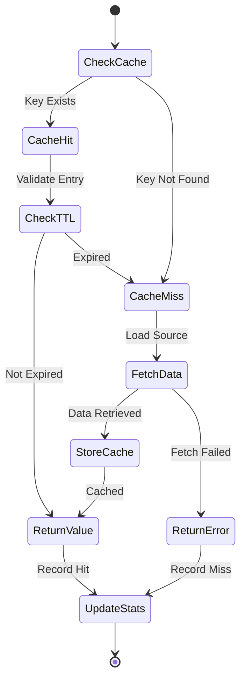

# Cache Manager Component Specification

## Purpose & Responsibility

The Cache Manager component provides intelligent caching across the application to improve performance and reduce external API calls. It is responsible for:

- Caching Spotify API responses with appropriate TTLs
- Managing user-specific cached data
- Implementing cache invalidation strategies
- Providing cache warming and preloading
- Supporting multiple storage backends

## Interface Definition

### Cache Manager Interface

```typescript
interface CacheManager {
  // Basic cache operations
  get<T>(key: string): Promise<Result<T | null, CacheError>>
  set<T>(key: string, value: T, ttl?: number): Promise<Result<void, CacheError>>
  delete(key: string): Promise<Result<void, CacheError>>
  
  // Batch operations
  getMany<T>(keys: string[]): Promise<Result<Map<string, T>, CacheError>>
  setMany<T>(entries: Map<string, T>, ttl?: number): Promise<Result<void, CacheError>>
  deleteMany(keys: string[]): Promise<Result<void, CacheError>>
  
  // Advanced operations
  exists(key: string): Promise<Result<boolean, CacheError>>
  expire(key: string, ttl: number): Promise<Result<void, CacheError>>
  getTTL(key: string): Promise<Result<number, CacheError>>
  
  // Pattern operations
  keys(pattern: string): Promise<Result<string[], CacheError>>
  deletePattern(pattern: string): Promise<Result<number, CacheError>>
  
  // Cache warming
  warm(strategy: CacheWarmingStrategy): Promise<Result<void, CacheError>>
  
  // Statistics
  getStats(): Promise<Result<CacheStats, CacheError>>
  clearStats(): Promise<Result<void, CacheError>>
}

interface CacheEntry<T> {
  value: T
  timestamp: number
  ttl: number
  hitCount: number
  tags?: string[]
}

interface CacheStats {
  hits: number
  misses: number
  hitRate: number
  entries: number
  memoryUsage?: number
  uptime: number
}

interface CacheError {
  type: 'CacheError'
  message: string
  operation: string
  key?: string
}

type CacheWarmingStrategy = {
  type: 'user-data'
  userId: string
} | {
  type: 'popular-content'
  limit: number
} | {
  type: 'prediction'
  based_on: 'recent_activity' | 'user_preferences'
}
```

### Cache Key Strategies

```typescript
// Cache key namespaces and patterns
export const CACHE_KEYS = {
  // Spotify API responses
  SPOTIFY: {
    TRACK: (trackId: string) => `spotify:track:${trackId}`,
    ALBUM: (albumId: string) => `spotify:album:${albumId}`,
    ARTIST: (artistId: string) => `spotify:artist:${artistId}`,
    PLAYLIST: (playlistId: string) => `spotify:playlist:${playlistId}`,
    SEARCH: (query: string, type: string, limit: number) => 
      `spotify:search:${type}:${Buffer.from(query).toString('base64')}:${limit}`,
    AUDIO_FEATURES: (trackId: string) => `spotify:features:${trackId}`,
    RECOMMENDATIONS: (seedTracks: string[], seedArtists: string[], seedGenres: string[]) =>
      `spotify:recs:${[...seedTracks, ...seedArtists, ...seedGenres].sort().join(',')}`
  },
  
  // User-specific data
  USER: {
    PROFILE: (userId: string) => `user:profile:${userId}`,
    PLAYLISTS: (userId: string) => `user:playlists:${userId}`,
    RECENT_TRACKS: (userId: string) => `user:recent:${userId}`,
    TOP_TRACKS: (userId: string, timeRange: string) => `user:top:tracks:${userId}:${timeRange}`,
    TOP_ARTISTS: (userId: string, timeRange: string) => `user:top:artists:${userId}:${timeRange}`,
    PREFERENCES: (userId: string) => `user:prefs:${userId}`
  },
  
  // Application state
  APP: {
    TOKENS: (userId: string) => `tokens:${userId}`,
    SESSION: (sessionId: string) => `session:${sessionId}`,
    RATE_LIMIT: (key: string, type: string) => `rate:${type}:${key}`
  }
} as const

// Cache TTL configurations (in seconds)
export const CACHE_TTL = {
  // Spotify content (relatively stable)
  TRACK_DATA: 24 * 60 * 60,        // 24 hours
  ALBUM_DATA: 24 * 60 * 60,        // 24 hours
  ARTIST_DATA: 12 * 60 * 60,       // 12 hours
  AUDIO_FEATURES: 7 * 24 * 60 * 60, // 7 days
  
  // Search results (can change frequently)
  SEARCH_RESULTS: 30 * 60,         // 30 minutes
  RECOMMENDATIONS: 60 * 60,        // 1 hour
  
  // User data (changes occasionally)
  USER_PROFILE: 60 * 60,           // 1 hour
  USER_PLAYLISTS: 15 * 60,         // 15 minutes
  USER_TOP_CONTENT: 6 * 60 * 60,   // 6 hours
  
  // Frequently changing data
  RECENT_TRACKS: 5 * 60,           // 5 minutes
  PLAYER_STATE: 30,                // 30 seconds
  
  // Session data
  TOKENS: 50 * 60,                 // 50 minutes (tokens expire in 1 hour)
  SESSIONS: 24 * 60 * 60,          // 24 hours
  
  // Rate limiting
  RATE_LIMITS: 60 * 60             // 1 hour
} as const
```

## Dependencies

### External Dependencies
- Storage backend (Redis, Cloudflare KV, in-memory)
- Serialization library (JSON, MessagePack)
- Compression library (optional)
- Monitoring/metrics system

### Internal Dependencies
- Configuration system
- Logging system
- Error handler
- Type system

## Behavior Specification

### Cache Operation Flow



### Multi-Layer Cache Implementation

```typescript
class MultiLayerCacheManager implements CacheManager {
  constructor(
    private l1Cache: InMemoryCache,     // Fast, small
    private l2Cache: RedisCache,        // Medium speed, larger
    private l3Cache: CloudflareKVCache  // Slower, huge capacity
  ) {}
  
  async get<T>(key: string): Promise<Result<T | null, CacheError>> {
    // Try L1 cache first (memory)
    const l1Result = await this.l1Cache.get<T>(key)
    if (l1Result.isOk() && l1Result.value !== null) {
      await this.recordHit('l1', key)
      return l1Result
    }
    
    // Try L2 cache (Redis)
    const l2Result = await this.l2Cache.get<T>(key)
    if (l2Result.isOk() && l2Result.value !== null) {
      // Promote to L1
      await this.l1Cache.set(key, l2Result.value, this.getShortTTL(key))
      await this.recordHit('l2', key)
      return l2Result
    }
    
    // Try L3 cache (KV)
    const l3Result = await this.l3Cache.get<T>(key)
    if (l3Result.isOk() && l3Result.value !== null) {
      // Promote to L2 and L1
      await this.l2Cache.set(key, l3Result.value, this.getMediumTTL(key))
      await this.l1Cache.set(key, l3Result.value, this.getShortTTL(key))
      await this.recordHit('l3', key)
      return l3Result
    }
    
    await this.recordMiss(key)
    return ok(null)
  }
  
  async set<T>(key: string, value: T, ttl?: number): Promise<Result<void, CacheError>> {
    const defaultTTL = ttl || this.getDefaultTTL(key)
    
    // Set in all layers with appropriate TTLs
    await Promise.all([
      this.l1Cache.set(key, value, Math.min(defaultTTL, 300)),      // Max 5 minutes in memory
      this.l2Cache.set(key, value, Math.min(defaultTTL, 3600)),     // Max 1 hour in Redis
      this.l3Cache.set(key, value, defaultTTL)                      // Full TTL in KV
    ])
    
    return ok(undefined)
  }
}
```

### Smart Cache Invalidation

```typescript
class SmartCacheInvalidator {
  constructor(private cacheManager: CacheManager) {}
  
  async invalidateUserData(userId: string): Promise<Result<void, CacheError>> {
    const patterns = [
      CACHE_KEYS.USER.PROFILE(userId),
      CACHE_KEYS.USER.PLAYLISTS(userId),
      CACHE_KEYS.USER.RECENT_TRACKS(userId),
      `${CACHE_KEYS.USER.TOP_TRACKS(userId, '*')}`,
      `${CACHE_KEYS.USER.TOP_ARTISTS(userId, '*')}`,
      CACHE_KEYS.USER.PREFERENCES(userId)
    ]
    
    for (const pattern of patterns) {
      if (pattern.includes('*')) {
        await this.cacheManager.deletePattern(pattern)
      } else {
        await this.cacheManager.delete(pattern)
      }
    }
    
    return ok(undefined)
  }
  
  async invalidatePlaylistData(playlistId: string): Promise<Result<void, CacheError>> {
    // Invalidate playlist itself
    await this.cacheManager.delete(CACHE_KEYS.SPOTIFY.PLAYLIST(playlistId))
    
    // Invalidate user playlists that might include this playlist
    const userKeys = await this.cacheManager.keys('user:playlists:*')
    if (userKeys.isOk()) {
      await this.cacheManager.deleteMany(userKeys.value)
    }
    
    return ok(undefined)
  }
  
  async invalidateSearchCache(query?: string): Promise<Result<void, CacheError>> {
    if (query) {
      // Invalidate specific search
      const patterns = [
        `spotify:search:*:${Buffer.from(query).toString('base64')}:*`
      ]
      
      for (const pattern of patterns) {
        await this.cacheManager.deletePattern(pattern)
      }
    } else {
      // Invalidate all search cache
      await this.cacheManager.deletePattern('spotify:search:*')
    }
    
    return ok(undefined)
  }
}
```

### Cache Warming Strategies

```typescript
class CacheWarmingService {
  constructor(
    private cacheManager: CacheManager,
    private spotifyApi: SpotifyApiClient
  ) {}
  
  async warmUserCache(userId: string): Promise<Result<void, CacheError>> {
    try {
      // Warm user profile and preferences
      await Promise.all([
        this.warmUserProfile(userId),
        this.warmUserPlaylists(userId),
        this.warmUserTopContent(userId)
      ])
      
      return ok(undefined)
    } catch (error) {
      return err({
        type: 'CacheError',
        message: `Failed to warm user cache: ${error}`,
        operation: 'warm'
      })
    }
  }
  
  private async warmUserProfile(userId: string): Promise<void> {
    const profileResult = await this.spotifyApi.getUserProfile(userId)
    if (profileResult.isOk()) {
      await this.cacheManager.set(
        CACHE_KEYS.USER.PROFILE(userId),
        profileResult.value,
        CACHE_TTL.USER_PROFILE
      )
    }
  }
  
  private async warmUserPlaylists(userId: string): Promise<void> {
    const playlistsResult = await this.spotifyApi.getUserPlaylists(userId)
    if (playlistsResult.isOk()) {
      await this.cacheManager.set(
        CACHE_KEYS.USER.PLAYLISTS(userId),
        playlistsResult.value,
        CACHE_TTL.USER_PLAYLISTS
      )
      
      // Warm individual playlists
      for (const playlist of playlistsResult.value.items.slice(0, 10)) { // Top 10 playlists
        const playlistResult = await this.spotifyApi.getPlaylist(playlist.id)
        if (playlistResult.isOk()) {
          await this.cacheManager.set(
            CACHE_KEYS.SPOTIFY.PLAYLIST(playlist.id),
            playlistResult.value,
            CACHE_TTL.USER_PLAYLISTS
          )
        }
      }
    }
  }
  
  async warmPopularContent(): Promise<Result<void, CacheError>> {
    // Warm frequently accessed content based on analytics
    const popularTracks = await this.getPopularTrackIds()
    
    for (const trackId of popularTracks.slice(0, 100)) {
      const trackResult = await this.spotifyApi.getTrack(trackId)
      if (trackResult.isOk()) {
        await this.cacheManager.set(
          CACHE_KEYS.SPOTIFY.TRACK(trackId),
          trackResult.value,
          CACHE_TTL.TRACK_DATA
        )
        
        // Also warm audio features for popular tracks
        const featuresResult = await this.spotifyApi.getAudioFeatures(trackId)
        if (featuresResult.isOk()) {
          await this.cacheManager.set(
            CACHE_KEYS.SPOTIFY.AUDIO_FEATURES(trackId),
            featuresResult.value,
            CACHE_TTL.AUDIO_FEATURES
          )
        }
      }
    }
    
    return ok(undefined)
  }
}
```

### Cache Middleware Integration

```typescript
export function cacheMiddleware(
  cacheManager: CacheManager,
  keyGenerator: (c: Context) => string,
  ttl: number,
  conditions?: CacheConditions
) {
  return async (c: Context, next: Next) => {
    const key = keyGenerator(c)
    
    // Check conditions
    if (conditions && !conditions.shouldCache(c)) {
      return next()
    }
    
    // Try to get from cache
    const cacheResult = await cacheManager.get(key)
    
    if (cacheResult.isOk() && cacheResult.value !== null) {
      c.header('X-Cache', 'HIT')
      return c.json(cacheResult.value)
    }
    
    // Not in cache, execute request
    c.header('X-Cache', 'MISS')
    
    // Intercept response to cache it
    const originalJson = c.json.bind(c)
    c.json = (data: any, status?: number) => {
      // Cache successful responses
      if (!status || (status >= 200 && status < 300)) {
        cacheManager.set(key, data, ttl).catch(error => {
          console.error('Failed to cache response:', error)
        })
      }
      return originalJson(data, status)
    }
    
    await next()
  }
}

interface CacheConditions {
  shouldCache: (c: Context) => boolean
}

// Example cache key generators
export const cacheKeyGenerators = {
  spotifySearch: (c: Context) => {
    const query = c.req.query('q') || ''
    const type = c.req.query('type') || 'track'
    const limit = c.req.query('limit') || '10'
    return CACHE_KEYS.SPOTIFY.SEARCH(query, type, parseInt(limit))
  },
  
  userProfile: (c: Context) => {
    const userId = c.get('userId')
    return CACHE_KEYS.USER.PROFILE(userId)
  },
  
  trackById: (c: Context) => {
    const trackId = c.req.param('id')
    return CACHE_KEYS.SPOTIFY.TRACK(trackId)
  }
}
```

## Testing Requirements

### Unit Tests

```typescript
describe('Cache Manager', () => {
  describe('Basic Operations', () => {
    it('should store and retrieve values')
    it('should handle TTL expiration')
    it('should return null for missing keys')
    it('should handle serialization errors')
  })
  
  describe('Multi-Layer Cache', () => {
    it('should promote values between layers')
    it('should handle layer failures gracefully')
    it('should maintain consistency across layers')
  })
  
  describe('Cache Invalidation', () => {
    it('should invalidate by pattern')
    it('should invalidate related data')
    it('should handle invalidation failures')
  })
  
  describe('Cache Warming', () => {
    it('should warm user-specific data')
    it('should warm popular content')
    it('should handle warming failures')
  })
})
```

## Performance Constraints

### Response Times
- L1 cache (memory): < 1ms
- L2 cache (Redis): < 10ms
- L3 cache (KV): < 50ms
- Cache warming: < 5s per strategy

### Memory Usage
- L1 cache: < 100MB total
- Cache entries: < 10KB each
- Automatic cleanup on memory pressure

### Hit Rates
- Target overall hit rate: > 80%
- L1 hit rate: > 50%
- L2 hit rate: > 30%
- Cache warming effectiveness: > 70%

## Security Considerations

### Data Isolation
- Ensure user data separation in cache keys
- Validate cache key format to prevent injection
- Encrypt sensitive cached data
- Implement cache access controls

### Cache Poisoning Prevention
- Validate data before caching
- Implement cache integrity checks
- Use secure serialization
- Monitor for abnormal cache patterns