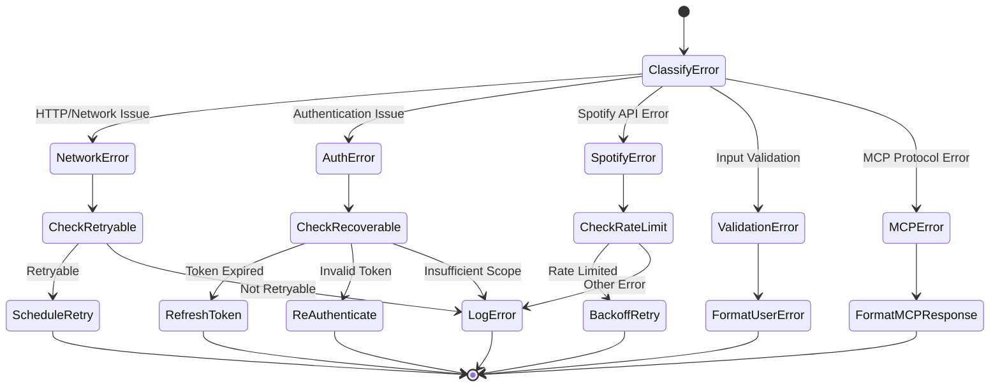

# Error Handler Component Specification

## Purpose & Responsibility

The Error Handler component provides centralized, type-safe error handling across the entire application. It is responsible for:

- Standardizing error types and formats
- Providing error recovery strategies
- Converting errors between different layers (API, MCP, HTTP)
- Logging and telemetry for errors
- User-friendly error messaging

## Interface Definition

### Core Error Types

```typescript
// Base error interface
interface BaseError {
  type: string
  message: string
  code?: string
  timestamp: number
  requestId?: string
}

// Domain-specific error types
interface NetworkError extends BaseError {
  type: 'NetworkError'
  statusCode?: number
  retryable: boolean
}

interface AuthError extends BaseError {
  type: 'AuthError'
  reason: 'expired' | 'invalid' | 'insufficient_scope' | 'rate_limited'
  scope?: string[]
}

interface SpotifyError extends BaseError {
  type: 'SpotifyError'
  statusCode?: number
  spotifyErrorCode?: string
  retryAfter?: number
}

interface ValidationError extends BaseError {
  type: 'ValidationError'
  field?: string
  invalidValue?: unknown
}

interface MCPError extends BaseError {
  type: 'MCPError'
  mcpCode: 'INVALID_REQUEST' | 'METHOD_NOT_FOUND' | 'INVALID_PARAMS' | 'INTERNAL_ERROR'
  toolName?: string
}

type ApplicationError = NetworkError | AuthError | SpotifyError | ValidationError | MCPError
```

### Error Handler Interface

```typescript
interface ErrorHandler {
  // Error creation
  createError<T extends ApplicationError>(
    type: T['type'],
    message: string,
    metadata?: Partial<T>
  ): T

  // Error classification
  isRetryable(error: ApplicationError): boolean
  isUserError(error: ApplicationError): boolean
  getSeverity(error: ApplicationError): 'low' | 'medium' | 'high' | 'critical'

  // Error conversion
  toHttpError(error: ApplicationError): HttpError
  toMCPError(error: ApplicationError): MCPError
  toUserMessage(error: ApplicationError): string

  // Error handling
  handleError(error: ApplicationError, context: ErrorContext): Promise<ErrorResult>
  
  // Recovery strategies
  canRecover(error: ApplicationError): boolean
  recover(error: ApplicationError, context: ErrorContext): Promise<Result<any, ApplicationError>>
}

interface ErrorContext {
  requestId: string
  userId?: string
  operation: string
  metadata?: Record<string, unknown>
}

interface ErrorResult {
  handled: boolean
  recovered?: any
  shouldRetry: boolean
  retryDelay?: number
}
```

## Dependencies

### External Dependencies
- neverthrow for Result types
- Structured logging system
- Request context middleware
- Telemetry/monitoring integration

### Internal Dependencies
- Type definitions from `types/`
- Configuration system
- Retry mechanism

## Behavior Specification

### Error Classification Flow



### Error Creation

```typescript
class ApplicationErrorHandler implements ErrorHandler {
  createError<T extends ApplicationError>(
    type: T['type'],
    message: string,
    metadata: Partial<T> = {}
  ): T {
    const baseError = {
      type,
      message,
      timestamp: Date.now(),
      requestId: this.getCurrentRequestId(),
      ...metadata
    }

    // Add type-specific defaults
    switch (type) {
      case 'NetworkError':
        return {
          ...baseError,
          retryable: true,
          ...metadata
        } as T

      case 'AuthError':
        return {
          ...baseError,
          reason: 'invalid',
          ...metadata
        } as T

      case 'SpotifyError':
        return {
          ...baseError,
          ...metadata
        } as T

      case 'ValidationError':
        return {
          ...baseError,
          ...metadata
        } as T

      case 'MCPError':
        return {
          ...baseError,
          mcpCode: 'INTERNAL_ERROR',
          ...metadata
        } as T

      default:
        throw new Error(`Unknown error type: ${type}`)
    }
  }
}
```

### Error Recovery Strategies

```typescript
async function recover(
  error: ApplicationError,
  context: ErrorContext
): Promise<Result<any, ApplicationError>> {
  switch (error.type) {
    case 'AuthError':
      if (error.reason === 'expired') {
        return this.refreshTokenAndRetry(context)
      }
      return err(error)

    case 'NetworkError':
      if (error.retryable && context.retryCount < 3) {
        const delay = this.calculateBackoffDelay(context.retryCount)
        await this.sleep(delay)
        return this.retryOperation(context)
      }
      return err(error)

    case 'SpotifyError':
      if (error.statusCode === 429 && error.retryAfter) {
        await this.sleep(error.retryAfter * 1000)
        return this.retryOperation(context)
      }
      return err(error)

    default:
      return err(error)
  }
}

private calculateBackoffDelay(retryCount: number): number {
  const baseDelay = 1000 // 1 second
  const maxDelay = 30000 // 30 seconds
  const delay = baseDelay * Math.pow(2, retryCount)
  return Math.min(delay + Math.random() * 1000, maxDelay)
}
```

### Error Conversion

```typescript
toHttpError(error: ApplicationError): HttpError {
  const httpStatusMap: Record<ApplicationError['type'], number> = {
    'NetworkError': 502,
    'AuthError': 401,
    'SpotifyError': error.statusCode || 502,
    'ValidationError': 400,
    'MCPError': 500
  }

  const userMessages: Record<ApplicationError['type'], string> = {
    'NetworkError': 'Service temporarily unavailable',
    'AuthError': 'Authentication required',
    'SpotifyError': 'Spotify service error',
    'ValidationError': error.message,
    'MCPError': 'Internal server error'
  }

  return {
    status: httpStatusMap[error.type],
    message: userMessages[error.type],
    code: error.code,
    requestId: error.requestId
  }
}

toMCPError(error: ApplicationError): MCPError {
  const mcpCodeMap: Record<ApplicationError['type'], MCPError['mcpCode']> = {
    'NetworkError': 'INTERNAL_ERROR',
    'AuthError': 'INVALID_REQUEST',
    'SpotifyError': 'INTERNAL_ERROR',
    'ValidationError': 'INVALID_PARAMS',
    'MCPError': error.mcpCode || 'INTERNAL_ERROR'
  }

  return this.createError('MCPError', error.message, {
    mcpCode: mcpCodeMap[error.type],
    toolName: error.toolName,
    requestId: error.requestId
  })
}
```

### User-Friendly Messages

```typescript
toUserMessage(error: ApplicationError): string {
  const templates: Record<ApplicationError['type'], (error: any) => string> = {
    'NetworkError': (e) => 
      `Unable to connect to Spotify. Please check your internet connection and try again.`,
    
    'AuthError': (e) => {
      switch (e.reason) {
        case 'expired': return 'Your Spotify session has expired. Please re-authenticate.'
        case 'insufficient_scope': return 'Additional Spotify permissions required for this action.'
        case 'rate_limited': return 'Too many authentication attempts. Please wait a moment.'
        default: return 'Authentication with Spotify failed. Please try again.'
      }
    },
    
    'SpotifyError': (e) => {
      if (e.statusCode === 404) return 'The requested item was not found on Spotify.'
      if (e.statusCode === 403) return 'This action requires Spotify Premium.'
      if (e.statusCode === 429) return 'Spotify rate limit reached. Please wait a moment.'
      return 'Spotify service is temporarily unavailable. Please try again later.'
    },
    
    'ValidationError': (e) => 
      e.field ? `Invalid ${e.field}: ${e.message}` : e.message,
    
    'MCPError': (e) => 
      'An internal error occurred while processing your request.'
  }

  return templates[error.type]?.(error) || error.message
}
```

## Integration Points

### Middleware Integration

```typescript
// Hono error handling middleware
export function errorHandlerMiddleware(errorHandler: ErrorHandler) {
  return async (c: Context, next: Next) => {
    try {
      await next()
    } catch (error) {
      const appError = errorHandler.normalizeError(error)
      const httpError = errorHandler.toHttpError(appError)
      
      // Log error with context
      await errorHandler.logError(appError, {
        requestId: c.get('requestId'),
        userId: c.get('userId'),
        operation: c.req.path,
        metadata: {
          method: c.req.method,
          userAgent: c.req.header('user-agent')
        }
      })

      return c.json({
        error: {
          message: httpError.message,
          code: httpError.code,
          requestId: httpError.requestId
        }
      }, httpError.status)
    }
  }
}
```

### MCP Tool Integration

```typescript
export function wrapMCPTool<TInput, TOutput>(
  tool: (input: TInput) => Promise<Result<TOutput, ApplicationError>>,
  errorHandler: ErrorHandler
) {
  return async (input: TInput): Promise<CallToolResult> => {
    const result = await tool(input)
    
    if (result.isErr()) {
      const mcpError = errorHandler.toMCPError(result.error)
      const userMessage = errorHandler.toUserMessage(result.error)
      
      return {
        content: [{
          type: 'text',
          text: userMessage
        }],
        isError: true
      }
    }
    
    return {
      content: [{
        type: 'text',
        text: JSON.stringify(result.value, null, 2)
      }]
    }
  }
}
```

## Testing Requirements

### Unit Tests

```typescript
describe('Error Handler', () => {
  describe('Error Creation', () => {
    it('should create network errors with retryable flag')
    it('should create auth errors with reason')
    it('should create spotify errors with status codes')
    it('should include request ID in all errors')
  })
  
  describe('Error Classification', () => {
    it('should identify retryable errors correctly')
    it('should classify user vs system errors')
    it('should determine error severity levels')
  })
  
  describe('Error Conversion', () => {
    it('should convert to appropriate HTTP status codes')
    it('should map to correct MCP error codes')
    it('should generate user-friendly messages')
  })
  
  describe('Recovery Strategies', () => {
    it('should attempt token refresh for expired auth')
    it('should implement exponential backoff for retries')
    it('should respect Spotify rate limits')
  })
})
```

## Performance Constraints

### Response Times
- Error creation: < 1ms
- Error classification: < 1ms
- Error conversion: < 5ms
- Recovery attempts: < 200ms (excluding retry delays)

### Memory Usage
- Error objects: < 1KB each
- Error context: < 512 bytes
- No error accumulation in memory

## Security Considerations

### Information Disclosure
- Never expose internal system details in user messages
- Sanitize error messages for external APIs
- Log sensitive data separately from user-facing errors
- Include only necessary information in error responses

### Error Logging
- Log all errors with sufficient context for debugging
- Include correlation IDs for request tracing
- Separate PII from error logs
- Implement log retention policies