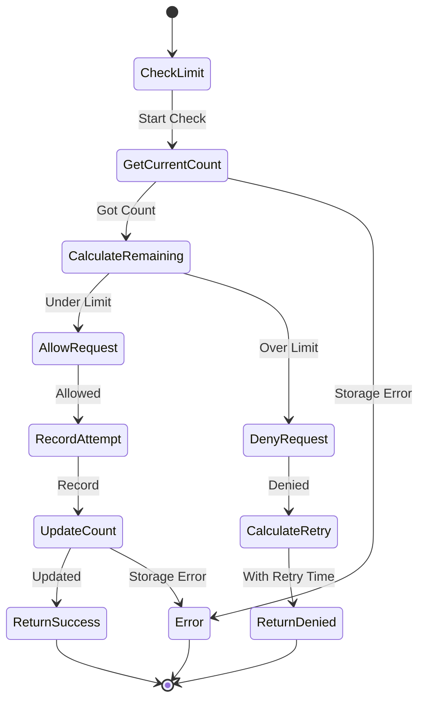

# Rate Limiter Component Specification

## Purpose & Responsibility

The Rate Limiter component protects the application and external APIs from abuse by controlling request rates. It is responsible for:

- Limiting requests per user/IP to prevent abuse
- Respecting Spotify API rate limits
- Implementing different rate limiting strategies
- Providing graceful degradation under load
- Coordinating rate limits across distributed instances

## Interface Definition

### Rate Limiter Interface

```typescript
interface RateLimiter {
  // Check if request is allowed
  checkLimit(key: string, limit: RateLimit): Promise<Result<RateLimitResult, RateLimitError>>
  
  // Record request attempt
  recordAttempt(key: string, limit: RateLimit): Promise<Result<void, RateLimitError>>
  
  // Get current status
  getStatus(key: string, limit: RateLimit): Promise<Result<RateLimitStatus, RateLimitError>>
  
  // Reset limits
  resetLimit(key: string, limit: RateLimit): Promise<Result<void, RateLimitError>>
}

interface RateLimit {
  name: string
  windowMs: number        // Time window in milliseconds
  maxRequests: number     // Maximum requests per window
  strategy: RateLimitStrategy
  skipSuccessful?: boolean // Only count failed requests
}

type RateLimitStrategy = 
  | 'fixed-window'        // Fixed time windows
  | 'sliding-window'      // Sliding time windows
  | 'token-bucket'        // Token bucket algorithm
  | 'leaky-bucket'        // Leaky bucket algorithm

interface RateLimitResult {
  allowed: boolean
  remaining: number
  resetTime: number
  retryAfter?: number
}

interface RateLimitStatus {
  count: number
  remaining: number
  resetTime: number
  windowStart: number
}

interface RateLimitError {
  type: 'RateLimitError'
  message: string
  retryAfter: number
  limit: RateLimit
}
```

### Rate Limit Configurations

```typescript
// Predefined rate limits
export const RATE_LIMITS = {
  // User-facing API limits
  USER_API: {
    name: 'user-api',
    windowMs: 60 * 1000,    // 1 minute
    maxRequests: 100,       // 100 requests per minute
    strategy: 'sliding-window' as const
  },
  
  // MCP tool execution limits
  MCP_TOOLS: {
    name: 'mcp-tools',
    windowMs: 60 * 1000,    // 1 minute
    maxRequests: 30,        // 30 tool calls per minute
    strategy: 'token-bucket' as const
  },
  
  // Spotify API limits (conservative)
  SPOTIFY_API: {
    name: 'spotify-api',
    windowMs: 30 * 1000,    // 30 seconds
    maxRequests: 100,       // ~200 requests per minute (Spotify limit)
    strategy: 'leaky-bucket' as const
  },
  
  // OAuth flow limits
  OAUTH_FLOW: {
    name: 'oauth-flow',
    windowMs: 60 * 60 * 1000, // 1 hour
    maxRequests: 10,          // 10 OAuth attempts per hour
    strategy: 'fixed-window' as const
  },
  
  // Authentication attempts
  AUTH_ATTEMPTS: {
    name: 'auth-attempts',
    windowMs: 15 * 60 * 1000, // 15 minutes
    maxRequests: 5,           // 5 failed attempts per 15 minutes
    strategy: 'fixed-window' as const,
    skipSuccessful: true
  }
} as const
```

## Dependencies

### External Dependencies
- Storage backend (Redis, Cloudflare KV, or in-memory)
- Time provider for accurate timestamps
- Distributed coordination (for multi-instance deployments)

### Internal Dependencies
- Configuration system
- Logging system
- Error handler
- Request context

## Behavior Specification

### Rate Limiting Flow



### Strategy Implementations

#### Fixed Window Strategy

```typescript
class FixedWindowRateLimiter implements RateLimiter {
  async checkLimit(key: string, limit: RateLimit): Promise<Result<RateLimitResult, RateLimitError>> {
    const windowKey = this.getWindowKey(key, limit)
    const currentCount = await this.storage.get(windowKey) || 0
    
    const remaining = Math.max(0, limit.maxRequests - currentCount)
    const allowed = currentCount < limit.maxRequests
    
    const resetTime = this.getNextWindowStart(limit.windowMs)
    const retryAfter = allowed ? undefined : Math.ceil((resetTime - Date.now()) / 1000)
    
    return ok({
      allowed,
      remaining,
      resetTime,
      retryAfter
    })
  }
  
  async recordAttempt(key: string, limit: RateLimit): Promise<Result<void, RateLimitError>> {
    const windowKey = this.getWindowKey(key, limit)
    const ttl = Math.ceil(limit.windowMs / 1000)
    
    try {
      await this.storage.increment(windowKey, 1, ttl)
      return ok(undefined)
    } catch (error) {
      return err({
        type: 'RateLimitError',
        message: 'Failed to record attempt',
        retryAfter: 1,
        limit
      })
    }
  }
  
  private getWindowKey(key: string, limit: RateLimit): string {
    const windowStart = Math.floor(Date.now() / limit.windowMs) * limit.windowMs
    return `rate_limit:${limit.name}:${key}:${windowStart}`
  }
  
  private getNextWindowStart(windowMs: number): number {
    return Math.ceil(Date.now() / windowMs) * windowMs
  }
}
```

#### Sliding Window Strategy

```typescript
class SlidingWindowRateLimiter implements RateLimiter {
  async checkLimit(key: string, limit: RateLimit): Promise<Result<RateLimitResult, RateLimitError>> {
    const now = Date.now()
    const windowStart = now - limit.windowMs
    
    // Get requests in current window
    const requests = await this.storage.getRange(
      `sliding:${limit.name}:${key}`,
      windowStart,
      now
    )
    
    const currentCount = requests.length
    const remaining = Math.max(0, limit.maxRequests - currentCount)
    const allowed = currentCount < limit.maxRequests
    
    // Calculate when the oldest request will expire
    const oldestRequest = requests[0]
    const resetTime = oldestRequest ? oldestRequest.timestamp + limit.windowMs : now
    const retryAfter = allowed ? undefined : Math.ceil((resetTime - now) / 1000)
    
    return ok({
      allowed,
      remaining,
      resetTime,
      retryAfter
    })
  }
  
  async recordAttempt(key: string, limit: RateLimit): Promise<Result<void, RateLimitError>> {
    const now = Date.now()
    const storageKey = `sliding:${limit.name}:${key}`
    
    try {
      // Add current request
      await this.storage.addToSortedSet(storageKey, now, now.toString())
      
      // Clean up old requests
      const cutoff = now - limit.windowMs
      await this.storage.removeFromSortedSet(storageKey, 0, cutoff)
      
      // Set TTL to window size
      await this.storage.expire(storageKey, Math.ceil(limit.windowMs / 1000))
      
      return ok(undefined)
    } catch (error) {
      return err({
        type: 'RateLimitError',
        message: 'Failed to record sliding window attempt',
        retryAfter: 1,
        limit
      })
    }
  }
}
```

#### Token Bucket Strategy

```typescript
class TokenBucketRateLimiter implements RateLimiter {
  async checkLimit(key: string, limit: RateLimit): Promise<Result<RateLimitResult, RateLimitError>> {
    const bucket = await this.getBucket(key, limit)
    const allowed = bucket.tokens >= 1
    
    const remaining = Math.floor(bucket.tokens)
    const resetTime = bucket.lastRefill + limit.windowMs
    const retryAfter = allowed ? undefined : Math.ceil((resetTime - Date.now()) / 1000)
    
    return ok({
      allowed,
      remaining,
      resetTime,
      retryAfter
    })
  }
  
  async recordAttempt(key: string, limit: RateLimit): Promise<Result<void, RateLimitError>> {
    const bucket = await this.getBucket(key, limit)
    
    if (bucket.tokens < 1) {
      return err({
        type: 'RateLimitError',
        message: 'No tokens available',
        retryAfter: Math.ceil((bucket.lastRefill + limit.windowMs - Date.now()) / 1000),
        limit
      })
    }
    
    // Consume token
    bucket.tokens -= 1
    bucket.lastRequest = Date.now()
    
    await this.saveBucket(key, limit, bucket)
    return ok(undefined)
  }
  
  private async getBucket(key: string, limit: RateLimit): Promise<TokenBucket> {
    const bucketKey = `bucket:${limit.name}:${key}`
    const stored = await this.storage.get(bucketKey)
    
    const now = Date.now()
    let bucket: TokenBucket
    
    if (stored) {
      bucket = JSON.parse(stored)
      // Refill tokens based on time elapsed
      const elapsed = now - bucket.lastRefill
      const tokensToAdd = (elapsed / limit.windowMs) * limit.maxRequests
      bucket.tokens = Math.min(limit.maxRequests, bucket.tokens + tokensToAdd)
      bucket.lastRefill = now
    } else {
      bucket = {
        tokens: limit.maxRequests,
        lastRefill: now,
        lastRequest: 0
      }
    }
    
    return bucket
  }
  
  private async saveBucket(key: string, limit: RateLimit, bucket: TokenBucket): Promise<void> {
    const bucketKey = `bucket:${limit.name}:${key}`
    const ttl = Math.ceil(limit.windowMs / 1000) * 2 // Keep bucket for 2 windows
    await this.storage.set(bucketKey, JSON.stringify(bucket), ttl)
  }
}

interface TokenBucket {
  tokens: number
  lastRefill: number
  lastRequest: number
}
```

### Middleware Integration

```typescript
export function rateLimitMiddleware(
  rateLimiter: RateLimiter,
  limit: RateLimit,
  keyGenerator: (c: Context) => string = defaultKeyGenerator
) {
  return async (c: Context, next: Next) => {
    const key = keyGenerator(c)
    
    // Check rate limit
    const checkResult = await rateLimiter.checkLimit(key, limit)
    
    if (checkResult.isErr()) {
      return c.json({
        error: 'Rate limit service unavailable'
      }, 503)
    }
    
    const { allowed, remaining, resetTime, retryAfter } = checkResult.value
    
    // Set rate limit headers
    c.header('X-RateLimit-Limit', limit.maxRequests.toString())
    c.header('X-RateLimit-Remaining', remaining.toString())
    c.header('X-RateLimit-Reset', Math.ceil(resetTime / 1000).toString())
    
    if (!allowed) {
      c.header('Retry-After', retryAfter!.toString())
      return c.json({
        error: 'Rate limit exceeded',
        retryAfter
      }, 429)
    }
    
    // Record the attempt
    const recordResult = await rateLimiter.recordAttempt(key, limit)
    if (recordResult.isErr()) {
      console.error('Failed to record rate limit attempt:', recordResult.error)
    }
    
    await next()
  }
}

function defaultKeyGenerator(c: Context): string {
  const userId = c.get('userId')
  const ip = c.req.header('cf-connecting-ip') || c.req.header('x-forwarded-for') || 'unknown'
  return userId || ip
}
```

### Spotify API Integration

```typescript
export class SpotifyRateLimitedClient {
  constructor(
    private rateLimiter: RateLimiter,
    private httpClient: HttpClient
  ) {}
  
  async makeRequest<T>(
    method: string,
    url: string,
    data?: any
  ): Promise<Result<T, NetworkError | RateLimitError>> {
    const key = 'spotify-api-global'
    
    // Check rate limit before making request
    const limitCheck = await this.rateLimiter.checkLimit(key, RATE_LIMITS.SPOTIFY_API)
    
    if (limitCheck.isErr()) {
      return err(limitCheck.error)
    }
    
    if (!limitCheck.value.allowed) {
      return err({
        type: 'RateLimitError',
        message: 'Spotify API rate limit exceeded',
        retryAfter: limitCheck.value.retryAfter!,
        limit: RATE_LIMITS.SPOTIFY_API
      })
    }
    
    // Record attempt before making request
    await this.rateLimiter.recordAttempt(key, RATE_LIMITS.SPOTIFY_API)
    
    // Make the actual request
    const response = await this.httpClient.request(method, url, data)
    
    // Handle Spotify rate limit responses
    if (response.isErr() && response.error.statusCode === 429) {
      const retryAfter = parseInt(response.error.headers?.['retry-after'] || '60')
      
      // Adjust our rate limiter based on Spotify's response
      await this.adjustRateLimit(key, retryAfter)
      
      return err({
        type: 'RateLimitError',
        message: 'Spotify API rate limit exceeded',
        retryAfter,
        limit: RATE_LIMITS.SPOTIFY_API
      })
    }
    
    return response
  }
  
  private async adjustRateLimit(key: string, retryAfter: number): Promise<void> {
    // Temporarily reduce rate limit based on Spotify's feedback
    const temporaryLimit: RateLimit = {
      ...RATE_LIMITS.SPOTIFY_API,
      maxRequests: Math.floor(RATE_LIMITS.SPOTIFY_API.maxRequests * 0.5),
      windowMs: retryAfter * 1000
    }
    
    // This would require additional implementation to handle temporary limits
    console.warn(`Adjusting Spotify API rate limit: ${temporaryLimit.maxRequests} requests per ${retryAfter}s`)
  }
}
```

## Testing Requirements

### Unit Tests

```typescript
describe('Rate Limiter', () => {
  describe('Fixed Window Strategy', () => {
    it('should allow requests within limit')
    it('should deny requests over limit')
    it('should reset count at window boundary')
    it('should calculate correct retry time')
  })
  
  describe('Sliding Window Strategy', () => {
    it('should track requests in sliding window')
    it('should clean up expired requests')
    it('should handle rapid requests correctly')
  })
  
  describe('Token Bucket Strategy', () => {
    it('should refill tokens over time')
    it('should limit burst requests')
    it('should handle concurrent access')
  })
  
  describe('Integration', () => {
    it('should work with Hono middleware')
    it('should set correct HTTP headers')
    it('should handle storage failures gracefully')
  })
})
```

## Performance Constraints

### Response Times
- Rate limit check: < 10ms (with Redis)
- Rate limit check: < 50ms (with Cloudflare KV)
- In-memory operations: < 1ms

### Storage Requirements
- Memory per user: < 1KB
- Storage cleanup: Automatic expiration
- Distributed synchronization: < 100ms

## Security Considerations

### Key Generation
- Use consistent user identification
- Include IP address for unauthenticated requests
- Prevent key enumeration attacks
- Hash sensitive information in keys

### Bypass Prevention
- Validate all key components
- Use cryptographically secure key generation
- Implement multiple rate limit layers
- Monitor for rate limit abuse patterns