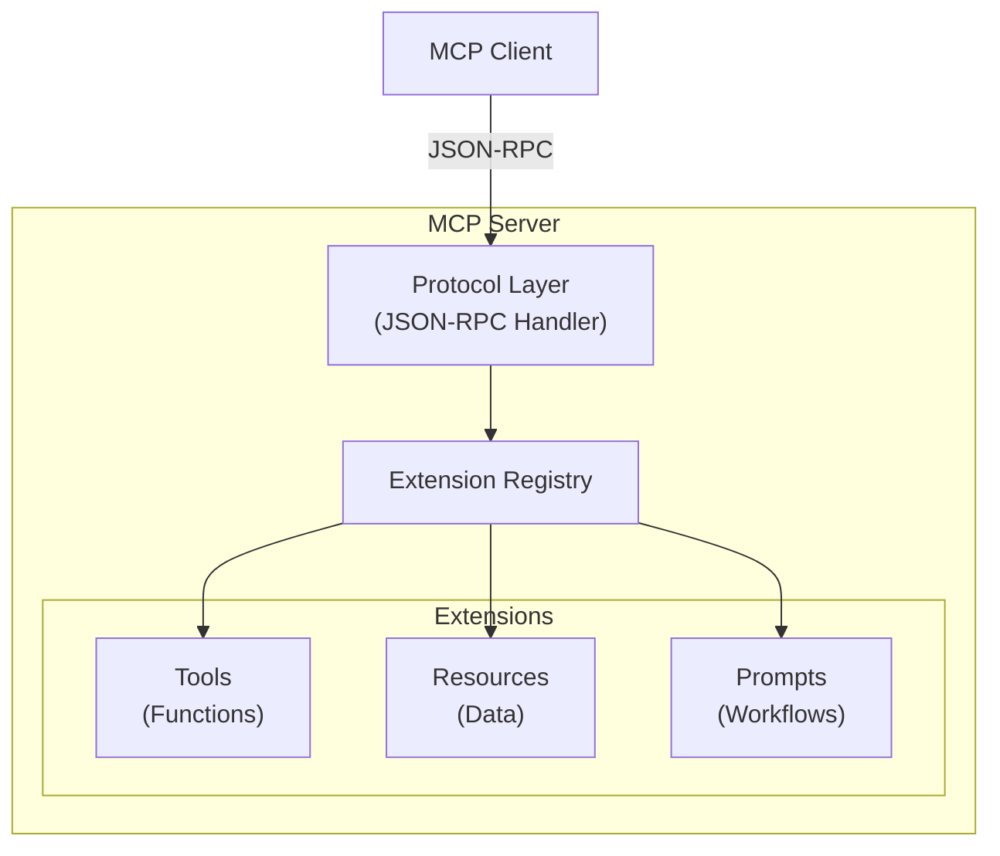

# MCP (Model Context Protocol) Implementation

## Overview

The MCP implementation is structured into four distinct layers, each with specific responsibilities:

```
mcp/
├── protocol.md     # Core protocol implementation
├── tools/          # Executable functions
├── resources/      # Data access endpoints
└── prompts/        # Pre-built workflows
```

## Architecture



## Component Responsibilities

### 1. Protocol Layer (`protocol.md`)

The protocol layer handles:
- JSON-RPC message processing
- Method routing (`initialize`, `tools/list`, `tools/invoke`, etc.)
- Request/response correlation
- Error handling and formatting
- Extension discovery and registration

### 2. Tools (`tools/`)

Tools are executable functions that perform actions:
- **search** - Search Spotify catalog
- **player_state** - Get playback information
- **player_control** - Control playback
- Future: playlist operations, recommendations

### 3. Resources (`resources/`)

Resources provide data access:
- **track** - Track information by URI
- **playlist** - Playlist data by URI
- **artist** - Artist information
- Future: albums, shows, episodes

### 4. Prompts (`prompts/`)

Prompts are pre-built workflows:
- **music_discovery** - Discover new music
- **playlist_generator** - Create playlists
- **music_analysis** - Analyze listening patterns

## Design Principles

### 1. Separation of Concerns

Each layer has a single, well-defined responsibility:
- Protocol handles communication
- Tools handle actions
- Resources handle data
- Prompts handle workflows

### 2. Extensibility

New capabilities can be added without modifying the protocol:
```typescript
// Register a new tool
registry.registerTool({
  name: 'new_tool',
  handler: newToolHandler,
  schema: newToolSchema
})
```

### 3. Type Safety

All components use strict TypeScript types:
```typescript
interface Tool<TInput, TOutput> {
  name: string
  description: string
  inputSchema: JsonSchema<TInput>
  handler: (input: TInput) => Promise<Result<TOutput, ToolError>>
}
```

### 4. Error Handling

Consistent error handling across all components:
```typescript
type MCPError = 
  | ProtocolError    // JSON-RPC errors
  | ToolError        // Tool execution errors
  | ResourceError    // Resource access errors
  | PromptError      // Prompt execution errors
```

## Implementation Guidelines

### Creating a New Tool

1. Define the tool specification in `tools/[tool-name].md`
2. Include:
   - Purpose and use cases
   - Input/output schemas
   - Error scenarios
   - Examples
   - Performance requirements

### Creating a New Resource

1. Define the resource specification in `resources/[resource-name].md`
2. Include:
   - URI pattern
   - Data schema
   - Access patterns
   - Caching strategy

### Creating a New Prompt

1. Define the prompt specification in `prompts/[prompt-name].md`
2. Include:
   - Use case description
   - Required tools/resources
   - Workflow steps
   - Parameter handling

## Testing Strategy

### Protocol Testing
- JSON-RPC compliance
- Method routing
- Error handling
- Extension loading

### Tool Testing
- Input validation
- Business logic
- Error cases
- Integration with Spotify API

### Resource Testing
- URI parsing
- Data fetching
- Caching behavior
- Access control

### Prompt Testing
- Workflow execution
- Parameter validation
- Tool coordination
- Output formatting

## Performance Considerations

### Protocol Layer
- Message parsing: < 1ms
- Method dispatch: < 1ms
- Response formatting: < 1ms

### Tools
- Simple queries: < 500ms
- Complex operations: < 2s
- Batch operations: < 5s

### Resources
- Cached data: < 10ms
- Fresh fetch: < 500ms
- Batch fetch: < 2s

### Prompts
- Simple workflows: < 2s
- Complex workflows: < 10s
- Interactive: < 30s

## Security Model

### Protocol Security
- Input validation
- Method authorization
- Rate limiting
- Audit logging

### Tool Security
- Parameter sanitization
- Scope verification
- Output filtering

### Resource Security
- URI validation
- Access control
- Data filtering

### Prompt Security
- Workflow validation
- Parameter bounds
- Result sanitization