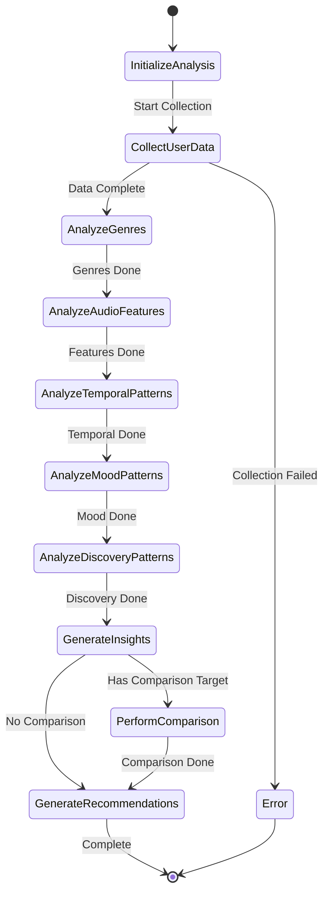

# Analyze Taste Prompt Specification

## Purpose & Responsibility

The Analyze Taste Prompt provides comprehensive music taste analysis and insights through natural language interactions. It is responsible for:

- Analyzing user's listening patterns and preferences
- Identifying musical characteristics and trends
- Providing personalized music insights and recommendations
- Comparing taste profiles with other users or artists

## Prompt Definition

### Prompt Registration

```typescript
const analyzeTastePrompt: PromptDefinition = {
  name: 'analyze-taste',
  description: 'Comprehensive analysis of your music taste and listening patterns',
  category: 'analytics',
  arguments: [
    {
      name: 'analysis_type',
      description: 'Type of analysis (e.g., "comprehensive", "genres", "audio_features", "temporal", "mood")',
      required: false
    },
    {
      name: 'time_range',
      description: 'Time range for analysis (e.g., "short_term", "medium_term", "long_term", "all_time")',
      required: false
    },
    {
      name: 'comparison_target',
      description: 'Optional comparison target (artist ID, user ID, or genre)',
      required: false
    },
    {
      name: 'depth',
      description: 'Analysis depth level ("surface", "detailed", "deep")',
      required: false
    }
  ]
}
```

## Interface Definition

### Handler Interface

```typescript
async function analyzeTastePromptHandler(
  request: PromptRequest
): Promise<Result<PromptResponse, PromptError>>
```

### Type Definitions

```typescript
interface AnalyzeTasteRequest {
  analysis_type?: 'comprehensive' | 'genres' | 'audio_features' | 'temporal' | 'mood' | 'discovery_patterns'
  time_range?: 'short_term' | 'medium_term' | 'long_term' | 'all_time'
  comparison_target?: {
    type: 'artist' | 'user' | 'genre' | 'playlist'
    id: string
    name?: string
  }
  depth?: 'surface' | 'detailed' | 'deep'
}

interface TasteAnalysisWorkflow {
  analysis_request: AnalyzeTasteRequest
  data_collection: DataCollectionStatus
  analysis_results: ComprehensiveTasteAnalysis
  insights: TasteInsight[]
  recommendations: TasteRecommendation[]
  comparison_results?: ComparisonAnalysis
}

interface DataCollectionStatus {
  top_tracks: { collected: boolean; count: number }
  top_artists: { collected: boolean; count: number }
  recently_played: { collected: boolean; count: number }
  saved_tracks: { collected: boolean; count: number }
  playlists: { collected: boolean; count: number }
  audio_features: { collected: boolean; count: number }
}

interface ComprehensiveTasteAnalysis {
  profile_summary: TasteProfileSummary
  genre_analysis: GenreAnalysis
  audio_features_profile: AudioFeaturesProfile
  temporal_patterns: TemporalPatterns
  mood_preferences: MoodPreferences
  discovery_patterns: DiscoveryPatterns
  listening_behavior: ListeningBehavior
  musical_sophistication: MusicalSophistication
}

interface TasteProfileSummary {
  dominant_characteristics: string[]
  musical_personality_type: string
  diversity_score: number
  adventurousness_score: number
  mainstream_appeal: number
  unique_traits: string[]
}

interface GenreAnalysis {
  primary_genres: GenrePreference[]
  genre_diversity: number
  genre_evolution: GenreEvolution[]
  subgenre_preferences: SubgenrePreference[]
  cross_genre_patterns: CrossGenrePattern[]
}

interface GenrePreference {
  genre: string
  percentage: number
  track_count: number
  affinity_score: number
  recency_trend: 'increasing' | 'stable' | 'decreasing'
  representative_artists: string[]
}

interface AudioFeaturesProfile {
  preferred_ranges: {
    energy: { min: number; max: number; avg: number; preference: string }
    valence: { min: number; max: number; avg: number; preference: string }
    danceability: { min: number; max: number; avg: number; preference: string }
    acousticness: { min: number; max: number; avg: number; preference: string }
    instrumentalness: { min: number; max: number; avg: number; preference: string }
    tempo: { min: number; max: number; avg: number; preference: string }
    loudness: { min: number; max: number; avg: number; preference: string }
  }
  feature_correlations: FeatureCorrelation[]
  ideal_track_profile: AudioFeatures
  listening_context_profiles: ContextProfile[]
}

interface TemporalPatterns {
  listening_schedule: HourlyPattern[]
  weekly_patterns: DayOfWeekPattern[]
  seasonal_trends: SeasonalTrend[]
  evolution_over_time: TasteEvolution[]
  consistency_score: number
}

interface MoodPreferences {
  mood_distribution: MoodDistribution[]
  mood_transitions: MoodTransition[]
  contextual_mood_preferences: ContextualMoodPreference[]
  emotional_range: number
}

interface DiscoveryPatterns {
  exploration_rate: number
  discovery_sources: DiscoverySource[]
  new_vs_familiar_ratio: number
  genre_exploration_patterns: GenreExploration[]
  artist_loyalty_patterns: ArtistLoyalty[]
}

interface TasteInsight {
  category: 'personality' | 'preferences' | 'patterns' | 'recommendations' | 'comparisons'
  title: string
  description: string
  confidence: number
  supporting_data: any
  actionable: boolean
  surprise_factor: number
}

interface ComparisonAnalysis {
  target: { type: string; id: string; name: string }
  similarity_score: number
  shared_preferences: SharedPreference[]
  unique_differences: TasteDifference[]
  recommendation_overlap: number
  compatibility_insights: string[]
}
```

## Dependencies

### External Dependencies
- Spotify Web API endpoints:
  - `GET /v1/me/top/tracks`
  - `GET /v1/me/top/artists`
  - `GET /v1/me/player/recently-played`
  - `GET /v1/me/tracks`
  - `GET /v1/me/playlists`
  - `GET /v1/audio-features`
  - `GET /v1/artists/{id}/top-tracks`
  - `GET /v1/recommendations`

### Internal Dependencies
- `user-analytics` - User data collection and analysis
- `audio-features-analyzer` - Audio feature analysis
- `genre-classifier` - Genre identification and classification
- `mood-analyzer` - Mood and emotion analysis
- `temporal-analyzer` - Time-based pattern analysis

## Behavior Specification

### Analysis Workflow



### Implementation Details

#### Data Collection and Preprocessing

```typescript
async function collectUserData(
  request: AnalyzeTasteRequest,
  context: PromptContext
): Promise<Result<UserMusicData, PromptError>> {
  const timeRange = request.time_range || 'medium_term'
  const depth = request.depth || 'detailed'
  
  // Determine data collection scope based on depth
  const collectionLimits = getCollectionLimits(depth)
  
  // Collect core data in parallel
  const [topTracksResult, topArtistsResult, recentlyPlayedResult] = await Promise.all([
    context.spotifyApi.getTopTracks({ time_range: timeRange, limit: collectionLimits.topTracks }),
    context.spotifyApi.getTopArtists({ time_range: timeRange, limit: collectionLimits.topArtists }),
    context.spotifyApi.getRecentlyPlayed({ limit: collectionLimits.recentlyPlayed })
  ])
  
  // Collect additional data if deep analysis requested
  let savedTracksResult, playlistsResult
  if (depth === 'deep') {
    [savedTracksResult, playlistsResult] = await Promise.all([
      context.spotifyApi.getSavedTracks({ limit: collectionLimits.savedTracks }),
      context.spotifyApi.getUserPlaylists({ limit: collectionLimits.playlists })
    ])
  }
  
  // Combine all track data and get audio features
  const allTracks = combineTrackData(
    topTracksResult.isOk() ? topTracksResult.value.items : [],
    recentlyPlayedResult.isOk() ? recentlyPlayedResult.value.items.map(i => i.track) : [],
    savedTracksResult?.isOk() ? savedTracksResult.value.items.map(i => i.track) : []
  )
  
  const audioFeaturesResult = await getAudioFeaturesForTracks(allTracks, context)
  
  return ok({
    top_tracks: topTracksResult.isOk() ? topTracksResult.value : { items: [], total: 0 },
    top_artists: topArtistsResult.isOk() ? topArtistsResult.value : { items: [], total: 0 },
    recently_played: recentlyPlayedResult.isOk() ? recentlyPlayedResult.value : { items: [], total: 0 },
    saved_tracks: savedTracksResult?.isOk() ? savedTracksResult.value : undefined,
    playlists: playlistsResult?.isOk() ? playlistsResult.value : undefined,
    audio_features: audioFeaturesResult.isOk() ? audioFeaturesResult.value : []
  })
}

function getCollectionLimits(depth: string) {
  switch (depth) {
    case 'surface':
      return { topTracks: 20, topArtists: 10, recentlyPlayed: 20, savedTracks: 0, playlists: 0 }
    case 'detailed':
      return { topTracks: 50, topArtists: 20, recentlyPlayed: 50, savedTracks: 50, playlists: 10 }
    case 'deep':
      return { topTracks: 50, topArtists: 50, recentlyPlayed: 50, savedTracks: 500, playlists: 50 }
    default:
      return { topTracks: 50, topArtists: 20, recentlyPlayed: 50, savedTracks: 0, playlists: 0 }
  }
}
```

#### Comprehensive Taste Analysis

```typescript
async function performTasteAnalysis(
  userData: UserMusicData,
  request: AnalyzeTasteRequest
): Promise<ComprehensiveTasteAnalysis> {
  const analysis: Partial<ComprehensiveTasteAnalysis> = {}
  
  // Genre Analysis
  analysis.genre_analysis = await analyzeGenrePreferences(userData)
  
  // Audio Features Analysis
  analysis.audio_features_profile = analyzeAudioFeaturesProfile(userData.audio_features)
  
  // Temporal Patterns (if we have timestamped data)
  analysis.temporal_patterns = analyzeTemporalPatterns(userData.recently_played)
  
  // Mood Preferences
  analysis.mood_preferences = analyzeMoodPreferences(userData.audio_features, userData.top_tracks)
  
  // Discovery Patterns
  analysis.discovery_patterns = analyzeDiscoveryPatterns(userData)
  
  // Listening Behavior
  analysis.listening_behavior = analyzeListeningBehavior(userData)
  
  // Musical Sophistication
  analysis.musical_sophistication = assessMusicalSophistication(analysis as ComprehensiveTasteAnalysis)
  
  // Generate Profile Summary
  analysis.profile_summary = generateTasteProfileSummary(analysis as ComprehensiveTasteAnalysis)
  
  return analysis as ComprehensiveTasteAnalysis
}

async function analyzeGenrePreferences(userData: UserMusicData): Promise<GenreAnalysis> {
  // Collect genres from artists
  const allGenres = userData.top_artists.items.flatMap(artist => artist.genres)
  const genreCounts = countGenreOccurrences(allGenres)
  
  // Calculate genre preferences with affinity scores
  const genrePreferences = calculateGenreAffinityScores(genreCounts, userData.top_tracks.items)
  
  // Analyze genre diversity
  const genreDiversity = calculateGenreDiversity(genrePreferences)
  
  // Track genre evolution over time
  const genreEvolution = analyzeGenreEvolution(userData.recently_played)
  
  // Identify subgenre preferences
  const subgenrePreferences = identifySubgenrePreferences(allGenres, userData.audio_features)
  
  // Find cross-genre patterns
  const crossGenrePatterns = findCrossGenrePatterns(userData.top_tracks.items, userData.audio_features)
  
  return {
    primary_genres: genrePreferences.slice(0, 10),
    genre_diversity: genreDiversity,
    genre_evolution: genreEvolution,
    subgenre_preferences: subgenrePreferences,
    cross_genre_patterns: crossGenrePatterns
  }
}

function analyzeAudioFeaturesProfile(audioFeatures: AudioFeatures[]): AudioFeaturesProfile {
  if (audioFeatures.length === 0) {
    return createDefaultAudioFeaturesProfile()
  }
  
  // Calculate preferred ranges for each feature
  const preferredRanges = {
    energy: calculateFeatureRange(audioFeatures, 'energy'),
    valence: calculateFeatureRange(audioFeatures, 'valence'),
    danceability: calculateFeatureRange(audioFeatures, 'danceability'),
    acousticness: calculateFeatureRange(audioFeatures, 'acousticness'),
    instrumentalness: calculateFeatureRange(audioFeatures, 'instrumentalness'),
    tempo: calculateFeatureRange(audioFeatures, 'tempo'),
    loudness: calculateFeatureRange(audioFeatures, 'loudness')
  }
  
  // Calculate feature correlations
  const featureCorrelations = calculateFeatureCorrelations(audioFeatures)
  
  // Create ideal track profile
  const idealTrackProfile = createIdealTrackProfile(preferredRanges)
  
  // Analyze context-specific profiles
  const contextProfiles = analyzeContextProfiles(audioFeatures)
  
  return {
    preferred_ranges: preferredRanges,
    feature_correlations: featureCorrelations,
    ideal_track_profile: idealTrackProfile,
    listening_context_profiles: contextProfiles
  }
}

function calculateFeatureRange(features: AudioFeatures[], featureName: keyof AudioFeatures) {
  const values = features.map(f => f[featureName] as number).filter(v => v !== undefined)
  
  if (values.length === 0) {
    return { min: 0, max: 1, avg: 0.5, preference: 'unknown' }
  }
  
  const min = Math.min(...values)
  const max = Math.max(...values)
  const avg = values.reduce((sum, val) => sum + val, 0) / values.length
  
  return {
    min,
    max,
    avg,
    preference: generateFeaturePreferenceDescription(featureName, avg)
  }
}

function generateFeaturePreferenceDescription(featureName: string, avgValue: number): string {
  const descriptions = {
    energy: avgValue > 0.7 ? 'High-energy music' : avgValue > 0.4 ? 'Moderate energy' : 'Low-energy music',
    valence: avgValue > 0.7 ? 'Very positive/happy' : avgValue > 0.4 ? 'Balanced mood' : 'Melancholic/sad',
    danceability: avgValue > 0.7 ? 'Highly danceable' : avgValue > 0.4 ? 'Moderately danceable' : 'Not dance-oriented',
    acousticness: avgValue > 0.7 ? 'Acoustic preference' : avgValue > 0.4 ? 'Mixed acoustic/electric' : 'Electronic preference',
    instrumentalness: avgValue > 0.5 ? 'Instrumental focus' : 'Vocal-focused',
    tempo: avgValue > 140 ? 'Fast tempo preference' : avgValue > 100 ? 'Moderate tempo' : 'Slow tempo preference',
    loudness: avgValue > -5 ? 'Loud music' : avgValue > -10 ? 'Moderate volume' : 'Quiet music'
  }
  
  return descriptions[featureName] || 'Unknown preference'
}
```

#### Insight Generation

```typescript
function generateTasteInsights(analysis: ComprehensiveTasteAnalysis): TasteInsight[] {
  const insights: TasteInsight[] = []
  
  // Personality insights
  insights.push(...generatePersonalityInsights(analysis))
  
  // Preference insights
  insights.push(...generatePreferenceInsights(analysis))
  
  // Pattern insights
  insights.push(...generatePatternInsights(analysis))
  
  // Surprise insights (unexpected findings)
  insights.push(...generateSurpriseInsights(analysis))
  
  // Actionable insights
  insights.push(...generateActionableInsights(analysis))
  
  return insights.sort((a, b) => b.confidence - a.confidence)
}

function generatePersonalityInsights(analysis: ComprehensiveTasteAnalysis): TasteInsight[] {
  const insights: TasteInsight[] = []
  
  // Musical adventurousness
  if (analysis.profile_summary.adventurousness_score > 0.7) {
    insights.push({
      category: 'personality',
      title: 'Musical Explorer',
      description: 'You have a strong tendency to explore new music and diverse genres. Your adventurous spirit shows in your willingness to try different sounds and artists.',
      confidence: 0.85,
      supporting_data: {
        adventurousness_score: analysis.profile_summary.adventurousness_score,
        genre_diversity: analysis.genre_analysis.genre_diversity,
        discovery_rate: analysis.discovery_patterns.exploration_rate
      },
      actionable: true,
      surprise_factor: 0.3
    })
  }
  
  // Genre consistency
  if (analysis.genre_analysis.genre_diversity < 0.3) {
    insights.push({
      category: 'personality',
      title: 'Genre Loyalist',
      description: 'You show strong loyalty to specific genres, preferring depth over breadth in your musical exploration.',
      confidence: 0.8,
      supporting_data: {
        primary_genres: analysis.genre_analysis.primary_genres.slice(0, 3),
        diversity_score: analysis.genre_analysis.genre_diversity
      },
      actionable: true,
      surprise_factor: 0.2
    })
  }
  
  return insights
}

function generateActionableInsights(analysis: ComprehensiveTasteAnalysis): TasteInsight[] {
  const insights: TasteInsight[] = []
  
  // Recommendation for genre expansion
  if (analysis.genre_analysis.genre_diversity < 0.5) {
    const relatedGenres = findRelatedGenres(analysis.genre_analysis.primary_genres)
    
    insights.push({
      category: 'recommendations',
      title: 'Expand Your Musical Horizons',
      description: `Based on your love for ${analysis.genre_analysis.primary_genres[0].genre}, you might enjoy exploring ${relatedGenres.join(', ')}.`,
      confidence: 0.75,
      supporting_data: {
        current_genres: analysis.genre_analysis.primary_genres.slice(0, 3),
        suggested_genres: relatedGenres
      },
      actionable: true,
      surprise_factor: 0.4
    })
  }
  
  return insights
}
```

### Response Generation

```typescript
function generateAnalyzeTasteResponse(
  workflow: TasteAnalysisWorkflow,
  analysis: ComprehensiveTasteAnalysis
): PromptResponse {
  const messages: PromptMessage[] = [
    {
      role: 'assistant',
      content: {
        type: 'text',
        text: generateTasteSummary(analysis)
      }
    },
    {
      role: 'assistant',
      content: {
        type: 'resource',
        resource: {
          uri: 'spotify://analysis/taste-profile',
          text: JSON.stringify({
            profile_summary: analysis.profile_summary,
            top_insights: workflow.insights.slice(0, 5),
            genre_breakdown: analysis.genre_analysis.primary_genres.slice(0, 5),
            audio_preferences: analysis.audio_features_profile.preferred_ranges,
            recommendations: workflow.recommendations.slice(0, 3)
          }, null, 2)
        }
      }
    }
  ]
  
  // Add comparison results if available
  if (workflow.comparison_results) {
    messages.push({
      role: 'assistant',
      content: {
        type: 'resource',
        resource: {
          uri: 'spotify://analysis/taste-comparison',
          text: JSON.stringify(workflow.comparison_results, null, 2)
        }
      }
    })
  }
  
  return {
    description: 'Your Musical Taste Analysis',
    messages
  }
}

function generateTasteSummary(analysis: ComprehensiveTasteAnalysis): string {
  const summary = []
  
  summary.push(`🎵 **Your Musical Personality**: ${analysis.profile_summary.musical_personality_type}`)
  summary.push(`📊 **Diversity Score**: ${Math.round(analysis.profile_summary.diversity_score * 100)}% - ${analysis.profile_summary.diversity_score > 0.7 ? 'Very diverse' : analysis.profile_summary.diversity_score > 0.4 ? 'Moderately diverse' : 'Focused'}`)
  
  const topGenres = analysis.genre_analysis.primary_genres.slice(0, 3).map(g => g.genre).join(', ')
  summary.push(`🎸 **Top Genres**: ${topGenres}`)
  
  const moodDescription = describeMoodPreferences(analysis.audio_features_profile.preferred_ranges)
  summary.push(`😊 **Mood Preferences**: ${moodDescription}`)
  
  if (analysis.discovery_patterns.exploration_rate > 0.3) {
    summary.push(`🔍 **Discovery Style**: You actively seek out new music (${Math.round(analysis.discovery_patterns.exploration_rate * 100)}% exploration rate)`)
  }
  
  summary.push(`\n🎯 **Key Insights**: ${analysis.profile_summary.unique_traits.slice(0, 2).join(' • ')}`)
  
  return summary.join('\n')
}
```

## Testing Requirements

### Unit Tests

```typescript
describe('Analyze Taste Prompt', () => {
  describe('Data Collection', () => {
    it('should collect user data based on depth setting')
    it('should handle API failures gracefully')
    it('should optimize data collection for different time ranges')
    it('should combine data from multiple sources correctly')
  })
  
  describe('Analysis Functions', () => {
    it('should analyze genre preferences accurately')
    it('should calculate audio feature profiles correctly')
    it('should identify temporal listening patterns')
    it('should assess musical sophistication appropriately')
  })
  
  describe('Insight Generation', () => {
    it('should generate relevant personality insights')
    it('should provide actionable recommendations')
    it('should identify surprising patterns')
    it('should rank insights by confidence and relevance')
  })
  
  describe('Comparison Analysis', () => {
    it('should compare taste profiles with artists')
    it('should identify shared preferences accurately')
    it('should calculate similarity scores correctly')
    it('should provide meaningful comparison insights')
  })
})
```

## Performance Constraints

### Response Time Targets
- Surface analysis: < 10s
- Detailed analysis: < 30s  
- Deep analysis: < 60s
- Comparison analysis: < 20s additional

### Resource Limits
- Maximum tracks analyzed: 1000
- Maximum artists analyzed: 100
- Analysis cache: 2 hours TTL
- Insight generation: < 5s

## Security Considerations

### Access Control
- Verify user has access to requested data
- Respect private listening data
- Handle comparison targets appropriately
- Validate analysis scope permissions

### Data Privacy
- Don't persist detailed listening patterns
- Respect user privacy preferences
- Anonymize comparison data when possible
- Handle sensitive insights appropriately

### Input Validation
- Validate comparison target IDs
- Limit analysis scope and depth
- Prevent unauthorized data access
- Rate limit analysis requests