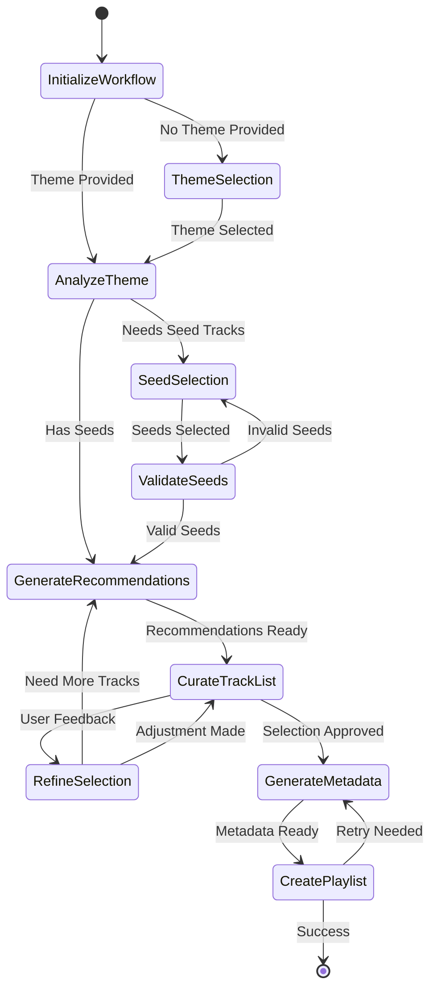

# Create Playlist Prompt Specification

## Purpose & Responsibility

The Create Playlist Prompt provides intelligent playlist creation workflows through natural language interactions. It is responsible for:

- Guiding users through playlist creation with smart suggestions
- Generating playlist names and descriptions
- Recommending tracks based on user preferences and context
- Supporting various playlist creation strategies

## Prompt Definition

### Prompt Registration

```typescript
const createPlaylistPrompt: PromptDefinition = {
  name: 'create-playlist',
  description: 'Interactive assistant for creating personalized Spotify playlists',
  category: 'creation',
  arguments: [
    {
      name: 'theme',
      description: 'Playlist theme or mood (e.g., "workout", "chill evening", "road trip")',
      required: false
    },
    {
      name: 'seed_tracks',
      description: 'Array of track IDs to use as seeds for recommendations',
      required: false
    },
    {
      name: 'target_length',
      description: 'Desired playlist length in minutes or track count',
      required: false
    },
    {
      name: 'preferences',
      description: 'User preferences (genres, energy level, explicit content, etc.)',
      required: false
    }
  ]
}
```

## Interface Definition

### Handler Interface

```typescript
async function createPlaylistPromptHandler(
  request: PromptRequest
): Promise<Result<PromptResponse, PromptError>>
```

### Type Definitions

```typescript
interface CreatePlaylistRequest {
  theme?: string
  seed_tracks?: string[]
  target_length?: number | string
  preferences?: {
    genres?: string[]
    energy_level?: 'low' | 'medium' | 'high'
    valence_level?: 'sad' | 'neutral' | 'happy'
    explicit_content?: boolean
    time_period?: string // e.g., "2020s", "90s"
    include_popular?: boolean
    diversity_factor?: number // 0-1, how diverse the playlist should be
  }
}

interface PlaylistCreationWorkflow {
  steps: PlaylistCreationStep[]
  current_step: number
  playlist_metadata: {
    suggested_name: string
    suggested_description: string
    estimated_duration: number
    track_count: number
  }
  track_suggestions: TrackSuggestion[]
  user_context: UserPlaylistContext
}

interface PlaylistCreationStep {
  id: string
  type: 'theme_selection' | 'seed_selection' | 'preference_setting' | 'track_curation' | 'finalization'
  title: string
  description: string
  options?: StepOption[]
  user_input?: any
  completed: boolean
}

interface TrackSuggestion {
  track: SpotifyTrack
  reason: string
  confidence: number
  category: 'seed' | 'recommendation' | 'mood_match' | 'genre_match' | 'user_history'
  audio_features_match?: {
    energy: number
    valence: number
    danceability: number
  }
}

interface UserPlaylistContext {
  listening_history?: {
    top_tracks: string[]
    top_artists: string[]
    top_genres: string[]
  }
  current_mood?: {
    energy: number
    valence: number
  }
  playlist_patterns?: {
    preferred_length: number
    genre_diversity: number
    era_preferences: string[]
  }
}
```

## Dependencies

### External Dependencies
- Spotify Web API endpoints:
  - `GET /v1/recommendations`
  - `POST /v1/users/{user_id}/playlists`
  - `POST /v1/playlists/{playlist_id}/tracks`
  - `GET /v1/me/top/tracks`
  - `GET /v1/me/top/artists`
  - `GET /v1/audio-features`

### Internal Dependencies
- `recommendations-tool` - Generate track recommendations
- `playlist-create-tool` - Create playlists on Spotify
- `user-analytics` - Get user listening patterns
- `audio-features-analyzer` - Analyze track compatibility

## Behavior Specification

### Workflow State Machine



### Implementation Details

#### Workflow Initialization

```typescript
async function initializePlaylistCreationWorkflow(
  request: CreatePlaylistRequest,
  context: PromptContext
): Promise<Result<PlaylistCreationWorkflow, PromptError>> {
  // Get user context for personalization
  const userContextResult = await getUserPlaylistContext(context)
  const userContext = userContextResult.isOk() ? userContextResult.value : undefined
  
  // Analyze theme if provided
  const themeAnalysis = request.theme 
    ? await analyzePlaylistTheme(request.theme, userContext)
    : undefined
  
  // Initialize workflow steps
  const steps = generateWorkflowSteps(request, themeAnalysis)
  
  const workflow: PlaylistCreationWorkflow = {
    steps,
    current_step: 0,
    playlist_metadata: {
      suggested_name: generatePlaylistName(request.theme, themeAnalysis),
      suggested_description: generatePlaylistDescription(request.theme, themeAnalysis),
      estimated_duration: calculateTargetDuration(request.target_length),
      track_count: calculateTargetTrackCount(request.target_length)
    },
    track_suggestions: [],
    user_context: userContext || {}
  }
  
  return ok(workflow)
}

async function analyzePlaylistTheme(
  theme: string,
  userContext?: UserPlaylistContext
): Promise<ThemeAnalysis> {
  // Use LLM or predefined patterns to analyze theme
  const moodKeywords = extractMoodKeywords(theme)
  const activityKeywords = extractActivityKeywords(theme)
  const genreHints = extractGenreHints(theme)
  
  return {
    mood_indicators: {
      energy: inferEnergyLevel(moodKeywords, activityKeywords),
      valence: inferValenceLevel(moodKeywords),
      context: inferListeningContext(activityKeywords)
    },
    genre_preferences: genreHints,
    audio_features_targets: calculateAudioTargets(moodKeywords, activityKeywords),
    recommended_length: inferPlaylistLength(activityKeywords),
    personalization_hints: userContext ? generatePersonalizationHints(userContext, theme) : undefined
  }
}
```

#### Track Recommendation and Curation

```typescript
async function generatePlaylistRecommendations(
  workflow: PlaylistCreationWorkflow,
  context: PromptContext
): Promise<Result<TrackSuggestion[], PromptError>> {
  const suggestions: TrackSuggestion[] = []
  const targetCount = workflow.playlist_metadata.track_count
  
  // Get seed tracks from user input or listening history
  const seedTracks = await getSeedTracks(workflow, context)
  
  // Generate core recommendations
  const coreRecommendations = await generateCoreRecommendations(
    seedTracks,
    workflow.playlist_metadata,
    workflow.user_context,
    Math.floor(targetCount * 0.7) // 70% core recommendations
  )
  
  if (coreRecommendations.isErr()) {
    return err(coreRecommendations.error)
  }
  
  suggestions.push(...coreRecommendations.value)
  
  // Add discovery tracks (20% discovery)
  const discoveryTracks = await generateDiscoveryTracks(
    workflow,
    context,
    Math.floor(targetCount * 0.2)
  )
  
  if (discoveryTracks.isOk()) {
    suggestions.push(...discoveryTracks.value)
  }
  
  // Add user history matches (10% familiarity)
  const historyMatches = await generateHistoryMatches(
    workflow,
    context,
    Math.floor(targetCount * 0.1)
  )
  
  if (historyMatches.isOk()) {
    suggestions.push(...historyMatches.value)
  }
  
  // Optimize track order and diversity
  const optimizedSuggestions = optimizeTrackSelection(suggestions, workflow)
  
  return ok(optimizedSuggestions)
}

function optimizeTrackSelection(
  suggestions: TrackSuggestion[],
  workflow: PlaylistCreationWorkflow
): TrackSuggestion[] {
  // Remove duplicates
  const uniqueSuggestions = removeDuplicateTracks(suggestions)
  
  // Apply diversity constraints
  const diversifiedSuggestions = applyDiversityConstraints(
    uniqueSuggestions,
    workflow.user_context.playlist_patterns?.genre_diversity || 0.7
  )
  
  // Order by confidence and flow
  const orderedSuggestions = orderByFlowAndConfidence(diversifiedSuggestions)
  
  // Trim to target count
  return orderedSuggestions.slice(0, workflow.playlist_metadata.track_count)
}
```

#### Playlist Name and Description Generation

```typescript
function generatePlaylistName(
  theme?: string,
  analysis?: ThemeAnalysis
): string {
  if (!theme) {
    return generateGenericPlaylistName()
  }
  
  const templates = getNameTemplates(analysis)
  const nameElements = extractNameElements(theme, analysis)
  
  return applyNameTemplate(templates[0], nameElements)
}

function generatePlaylistDescription(
  theme?: string,
  analysis?: ThemeAnalysis
): string {
  if (!theme) {
    return "A personalized playlist created just for you"
  }
  
  const elements = [
    generateThemeDescription(theme),
    generateMoodDescription(analysis?.mood_indicators),
    generateContextDescription(analysis?.mood_indicators?.context),
    "Perfect for your listening experience."
  ].filter(Boolean)
  
  return elements.join(' ')
}

function getNameTemplates(analysis?: ThemeAnalysis): string[] {
  const energy = analysis?.mood_indicators?.energy || 'medium'
  const context = analysis?.mood_indicators?.context || 'general'
  
  const templates = {
    workout: ["Power {adjective}", "{adjective} Energy", "Gym {descriptor}"],
    chill: ["{adjective} Vibes", "Chill {descriptor}", "{adjective} Evening"],
    party: ["Party {adjective}", "{adjective} Night", "Dance {descriptor}"],
    focus: ["Focus {adjective}", "{adjective} Concentration", "Deep {descriptor}"],
    road_trip: ["{adjective} Journey", "Road {descriptor}", "{adjective} Miles"],
    general: ["{adjective} Mix", "My {descriptor}", "{adjective} Collection"]
  }
  
  return templates[context] || templates.general
}
```

### Response Generation

```typescript
function generateCreatePlaylistResponse(
  workflow: PlaylistCreationWorkflow,
  step_results?: any
): PromptResponse {
  const currentStep = workflow.steps[workflow.current_step]
  
  if (currentStep.type === 'finalization' && currentStep.completed) {
    return generateCompletionResponse(workflow)
  }
  
  return generateStepResponse(workflow, currentStep)
}

function generateStepResponse(
  workflow: PlaylistCreationWorkflow,
  step: PlaylistCreationStep
): PromptResponse {
  const messages: PromptMessage[] = [
    {
      role: 'assistant',
      content: {
        type: 'text',
        text: generateStepInstructions(step, workflow)
      }
    }
  ]
  
  if (step.type === 'track_curation' && workflow.track_suggestions.length > 0) {
    messages.push({
      role: 'assistant',
      content: {
        type: 'resource',
        resource: {
          uri: `spotify://playlists/preview/${workflow.current_step}`,
          text: JSON.stringify({
            metadata: workflow.playlist_metadata,
            suggestions: workflow.track_suggestions.slice(0, 10) // Preview first 10
          }, null, 2)
        }
      }
    })
  }
  
  return {
    description: `Create Playlist: ${step.title}`,
    messages
  }
}

function generateStepInstructions(
  step: PlaylistCreationStep,
  workflow: PlaylistCreationWorkflow
): string {
  switch (step.type) {
    case 'theme_selection':
      return "Let's create the perfect playlist for you! What's the occasion or mood? For example: 'workout motivation', 'chill evening', 'road trip', or 'focus time'."
    
    case 'seed_selection':
      return `Great! I'll create a ${workflow.playlist_metadata.suggested_name} playlist. To get started, could you share a few songs or artists you'd like to include? Or would you like me to suggest some based on your listening history?`
    
    case 'preference_setting':
      return `Perfect! Now let's fine-tune your playlist. I can adjust the energy level, include explicit content, focus on specific genres, or match a particular time period. What preferences do you have?`
    
    case 'track_curation':
      return `Here's what I've curated for your ${workflow.playlist_metadata.suggested_name} playlist! I've included ${workflow.track_suggestions.length} tracks that match your preferences. You can review the suggestions, ask me to add or remove specific tracks, or adjust the overall vibe.`
    
    case 'finalization':
      return `Your playlist looks perfect! Ready to create "${workflow.playlist_metadata.suggested_name}" with these ${workflow.track_suggestions.length} tracks? I can also adjust the name or description if you'd like.`
    
    default:
      return "Let's continue building your playlist!"
  }
}
```

## Testing Requirements

### Unit Tests

```typescript
describe('Create Playlist Prompt', () => {
  describe('Workflow Initialization', () => {
    it('should initialize workflow with theme analysis')
    it('should handle workflow without theme')
    it('should incorporate user context')
    it('should generate appropriate metadata')
  })
  
  describe('Theme Analysis', () => {
    it('should extract mood indicators from theme')
    it('should identify activity contexts')
    it('should infer audio feature targets')
    it('should handle ambiguous themes')
  })
  
  describe('Track Recommendation', () => {
    it('should generate diverse track suggestions')
    it('should respect user preferences')
    it('should balance familiarity and discovery')
    it('should optimize track order')
  })
  
  describe('Response Generation', () => {
    it('should provide step-by-step guidance')
    it('should include relevant suggestions')
    it('should handle user feedback')
    it('should generate completion responses')
  })
})
```

## Performance Constraints

### Response Time Targets
- Theme analysis: < 500ms
- Track recommendations: < 3s
- Name/description generation: < 200ms
- Full workflow step: < 4s

### Resource Limits
- Maximum recommendations per step: 50
- Workflow state size: < 5MB
- User context cache: 30 minutes TTL

## Security Considerations

### Access Control
- Verify user has playlist creation permissions
- Validate seed track accessibility
- Respect user's explicit content settings
- Check playlist privacy preferences

### Data Privacy
- Don't persist sensitive user preferences
- Respect listening history privacy
- Filter inappropriate content suggestions
- Handle user feedback data appropriately

### Input Validation
- Sanitize theme descriptions
- Validate seed track IDs
- Limit workflow complexity
- Prevent malicious prompt injection