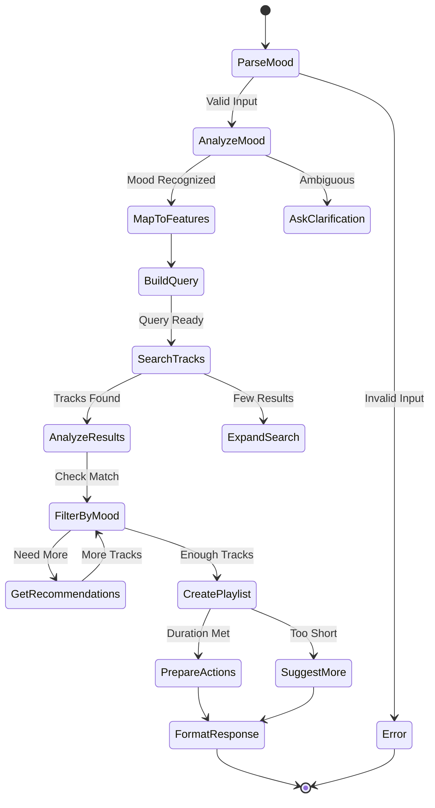

# Discover by Mood Prompt Specification

## Purpose & Responsibility

The Discover by Mood prompt helps users find music that matches their current emotional state or desired atmosphere. It is responsible for:

- Translating mood descriptions into musical characteristics
- Finding tracks that match the desired mood
- Creating cohesive playlists from discoveries
- Learning from user feedback

## Prompt Definition

### Registration

```typescript
const discoverByMoodPrompt: PromptDefinition = {
  name: 'discover_by_mood',
  description: 'Find music that matches your current mood or desired atmosphere',
  category: 'discovery',
  arguments: [
    {
      name: 'mood',
      description: 'Describe your mood (e.g., "energetic", "melancholy", "focused")',
      required: true
    },
    {
      name: 'genre',
      description: 'Preferred genre (optional)',
      required: false
    },
    {
      name: 'duration',
      description: 'Playlist duration in minutes (default: 60)',
      required: false
    }
  ],
  template: MOOD_PROMPT_TEMPLATE,
  followUp: [
    'adjust_mood_intensity',
    'save_as_playlist',
    'find_similar_moods'
  ]
}
```

### Template Definition

```typescript
const MOOD_PROMPT_TEMPLATE = `
I'll help you discover music that matches your {{mood}} mood.

Let me analyze what musical characteristics typically match this mood and find some great tracks for you.

{{#if genre}}
I'll focus on {{genre}} music as requested.
{{/if}}

[ANALYZING MOOD: {{mood}}]
Based on your mood, I'll look for music with:
{{moodCharacteristics}}

[SEARCHING FOR TRACKS]
Finding tracks that match these characteristics...

[RESULTS]
{{searchResults}}

{{#if duration}}
[CREATING PLAYLIST]
I've selected tracks to create approximately {{duration}} minutes of music.
{{/if}}

Would you like me to:
1. Play these tracks now
2. Save as a playlist
3. Adjust the mood intensity
4. Find more tracks like these
`
```

## Interface Definition

### Handler Interface

```typescript
async function discoverByMoodHandler(
  args: DiscoverByMoodArgs,
  context: PromptContext
): Promise<Result<PromptResult, PromptError>>
```

### Type Definitions

```typescript
interface DiscoverByMoodArgs {
  mood: string
  genre?: string
  duration?: number
}

interface MoodCharacteristics {
  energy: Range<0, 1>
  valence: Range<0, 1>
  danceability: Range<0, 1>
  acousticness: Range<0, 1>
  instrumentalness: Range<0, 1>
  tempo: Range<60, 200>
}

interface PromptResult {
  message: string
  data: {
    tracks: SpotifyTrack[]
    characteristics: MoodCharacteristics
    playlistDuration: number
  }
  actions: PromptAction[]
}

interface PromptAction {
  id: string
  label: string
  tool: string
  args: Record<string, any>
}
```

## Dependencies

### Internal Dependencies
- `mood-analyzer` - Convert mood to audio features
- `search` tool - Find matching tracks
- `audio_features` tool - Analyze track characteristics
- `recommendations` tool - Expand search results
- `playlist_create` tool - Save discoveries

## Behavior Specification

### Execution Flow



### Mood Analysis

```typescript
const MOOD_MAPPINGS: Record<string, MoodCharacteristics> = {
  // Positive moods
  'happy': {
    energy: [0.6, 0.9],
    valence: [0.7, 1.0],
    danceability: [0.6, 0.9],
    acousticness: [0.0, 0.5],
    instrumentalness: [0.0, 0.3],
    tempo: [120, 160]
  },
  'energetic': {
    energy: [0.8, 1.0],
    valence: [0.5, 0.9],
    danceability: [0.7, 1.0],
    acousticness: [0.0, 0.3],
    instrumentalness: [0.0, 0.4],
    tempo: [140, 180]
  },
  
  // Calm moods
  'relaxed': {
    energy: [0.1, 0.4],
    valence: [0.4, 0.7],
    danceability: [0.2, 0.5],
    acousticness: [0.4, 0.9],
    instrumentalness: [0.3, 0.8],
    tempo: [60, 100]
  },
  'focused': {
    energy: [0.3, 0.6],
    valence: [0.4, 0.6],
    danceability: [0.2, 0.4],
    acousticness: [0.2, 0.7],
    instrumentalness: [0.5, 0.9],
    tempo: [90, 120]
  },
  
  // Complex moods
  'melancholy': {
    energy: [0.2, 0.5],
    valence: [0.1, 0.4],
    danceability: [0.2, 0.5],
    acousticness: [0.3, 0.8],
    instrumentalness: [0.1, 0.6],
    tempo: [70, 110]
  }
}

function analyzeMood(input: string): MoodCharacteristics {
  // Direct mapping
  if (MOOD_MAPPINGS[input.toLowerCase()]) {
    return MOOD_MAPPINGS[input.toLowerCase()]
  }
  
  // Compound moods
  const words = input.toLowerCase().split(/\s+/)
  const characteristics = words
    .map(word => MOOD_MAPPINGS[word])
    .filter(Boolean)
  
  if (characteristics.length > 0) {
    return averageCharacteristics(characteristics)
  }
  
  // ML-based analysis (future)
  return inferMoodFromNLP(input)
}
```

### Track Selection

```typescript
async function selectTracksForMood(
  characteristics: MoodCharacteristics,
  args: DiscoverByMoodArgs,
  context: PromptContext
): Promise<SpotifyTrack[]> {
  // 1. Initial search with genre
  const searchQuery = args.genre 
    ? `genre:${args.genre}` 
    : generateSearchQuery(characteristics)
  
  const searchResult = await context.tools.search({
    query: searchQuery,
    limit: 50
  })
  
  // 2. Get audio features for all tracks
  const tracksWithFeatures = await Promise.all(
    searchResult.tracks.map(async track => {
      const features = await context.tools.audio_features({
        trackId: track.id
      })
      return { track, features }
    })
  )
  
  // 3. Score tracks by mood match
  const scoredTracks = tracksWithFeatures.map(({ track, features }) => ({
    track,
    score: calculateMoodMatch(features, characteristics)
  }))
  
  // 4. Sort by score and diversity
  return selectDiverseTracks(
    scoredTracks,
    args.duration || 60
  )
}

function calculateMoodMatch(
  features: AudioFeatures,
  target: MoodCharacteristics
): number {
  const weights = {
    energy: 0.25,
    valence: 0.25,
    danceability: 0.15,
    acousticness: 0.15,
    instrumentalness: 0.10,
    tempo: 0.10
  }
  
  let score = 0
  for (const [key, weight] of Object.entries(weights)) {
    const value = features[key]
    const [min, max] = target[key]
    
    if (value >= min && value <= max) {
      // Perfect match within range
      score += weight
    } else {
      // Partial score based on distance
      const distance = value < min ? min - value : value - max
      score += weight * Math.max(0, 1 - distance)
    }
  }
  
  return score
}
```

### Response Generation

```typescript
function generateMoodResponse(
  args: DiscoverByMoodArgs,
  tracks: SpotifyTrack[],
  characteristics: MoodCharacteristics
): PromptResult {
  const totalDuration = tracks.reduce(
    (sum, track) => sum + track.duration_ms,
    0
  ) / 60000 // Convert to minutes
  
  const actions: PromptAction[] = [
    {
      id: 'play_now',
      label: 'Play these tracks',
      tool: 'player_control',
      args: {
        action: 'play',
        uris: tracks.map(t => t.uri)
      }
    },
    {
      id: 'save_playlist',
      label: `Save as "${args.mood}" playlist`,
      tool: 'playlist_create',
      args: {
        name: `${args.mood} Mood`,
        description: `Music for when you're feeling ${args.mood}`,
        tracks: tracks.map(t => t.uri)
      }
    },
    {
      id: 'refine_mood',
      label: 'Adjust mood intensity',
      tool: 'prompt',
      args: {
        name: 'adjust_mood_intensity',
        currentMood: args.mood,
        characteristics
      }
    }
  ]
  
  return {
    message: formatMoodDiscoveryMessage(args, tracks, characteristics),
    data: {
      tracks,
      characteristics,
      playlistDuration: totalDuration
    },
    actions
  }
}
```

## Testing Requirements

### Unit Tests

```typescript
describe('Discover by Mood Prompt', () => {
  describe('Mood Analysis', () => {
    it('should map basic moods to characteristics')
    it('should handle compound moods')
    it('should handle unknown moods gracefully')
    it('should normalize mood input')
  })
  
  describe('Track Selection', () => {
    it('should filter tracks by mood match')
    it('should respect genre preferences')
    it('should ensure playlist diversity')
    it('should meet duration requirements')
  })
  
  describe('Response Generation', () => {
    it('should format discovery message')
    it('should include relevant actions')
    it('should handle edge cases')
  })
})
```

## Performance Constraints

### Response Time
- Mood analysis: < 10ms
- Track search: < 500ms
- Feature analysis: < 1s per batch
- Total execution: < 3s

### Optimization Strategies
- Batch audio feature requests
- Cache mood mappings
- Pre-compute common moods
- Progressive loading

## Security Considerations

### Input Validation
- Sanitize mood descriptions
- Validate duration limits
- Prevent prompt injection
- Rate limit requests