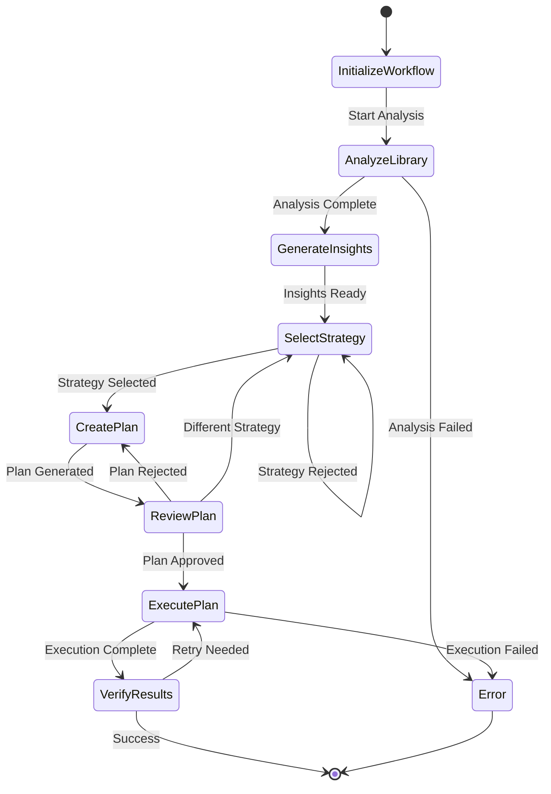

# Organize Music Prompt Specification

## Purpose & Responsibility

The Organize Music Prompt provides intelligent music library organization workflows through natural language interactions. It is responsible for:

- Analyzing user's music library and listening patterns
- Suggesting playlist organization strategies
- Automating playlist cleanup and optimization
- Providing insights into music collection structure

## Prompt Definition

### Prompt Registration

```typescript
const organizeMusicPrompt: PromptDefinition = {
  name: 'organize-music',
  description: 'Intelligent assistant for organizing and optimizing your music library',
  category: 'organization',
  arguments: [
    {
      name: 'scope',
      description: 'Scope of organization (e.g., "all_playlists", "liked_songs", "specific_playlist")',
      required: false
    },
    {
      name: 'strategy',
      description: 'Organization strategy (e.g., "by_genre", "by_mood", "by_decade", "smart_cleanup")',
      required: false
    },
    {
      name: 'target_playlist_id',
      description: 'Specific playlist ID to organize (when scope is "specific_playlist")',
      required: false
    },
    {
      name: 'preferences',
      description: 'Organization preferences and constraints',
      required: false
    }
  ]
}
```

## Interface Definition

### Handler Interface

```typescript
async function organizeMusicPromptHandler(
  request: PromptRequest
): Promise<Result<PromptResponse, PromptError>>
```

### Type Definitions

```typescript
interface OrganizeMusicRequest {
  scope?: 'all_playlists' | 'liked_songs' | 'specific_playlist' | 'recent_activity'
  strategy?: 'by_genre' | 'by_mood' | 'by_decade' | 'by_activity' | 'smart_cleanup' | 'duplicate_removal'
  target_playlist_id?: string
  preferences?: {
    max_playlists?: number
    min_playlist_size?: number
    preserve_existing?: boolean
    create_new_playlists?: boolean
    merge_similar?: boolean
    remove_duplicates?: boolean
    organization_depth?: 'shallow' | 'medium' | 'deep'
  }
}

interface MusicOrganizationWorkflow {
  steps: OrganizationStep[]
  current_step: number
  analysis_results: LibraryAnalysis
  organization_plan: OrganizationPlan
  user_preferences: OrganizationPreferences
  progress: {
    analyzed_tracks: number
    total_tracks: number
    created_playlists: number
    moved_tracks: number
  }
}

interface OrganizationStep {
  id: string
  type: 'analysis' | 'strategy_selection' | 'plan_review' | 'execution' | 'verification'
  title: string
  description: string
  status: 'pending' | 'in_progress' | 'completed' | 'skipped'
  results?: any
  user_input?: any
}

interface LibraryAnalysis {
  total_tracks: number
  total_playlists: number
  liked_songs_count: number
  duplicate_tracks: DuplicateGroup[]
  genre_distribution: GenreDistribution[]
  mood_clusters: MoodCluster[]
  decade_distribution: DecadeDistribution[]
  playlist_health: PlaylistHealthReport[]
  organization_opportunities: OrganizationOpportunity[]
}

interface DuplicateGroup {
  track_id: string
  track_name: string
  artist_name: string
  locations: Array<{
    playlist_id: string
    playlist_name: string
    position: number
  }>
  confidence: number
}

interface GenreDistribution {
  genre: string
  track_count: number
  percentage: number
  playlists: string[]
  avg_popularity: number
}

interface MoodCluster {
  mood_label: string
  audio_features: {
    energy: number
    valence: number
    danceability: number
  }
  track_count: number
  representative_tracks: string[]
  suggested_playlist_name: string
}

interface PlaylistHealthReport {
  playlist_id: string
  playlist_name: string
  issues: PlaylistIssue[]
  score: number
  recommendations: string[]
}

interface PlaylistIssue {
  type: 'duplicates' | 'inconsistent_mood' | 'too_long' | 'too_short' | 'outdated' | 'low_engagement'
  severity: 'low' | 'medium' | 'high'
  description: string
  affected_tracks?: string[]
  suggested_action: string
}

interface OrganizationPlan {
  strategy: string
  actions: OrganizationAction[]
  estimated_duration: number
  impact_summary: {
    playlists_to_create: number
    playlists_to_modify: number
    tracks_to_move: number
    duplicates_to_remove: number
  }
}

interface OrganizationAction {
  type: 'create_playlist' | 'move_tracks' | 'remove_duplicates' | 'merge_playlists' | 'rename_playlist'
  priority: number
  description: string
  details: any
  estimated_time: number
}
```

## Dependencies

### External Dependencies
- Spotify Web API endpoints:
  - `GET /v1/me/playlists`
  - `GET /v1/playlists/{playlist_id}/tracks`
  - `GET /v1/me/tracks`
  - `POST /v1/users/{user_id}/playlists`
  - `PUT /v1/playlists/{playlist_id}/tracks`
  - `DELETE /v1/playlists/{playlist_id}/tracks`
  - `GET /v1/audio-features`

### Internal Dependencies
- `user-analytics` - Analyze listening patterns
- `playlist-create-tool` - Create new playlists
- `playlist-modify-tool` - Modify existing playlists
- `audio-features-analyzer` - Analyze track characteristics
- `recommendations-engine` - Suggest organization strategies

## Behavior Specification

### Workflow State Machine



### Implementation Details

#### Library Analysis

```typescript
async function analyzeUserLibrary(
  request: OrganizeMusicRequest,
  context: PromptContext
): Promise<Result<LibraryAnalysis, PromptError>> {
  const analysis: Partial<LibraryAnalysis> = {}
  
  // Get all playlists
  const playlistsResult = await getUserPlaylists(context)
  if (playlistsResult.isErr()) {
    return err(playlistsResult.error)
  }
  
  const playlists = playlistsResult.value
  analysis.total_playlists = playlists.length
  
  // Get liked songs
  const likedSongsResult = await getLikedSongs(context)
  if (likedSongsResult.isOk()) {
    analysis.liked_songs_count = likedSongsResult.value.length
  }
  
  // Collect all tracks from all sources
  const allTracks = await collectAllTracks(playlists, likedSongsResult.value || [])
  analysis.total_tracks = allTracks.length
  
  // Analyze duplicates
  analysis.duplicate_tracks = await findDuplicateTracks(allTracks, playlists)
  
  // Analyze genre distribution
  analysis.genre_distribution = await analyzeGenreDistribution(allTracks, context)
  
  // Cluster by mood/audio features
  analysis.mood_clusters = await clusterByMood(allTracks, context)
  
  // Analyze by decade
  analysis.decade_distribution = analyzeDecadeDistribution(allTracks)
  
  // Assess playlist health
  analysis.playlist_health = await assessPlaylistHealth(playlists, context)
  
  // Identify organization opportunities
  analysis.organization_opportunities = identifyOrganizationOpportunities(analysis as LibraryAnalysis)
  
  return ok(analysis as LibraryAnalysis)
}

async function findDuplicateTracks(
  allTracks: TrackLocation[],
  playlists: PlaylistData[]
): Promise<DuplicateGroup[]> {
  const trackGroups = new Map<string, TrackLocation[]>()
  
  // Group tracks by normalized identifier
  allTracks.forEach(track => {
    const key = normalizeTrackIdentifier(track.track)
    if (!trackGroups.has(key)) {
      trackGroups.set(key, [])
    }
    trackGroups.get(key)!.push(track)
  })
  
  // Find groups with multiple locations
  const duplicateGroups: DuplicateGroup[] = []
  
  for (const [key, locations] of trackGroups.entries()) {
    if (locations.length > 1) {
      const firstTrack = locations[0].track
      duplicateGroups.push({
        track_id: firstTrack.id,
        track_name: firstTrack.name,
        artist_name: firstTrack.artists[0]?.name || 'Unknown',
        locations: locations.map(loc => ({
          playlist_id: loc.playlist_id,
          playlist_name: loc.playlist_name,
          position: loc.position
        })),
        confidence: calculateDuplicateConfidence(locations)
      })
    }
  }
  
  return duplicateGroups.sort((a, b) => b.confidence - a.confidence)
}

async function clusterByMood(
  tracks: TrackLocation[],
  context: PromptContext
): Promise<MoodCluster[]> {
  // Get audio features for all tracks
  const trackIds = tracks.map(t => t.track.id).filter(Boolean)
  const audioFeaturesResult = await context.spotifyApi.getAudioFeatures(trackIds)
  
  if (audioFeaturesResult.isErr()) {
    return []
  }
  
  const audioFeatures = audioFeaturesResult.value
  
  // Perform k-means clustering on energy, valence, danceability
  const clusters = performMoodClustering(audioFeatures, 5) // 5 mood clusters
  
  return clusters.map((cluster, index) => ({
    mood_label: generateMoodLabel(cluster.centroid),
    audio_features: cluster.centroid,
    track_count: cluster.tracks.length,
    representative_tracks: selectRepresentativeTracks(cluster.tracks, 3),
    suggested_playlist_name: generateMoodPlaylistName(cluster.centroid)
  }))
}

function generateMoodLabel(centroid: { energy: number; valence: number; danceability: number }): string {
  const { energy, valence, danceability } = centroid
  
  if (energy > 0.7 && valence > 0.7) return 'Energetic & Happy'
  if (energy > 0.7 && valence < 0.3) return 'Intense & Dark'
  if (energy < 0.3 && valence > 0.7) return 'Calm & Peaceful'
  if (energy < 0.3 && valence < 0.3) return 'Melancholic & Slow'
  if (danceability > 0.8) return 'Danceable'
  if (energy > 0.5 && valence > 0.5) return 'Upbeat'
  if (energy < 0.5 && valence < 0.5) return 'Mellow'
  
  return 'Mixed Mood'
}
```

#### Organization Plan Generation

```typescript
async function createOrganizationPlan(
  analysis: LibraryAnalysis,
  strategy: string,
  preferences: OrganizationPreferences
): Promise<OrganizationPlan> {
  const actions: OrganizationAction[] = []
  let planEstimate = 0
  
  switch (strategy) {
    case 'by_genre':
      actions.push(...createGenreBasedActions(analysis, preferences))
      break
    
    case 'by_mood':
      actions.push(...createMoodBasedActions(analysis, preferences))
      break
    
    case 'smart_cleanup':
      actions.push(...createCleanupActions(analysis, preferences))
      break
    
    case 'duplicate_removal':
      actions.push(...createDuplicateRemovalActions(analysis, preferences))
      break
    
    default:
      actions.push(...createHybridActions(analysis, preferences))
  }
  
  // Sort actions by priority
  actions.sort((a, b) => b.priority - a.priority)
  
  // Calculate estimates
  planEstimate = actions.reduce((sum, action) => sum + action.estimated_time, 0)
  
  return {
    strategy,
    actions,
    estimated_duration: planEstimate,
    impact_summary: calculateImpactSummary(actions)
  }
}

function createMoodBasedActions(
  analysis: LibraryAnalysis,
  preferences: OrganizationPreferences
): OrganizationAction[] {
  const actions: OrganizationAction[] = []
  
  // Create playlists for each mood cluster
  analysis.mood_clusters.forEach((cluster, index) => {
    if (cluster.track_count >= (preferences.min_playlist_size || 10)) {
      actions.push({
        type: 'create_playlist',
        priority: 80,
        description: `Create "${cluster.suggested_playlist_name}" playlist`,
        details: {
          name: cluster.suggested_playlist_name,
          description: `A collection of ${cluster.mood_label.toLowerCase()} tracks`,
          track_ids: cluster.representative_tracks,
          mood_criteria: cluster.audio_features
        },
        estimated_time: 30
      })
    }
  })
  
  return actions
}

function createCleanupActions(
  analysis: LibraryAnalysis,
  preferences: OrganizationPreferences
): OrganizationAction[] {
  const actions: OrganizationAction[] = []
  
  // Address playlist health issues
  analysis.playlist_health.forEach(health => {
    health.issues.forEach(issue => {
      if (issue.severity === 'high') {
        actions.push({
          type: determineActionType(issue.type),
          priority: 90,
          description: `Fix ${issue.type} in "${health.playlist_name}"`,
          details: {
            playlist_id: health.playlist_id,
            issue_type: issue.type,
            affected_tracks: issue.affected_tracks,
            suggested_action: issue.suggested_action
          },
          estimated_time: 15
        })
      }
    })
  })
  
  return actions
}
```

### Response Generation

```typescript
function generateOrganizeMusicResponse(
  workflow: MusicOrganizationWorkflow,
  step_results?: any
): PromptResponse {
  const currentStep = workflow.steps[workflow.current_step]
  
  switch (currentStep.type) {
    case 'analysis':
      return generateAnalysisResponse(workflow)
    
    case 'strategy_selection':
      return generateStrategySelectionResponse(workflow)
    
    case 'plan_review':
      return generatePlanReviewResponse(workflow)
    
    case 'execution':
      return generateExecutionResponse(workflow)
    
    case 'verification':
      return generateVerificationResponse(workflow)
    
    default:
      return generateGenericResponse(workflow, currentStep)
  }
}

function generateAnalysisResponse(workflow: MusicOrganizationWorkflow): PromptResponse {
  const analysis = workflow.analysis_results
  
  const messages: PromptMessage[] = [
    {
      role: 'assistant',
      content: {
        type: 'text',
        text: generateAnalysisSummary(analysis)
      }
    },
    {
      role: 'assistant',
      content: {
        type: 'resource',
        resource: {
          uri: 'spotify://analysis/library-overview',
          text: JSON.stringify({
            summary: {
              total_tracks: analysis.total_tracks,
              total_playlists: analysis.total_playlists,
              duplicates: analysis.duplicate_tracks.length,
              opportunities: analysis.organization_opportunities.length
            },
            top_issues: analysis.playlist_health
              .filter(h => h.issues.some(i => i.severity === 'high'))
              .slice(0, 5),
            mood_insights: analysis.mood_clusters.slice(0, 3)
          }, null, 2)
        }
      }
    }
  ]
  
  return {
    description: 'Music Library Analysis Complete',
    messages
  }
}

function generateAnalysisSummary(analysis: LibraryAnalysis): string {
  const insights = []
  
  insights.push(`📊 **Library Overview**: ${analysis.total_tracks} tracks across ${analysis.total_playlists} playlists`)
  
  if (analysis.duplicate_tracks.length > 0) {
    insights.push(`🔄 **Duplicates Found**: ${analysis.duplicate_tracks.length} sets of duplicate tracks`)
  }
  
  if (analysis.mood_clusters.length > 0) {
    insights.push(`🎭 **Mood Patterns**: Identified ${analysis.mood_clusters.length} distinct mood clusters`)
  }
  
  const highPriorityIssues = analysis.playlist_health.reduce(
    (count, health) => count + health.issues.filter(i => i.severity === 'high').length, 0
  )
  
  if (highPriorityIssues > 0) {
    insights.push(`⚠️ **Issues Detected**: ${highPriorityIssues} high-priority playlist issues`)
  }
  
  insights.push(`\n🎯 **Organization Opportunities**: ${analysis.organization_opportunities.length} ways to improve your library`)
  
  return insights.join('\n') + '\n\nBased on this analysis, I can help you organize your music in several ways. What would you like to focus on?'
}
```

## Testing Requirements

### Unit Tests

```typescript
describe('Organize Music Prompt', () => {
  describe('Library Analysis', () => {
    it('should analyze user playlists and liked songs')
    it('should identify duplicate tracks correctly')
    it('should cluster tracks by mood/audio features')
    it('should assess playlist health accurately')
  })
  
  describe('Organization Planning', () => {
    it('should create genre-based organization plans')
    it('should create mood-based organization plans')
    it('should prioritize actions appropriately')
    it('should respect user preferences')
  })
  
  describe('Workflow Management', () => {
    it('should guide users through organization process')
    it('should handle user feedback and adjustments')
    it('should track progress accurately')
    it('should handle errors gracefully')
  })
  
  describe('Response Generation', () => {
    it('should provide clear analysis summaries')
    it('should offer actionable recommendations')
    it('should include relevant data visualizations')
    it('should adapt to user preferences')
  })
})
```

## Performance Constraints

### Response Time Targets
- Library analysis: < 30s for 1000+ tracks
- Plan generation: < 5s
- Single organization action: < 10s
- Full workflow step: < 45s

### Resource Limits
- Maximum tracks analyzed: 5000
- Maximum playlists processed: 100
- Analysis cache: 1 hour TTL
- Workflow state size: < 10MB

## Security Considerations

### Access Control
- Verify user has playlist modification permissions
- Respect private playlist access
- Validate playlist ownership before modifications
- Check user consent for bulk operations

### Data Privacy
- Don't persist detailed listening data
- Respect user's music privacy preferences
- Handle sensitive playlist information appropriately
- Provide clear consent for organizational changes

### Input Validation
- Validate playlist IDs and permissions
- Limit scope of bulk operations
- Prevent unauthorized playlist access
- Rate limit organization actions