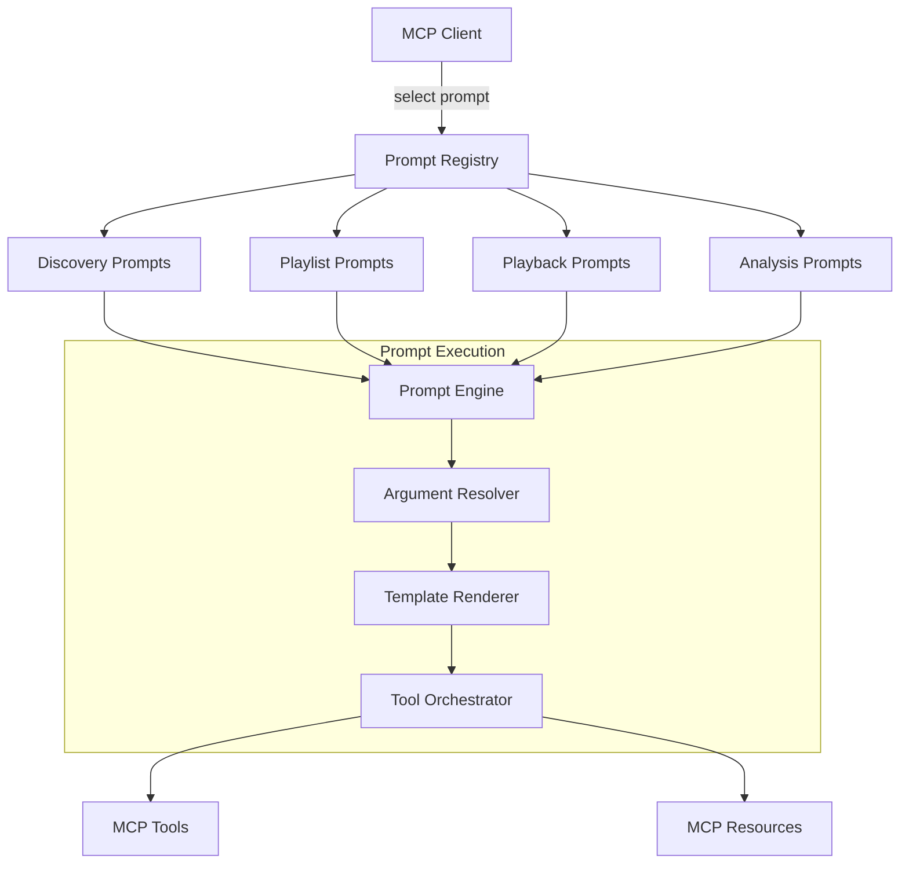

# MCP Prompts Overview

## Purpose

MCP Prompts provide pre-built, reusable conversation templates for common Spotify interactions. They guide users through complex workflows and enable consistent, high-quality experiences for music discovery, playlist management, and playback control.

## Prompt Categories

### 1. Music Discovery
- Find music by mood or activity
- Discover new artists similar to favorites
- Explore different genres

### 2. Playlist Management
- Create themed playlists
- Organize existing playlists
- Collaborative playlist workflows

### 3. Playback Control
- Smart queue management
- Context-aware playback
- Multi-device control

### 4. Music Analysis
- Deep dive into track characteristics
- Compare musical styles
- Understand listening patterns

## Prompt Structure

Each prompt follows a consistent structure:

```typescript
interface PromptDefinition {
  name: string
  description: string
  category: 'discovery' | 'playlist' | 'playback' | 'analysis'
  arguments: Array<{
    name: string
    description: string
    required: boolean
  }>
  template: string
  followUp?: string[]
}
```

## Implementation Architecture



## Prompt Design Principles

### 1. User-Centric Language
- Natural, conversational tone
- Clear instructions
- Helpful suggestions

### 2. Progressive Disclosure
- Start with essential information
- Offer detailed options when needed
- Guide users through complex tasks

### 3. Error Recovery
- Graceful handling of failures
- Alternative suggestions
- Clear next steps

### 4. Contextual Awareness
- Consider current playback state
- Respect user preferences
- Adapt to usage patterns

## Integration with Tools & Resources

Prompts orchestrate multiple tools and resources:

```typescript
// Example: Discover by Mood prompt uses:
- search tool (find initial tracks)
- audio_features tool (analyze characteristics)
- recommendations tool (find similar music)
- playlist_create tool (save results)
```

## Customization & Extension

Prompts support customization through:
- Variable substitution
- Conditional sections
- User preference integration
- Follow-up suggestions