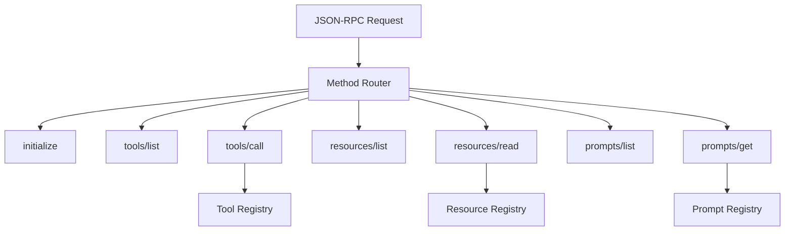

# MCP Protocol Layer Specification

## Purpose & Responsibility

The Protocol Layer implements the Model Context Protocol (MCP) server, handling all protocol-level concerns. It is responsible for:

- Processing JSON-RPC 2.0 messages
- Routing methods to appropriate handlers
- Managing server lifecycle and capabilities
- Discovering and registering extensions (tools, resources, prompts)
- Formatting responses according to MCP specification
- Handling protocol-level errors

This component serves as the core infrastructure that enables tools, resources, and prompts to function within the MCP framework.

## Interface Definition

### Public API

```typescript
// Server Creation
export function createMCPServer(config: MCPServerConfig): MCPServer

// Server Interface
export interface MCPServer {
  // Lifecycle
  start(): Promise<void>
  stop(): Promise<void>
  
  // Extension Registration
  registerTool(tool: ToolDefinition): void
  registerResource(resource: ResourceDefinition): void
  registerPrompt(prompt: PromptDefinition): void
  
  // Request Handling
  handleRequest(request: JsonRpcRequest): Promise<JsonRpcResponse>
  
  // Server Information
  getCapabilities(): ServerCapabilities
  getInfo(): ServerInfo
}

// Configuration
export interface MCPServerConfig {
  name: string
  version: string
  tokenManager: TokenManager
  capabilities?: Partial<ServerCapabilities>
  extensions?: {
    tools?: ToolDefinition[]
    resources?: ResourceDefinition[]
    prompts?: PromptDefinition[]
  }
}
```

### Protocol Types

```typescript
// MCP Protocol Types
interface ServerCapabilities {
  tools: boolean
  resources: boolean
  prompts: boolean
  experimental?: Record<string, boolean>
}

interface ServerInfo {
  name: string
  version: string
  protocolVersion: string
}

// JSON-RPC Types
interface JsonRpcRequest {
  jsonrpc: '2.0'
  method: string
  params?: unknown
  id: string | number
}

interface JsonRpcResponse {
  jsonrpc: '2.0'
  result?: unknown
  error?: JsonRpcError
  id: string | number
}

interface JsonRpcError {
  code: number
  message: string
  data?: unknown
}

// Extension Types
interface ToolDefinition {
  name: string
  description: string
  inputSchema: JsonSchema
  handler: ToolHandler
}

interface ResourceDefinition {
  uri: string
  name: string
  mimeType: string
  handler: ResourceHandler
}

interface PromptDefinition {
  name: string
  description: string
  arguments: PromptArgument[]
  handler: PromptHandler
}
```

## Dependencies

### External Dependencies
- `@modelcontextprotocol/sdk` (^0.5.0) - MCP SDK
- `neverthrow` (^6.0.0) - Error handling
- `ajv` (^8.0.0) - JSON Schema validation

### Internal Dependencies
- `token-manager.ts` - Authentication
- `tools/*` - Tool implementations
- `resources/*` - Resource implementations
- `prompts/*` - Prompt implementations

## Behavior Specification

### Server Initialization

```typescript
export function createMCPServer(config: MCPServerConfig): MCPServer {
  // 1. Create SDK server instance
  const server = new Server({
    name: config.name,
    version: config.version
  }, {
    capabilities: {
      tools: config.capabilities?.tools ?? true,
      resources: config.capabilities?.resources ?? true,
      prompts: config.capabilities?.prompts ?? true
    }
  })
  
  // 2. Set up method handlers
  server.setRequestHandler(InitializeRequestSchema, handleInitialize)
  server.setRequestHandler(ListToolsRequestSchema, handleListTools)
  server.setRequestHandler(CallToolRequestSchema, handleCallTool)
  server.setRequestHandler(ListResourcesRequestSchema, handleListResources)
  server.setRequestHandler(ReadResourceRequestSchema, handleReadResource)
  server.setRequestHandler(ListPromptsRequestSchema, handleListPrompts)
  server.setRequestHandler(GetPromptRequestSchema, handleGetPrompt)
  
  // 3. Register extensions
  config.extensions?.tools?.forEach(tool => server.registerTool(tool))
  config.extensions?.resources?.forEach(resource => server.registerResource(resource))
  config.extensions?.prompts?.forEach(prompt => server.registerPrompt(prompt))
  
  // 4. Return wrapped server
  return new MCPServerWrapper(server, config.tokenManager)
}
```

### Method Routing



### Request Processing Flow

```typescript
async function handleRequest(request: JsonRpcRequest): Promise<JsonRpcResponse> {
  try {
    // 1. Validate JSON-RPC structure
    const validation = validateJsonRpc(request)
    if (validation.isErr()) {
      return createErrorResponse(request.id, -32600, 'Invalid Request')
    }
    
    // 2. Route to method handler
    const handler = methodHandlers.get(request.method)
    if (!handler) {
      return createErrorResponse(request.id, -32601, 'Method not found')
    }
    
    // 3. Validate parameters
    const paramsValidation = handler.validateParams(request.params)
    if (paramsValidation.isErr()) {
      return createErrorResponse(request.id, -32602, 'Invalid params')
    }
    
    // 4. Execute handler
    const result = await handler.execute(request.params)
    
    // 5. Format response
    if (result.isOk()) {
      return {
        jsonrpc: '2.0',
        result: result.value,
        id: request.id
      }
    } else {
      return createErrorResponse(
        request.id,
        -32603,
        'Internal error',
        result.error
      )
    }
    
  } catch (error) {
    // 6. Handle unexpected errors
    console.error('Unexpected error:', error)
    return createErrorResponse(request.id, -32603, 'Internal error')
  }
}
```

### Method Handlers

#### Initialize Handler

```typescript
async function handleInitialize(params: InitializeParams): Promise<InitializeResult> {
  return {
    protocolVersion: '1.0',
    capabilities: server.getCapabilities(),
    serverInfo: {
      name: server.name,
      version: server.version
    }
  }
}
```

#### List Tools Handler

```typescript
async function handleListTools(): Promise<ListToolsResult> {
  const tools = Array.from(toolRegistry.values()).map(tool => ({
    name: tool.name,
    description: tool.description,
    inputSchema: tool.inputSchema
  }))
  
  return { tools }
}
```

#### Call Tool Handler

```typescript
async function handleCallTool(params: CallToolParams): Promise<CallToolResult> {
  // 1. Get tool from registry
  const tool = toolRegistry.get(params.name)
  if (!tool) {
    throw new Error(`Unknown tool: ${params.name}`)
  }
  
  // 2. Validate arguments
  const validation = validateSchema(tool.inputSchema, params.arguments)
  if (!validation.valid) {
    throw new Error(`Invalid arguments: ${validation.errors.join(', ')}`)
  }
  
  // 3. Get authentication token
  const tokenResult = await tokenManager.getToken()
  if (tokenResult.isErr()) {
    throw new Error('Authentication required')
  }
  
  // 4. Execute tool
  const context: ToolContext = {
    token: tokenResult.value,
    userId: getUserId(tokenResult.value)
  }
  
  const result = await tool.handler(params.arguments, context)
  
  // 5. Format result
  if (result.isOk()) {
    return {
      content: result.value.content,
      isError: false
    }
  } else {
    return {
      content: [{
        type: 'text',
        text: formatError(result.error)
      }],
      isError: true
    }
  }
}
```

### Extension Registration

```typescript
class ExtensionRegistry {
  private tools = new Map<string, ToolDefinition>()
  private resources = new Map<string, ResourceDefinition>()
  private prompts = new Map<string, PromptDefinition>()
  
  registerTool(tool: ToolDefinition): void {
    // Validate tool definition
    if (!tool.name || !tool.handler) {
      throw new Error('Invalid tool definition')
    }
    
    // Check for duplicates
    if (this.tools.has(tool.name)) {
      throw new Error(`Tool '${tool.name}' already registered`)
    }
    
    // Compile schema validator
    const validator = ajv.compile(tool.inputSchema)
    
    // Register tool
    this.tools.set(tool.name, {
      ...tool,
      validator
    })
  }
  
  // Similar for resources and prompts...
}
```

## Error Handling

### Error Code Mapping

```typescript
// Standard JSON-RPC error codes
enum JsonRpcErrorCode {
  ParseError = -32700,
  InvalidRequest = -32600,
  MethodNotFound = -32601,
  InvalidParams = -32602,
  InternalError = -32603
}

// MCP-specific error codes
enum MCPErrorCode {
  ToolNotFound = 1001,
  ResourceNotFound = 1002,
  PromptNotFound = 1003,
  AuthenticationRequired = 2001,
  InsufficientPermissions = 2002,
  RateLimitExceeded = 3001
}
```

### Error Response Creation

```typescript
function createErrorResponse(
  id: string | number | null,
  code: number,
  message: string,
  data?: unknown
): JsonRpcResponse {
  return {
    jsonrpc: '2.0',
    error: {
      code,
      message,
      data
    },
    id: id ?? null
  }
}
```

## Testing Requirements

### Unit Tests

```typescript
describe('MCP Protocol Layer', () => {
  describe('Server Creation', () => {
    it('should create server with default capabilities')
    it('should register initial extensions')
    it('should validate configuration')
  })
  
  describe('Method Routing', () => {
    it('should route initialize method')
    it('should route tool methods')
    it('should route resource methods')
    it('should route prompt methods')
    it('should return error for unknown method')
  })
  
  describe('Request Validation', () => {
    it('should validate JSON-RPC structure')
    it('should validate method parameters')
    it('should handle malformed requests')
  })
  
  describe('Extension Registration', () => {
    it('should register tools dynamically')
    it('should prevent duplicate registrations')
    it('should validate extension definitions')
  })
  
  describe('Error Handling', () => {
    it('should return proper error codes')
    it('should include error data')
    it('should handle unexpected errors')
  })
})
```

### Integration Tests

```typescript
describe('Protocol Integration', () => {
  it('should handle complete tool execution flow')
  it('should manage authentication throughout')
  it('should coordinate multiple extensions')
  it('should maintain protocol compliance')
})
```

## Performance Constraints

### Latency Requirements
- Method routing: < 1ms
- Parameter validation: < 5ms
- Extension lookup: < 1ms
- Response formatting: < 1ms

### Resource Limits
- Max request size: 1MB
- Max response size: 10MB
- Max extensions: 1000
- Max concurrent requests: 100

### Optimization Strategies
- Pre-compiled validators
- Extension caching
- Lazy loading
- Request pooling

## Security Considerations

### Input Validation
- Strict JSON-RPC validation
- Parameter type checking
- Schema enforcement
- Size limits

### Method Authorization
- Authentication check
- Permission validation
- Rate limiting
- Audit logging

### Output Sanitization
- Error message filtering
- Sensitive data removal
- Response size limits
- Content validation