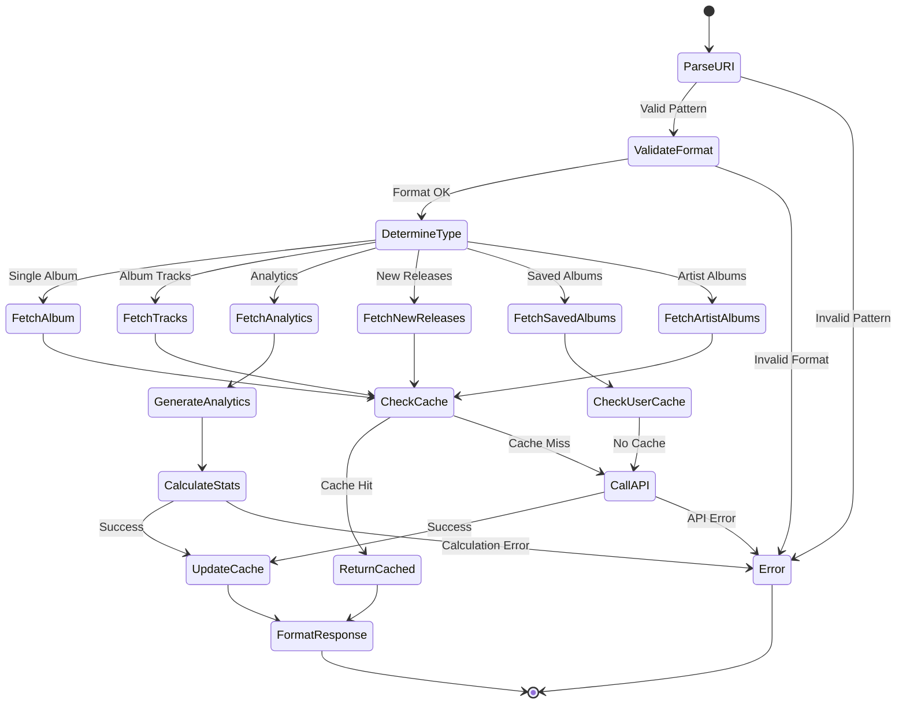

# Album Resource Specification

## Purpose & Responsibility

The Album Resource provides read-only access to Spotify album information through MCP resource URIs. It is responsible for:

- Fetching detailed album metadata and tracks
- Providing album analytics and insights
- Supporting album discovery and exploration
- Caching album data for performance

## Resource Definition

### URI Patterns

```typescript
type AlbumResourceURI = 
  | `spotify://albums/${string}`              // Single album
  | `spotify://albums/${string}/tracks`       // Album tracks
  | `spotify://albums/${string}/analytics`    // Album analytics
  | `spotify://albums/new-releases`           // New releases
  | `spotify://albums/saved`                 // User's saved albums
  | `spotify://artists/${string}/albums`     // Artist's albums
```

### Resource Registration

```typescript
const albumResource: ResourceDefinition = {
  uri: 'spotify://albums/*',
  name: 'Spotify Album',
  description: 'Access Spotify album information and metadata',
  mimeType: 'application/json',
  handler: albumResourceHandler
}
```

## Interface Definition

### Handler Interface

```typescript
async function albumResourceHandler(
  uri: string,
  context: ResourceContext
): Promise<Result<ResourceResponse, ResourceError>>
```

### Type Definitions

```typescript
interface AlbumData {
  id: string
  name: string
  artists: Array<{
    id: string
    name: string
    type: 'artist'
    uri: string
  }>
  album_type: 'album' | 'single' | 'compilation'
  total_tracks: number
  tracks: {
    items: AlbumTrack[]
    total: number
  }
  release_date: string
  release_date_precision: 'year' | 'month' | 'day'
  images: Array<{
    url: string
    height: number
    width: number
  }>
  genres: string[]
  popularity: number
  uri: string
  external_urls: {
    spotify: string
  }
  copyrights: Array<{
    text: string
    type: 'C' | 'P'
  }>
  label: string
  available_markets: string[]
}

interface AlbumTrack {
  id: string
  name: string
  artists: Array<{
    id: string
    name: string
  }>
  disc_number: number
  track_number: number
  duration_ms: number
  explicit: boolean
  is_local: boolean
  popularity: number
  preview_url: string | null
  uri: string
}

interface AlbumAnalytics {
  total_tracks: number
  total_duration_ms: number
  average_track_duration_ms: number
  longest_track: AlbumTrack
  shortest_track: AlbumTrack
  explicit_content_ratio: number
  average_popularity: number
  disc_distribution: Array<{
    disc_number: number
    track_count: number
  }>
  audio_features_summary: {
    energy: { min: number; max: number; avg: number }
    valence: { min: number; max: number; avg: number }
    danceability: { min: number; max: number; avg: number }
    tempo: { min: number; max: number; avg: number }
    key_distribution: Array<{
      key: string
      count: number
      percentage: number
    }>
    time_signature_distribution: Array<{
      time_signature: number
      count: number
      percentage: number
    }>
  }
  release_info: {
    release_year: number
    release_decade: string
    days_since_release: number
    is_new_release: boolean
  }
}

interface NewReleases {
  albums: {
    items: AlbumData[]
    total: number
    limit: number
    offset: number
  }
}
```

## Dependencies

### External Dependencies
- Spotify Web API endpoints:
  - `GET /v1/albums/{id}`
  - `GET /v1/albums/{id}/tracks`
  - `GET /v1/browse/new-releases`
  - `GET /v1/me/albums`
  - `GET /v1/artists/{id}/albums`
  - `GET /v1/audio-features`

### Internal Dependencies
- `spotify-api-client` - API wrapper
- `token-manager` - Authentication
- `cache-manager` - Response caching
- `audio-features-analyzer` - Analytics calculation

## Behavior Specification

### URI Resolution Flow



### Implementation Details

#### Single Album Fetch

```typescript
async function fetchAlbumData(
  albumId: string,
  context: ResourceContext
): Promise<Result<AlbumData, SpotifyError>> {
  // Check cache first
  const cacheKey = `album:${albumId}`
  const cached = await context.cache.get<AlbumData>(cacheKey)
  if (cached) {
    return ok(cached)
  }
  
  // Get access token
  const tokenResult = await context.tokenManager.getAccessToken()
  if (tokenResult.isErr()) {
    return err(tokenResult.error)
  }
  
  // Fetch album with tracks
  const albumResult = await context.spotifyApi.getAlbum(albumId)
  if (albumResult.isErr()) {
    return err(albumResult.error)
  }
  
  // Cache result (24 hours for albums - relatively stable)
  await context.cache.set(cacheKey, albumResult.value, 86400)
  
  return ok(albumResult.value)
}
```

#### Album Analytics Generation

```typescript
async function generateAlbumAnalytics(
  albumId: string,
  context: ResourceContext
): Promise<Result<AlbumAnalytics, SpotifyError>> {
  // Get album data
  const albumResult = await fetchAlbumData(albumId, context)
  if (albumResult.isErr()) {
    return err(albumResult.error)
  }
  
  const album = albumResult.value
  const tracks = album.tracks.items
  
  // Get audio features for all tracks
  const trackIds = tracks.filter(track => track.id && !track.is_local).map(track => track.id)
  const audioFeaturesResult = await context.spotifyApi.getAudioFeatures(trackIds)
  const audioFeatures = audioFeaturesResult.isOk() ? audioFeaturesResult.value : []
  
  // Calculate basic stats
  const totalDuration = tracks.reduce((sum, track) => sum + track.duration_ms, 0)
  const averageDuration = totalDuration / tracks.length
  
  const sortedByDuration = [...tracks].sort((a, b) => a.duration_ms - b.duration_ms)
  const longestTrack = sortedByDuration[sortedByDuration.length - 1]
  const shortestTrack = sortedByDuration[0]
  
  const explicitCount = tracks.filter(track => track.explicit).length
  const averagePopularity = tracks.reduce((sum, track) => sum + track.popularity, 0) / tracks.length
  
  // Calculate disc distribution
  const discDistribution = calculateDiscDistribution(tracks)
  
  // Calculate release info
  const releaseInfo = calculateReleaseInfo(album.release_date, album.release_date_precision)
  
  // Calculate audio features summary
  const audioFeaturesSummary = calculateAlbumAudioFeaturesSummary(audioFeatures)
  
  const analytics: AlbumAnalytics = {
    total_tracks: tracks.length,
    total_duration_ms: totalDuration,
    average_track_duration_ms: averageDuration,
    longest_track: longestTrack,
    shortest_track: shortestTrack,
    explicit_content_ratio: explicitCount / tracks.length,
    average_popularity: averagePopularity,
    disc_distribution: discDistribution,
    audio_features_summary: audioFeaturesSummary,
    release_info: releaseInfo
  }
  
  return ok(analytics)
}

function calculateDiscDistribution(tracks: AlbumTrack[]): Array<{disc_number: number; track_count: number}> {
  const discCounts = new Map<number, number>()
  
  tracks.forEach(track => {
    const disc = track.disc_number
    discCounts.set(disc, (discCounts.get(disc) || 0) + 1)
  })
  
  return Array.from(discCounts.entries())
    .map(([disc_number, track_count]) => ({ disc_number, track_count }))
    .sort((a, b) => a.disc_number - b.disc_number)
}

function calculateReleaseInfo(releaseDate: string, precision: string): AlbumAnalytics['release_info'] {
  const date = new Date(releaseDate)
  const year = date.getFullYear()
  const decade = `${Math.floor(year / 10) * 10}s`
  const daysSinceRelease = Math.floor((Date.now() - date.getTime()) / (1000 * 60 * 60 * 24))
  const isNewRelease = daysSinceRelease <= 30 // Consider albums from last 30 days as new
  
  return {
    release_year: year,
    release_decade: decade,
    days_since_release: daysSinceRelease,
    is_new_release: isNewRelease
  }
}

function calculateAlbumAudioFeaturesSummary(features: AudioFeatures[]): AlbumAnalytics['audio_features_summary'] {
  if (features.length === 0) {
    return {
      energy: { min: 0, max: 0, avg: 0 },
      valence: { min: 0, max: 0, avg: 0 },
      danceability: { min: 0, max: 0, avg: 0 },
      tempo: { min: 0, max: 0, avg: 0 },
      key_distribution: [],
      time_signature_distribution: []
    }
  }
  
  const calculateStats = (values: number[]) => ({
    min: Math.min(...values),
    max: Math.max(...values),
    avg: values.reduce((sum, val) => sum + val, 0) / values.length
  })
  
  // Calculate key distribution
  const keyCounts = new Map<number, number>()
  features.forEach(f => {
    if (f.key >= 0) {
      keyCounts.set(f.key, (keyCounts.get(f.key) || 0) + 1)
    }
  })
  
  const keyNames = ['C', 'C♯/D♭', 'D', 'D♯/E♭', 'E', 'F', 'F♯/G♭', 'G', 'G♯/A♭', 'A', 'A♯/B♭', 'B']
  const keyDistribution = Array.from(keyCounts.entries())
    .map(([key, count]) => ({
      key: keyNames[key] || `Key ${key}`,
      count,
      percentage: (count / features.length) * 100
    }))
    .sort((a, b) => b.count - a.count)
  
  // Calculate time signature distribution
  const timeSigCounts = new Map<number, number>()
  features.forEach(f => {
    timeSigCounts.set(f.time_signature, (timeSigCounts.get(f.time_signature) || 0) + 1)
  })
  
  const timeSignatureDistribution = Array.from(timeSigCounts.entries())
    .map(([time_signature, count]) => ({
      time_signature,
      count,
      percentage: (count / features.length) * 100
    }))
    .sort((a, b) => b.count - a.count)
  
  return {
    energy: calculateStats(features.map(f => f.energy)),
    valence: calculateStats(features.map(f => f.valence)),
    danceability: calculateStats(features.map(f => f.danceability)),
    tempo: calculateStats(features.map(f => f.tempo)),
    key_distribution: keyDistribution,
    time_signature_distribution: timeSignatureDistribution
  }
}
```

#### New Releases Fetch

```typescript
async function fetchNewReleases(
  context: ResourceContext,
  options: {
    country?: string
    limit?: number
    offset?: number
  } = {}
): Promise<Result<NewReleases, SpotifyError>> {
  const cacheKey = `new_releases:${options.country || 'global'}:${options.limit || 20}:${options.offset || 0}`
  
  // Check cache (1 hour for new releases)
  const cached = await context.cache.get<NewReleases>(cacheKey)
  if (cached) {
    return ok(cached)
  }
  
  const tokenResult = await context.tokenManager.getAccessToken()
  if (tokenResult.isErr()) {
    return err(tokenResult.error)
  }
  
  const releasesResult = await context.spotifyApi.getNewReleases({
    country: options.country,
    limit: options.limit || 20,
    offset: options.offset || 0
  })
  
  if (releasesResult.isErr()) {
    return err(releasesResult.error)
  }
  
  await context.cache.set(cacheKey, releasesResult.value, 3600)
  return ok(releasesResult.value)
}
```

### Response Formatting

```typescript
function formatAlbumResponse(
  uri: string,
  data: AlbumData | AlbumAnalytics | NewReleases | any
): ResourceResponse {
  const type = determineAlbumResponseType(uri)
  const name = generateAlbumResponseName(type, data)
  const description = generateAlbumResponseDescription(type, data)
  
  return {
    uri,
    name,
    description,
    mimeType: 'application/json',
    text: JSON.stringify(data, null, 2)
  }
}

function determineAlbumResponseType(uri: string): string {
  if (uri.includes('/analytics')) return 'Album Analytics'
  if (uri.includes('/tracks')) return 'Album Tracks'
  if (uri.includes('new-releases')) return 'New Releases'
  if (uri.includes('saved')) return 'Saved Albums'
  if (uri.includes('/albums')) return 'Artist Albums'
  return 'Album'
}

function generateAlbumResponseName(type: string, data: any): string {
  switch (type) {
    case 'Album':
      return `${data.name} by ${data.artists.map(a => a.name).join(', ')}`
    case 'Album Analytics':
      return `Analytics: ${data.total_tracks} tracks, ${formatDuration(data.total_duration_ms)}`
    case 'New Releases':
      return `New Releases: ${data.albums.items.length} albums`
    case 'Artist Albums':
      return `Artist Albums: ${data.items.length} albums`
    default:
      return type
  }
}

function generateAlbumResponseDescription(type: string, data: any): string {
  switch (type) {
    case 'Album':
      return `${data.album_type} • ${data.release_date} • ${data.total_tracks} tracks • Popularity: ${data.popularity}%`
    case 'Album Analytics':
      const avgMin = Math.round(data.average_track_duration_ms / 60000)
      return `Avg track: ${avgMin}m • Released: ${data.release_info.release_year} • Explicit: ${Math.round(data.explicit_content_ratio * 100)}%`
    case 'New Releases':
      return 'Latest album releases from Spotify'
    default:
      return ''
  }
}

function formatDuration(durationMs: number): string {
  const minutes = Math.floor(durationMs / 60000)
  const seconds = Math.floor((durationMs % 60000) / 1000)
  return `${minutes}:${seconds.toString().padStart(2, '0')}`
}
```

## Testing Requirements

### Unit Tests

```typescript
describe('Album Resource', () => {
  describe('URI Parsing', () => {
    it('should parse single album URI')
    it('should parse album tracks URI')
    it('should parse album analytics URI')
    it('should parse new releases URI')
    it('should reject invalid URIs')
  })
  
  describe('Data Fetching', () => {
    it('should fetch album data from API')
    it('should return cached data when available')
    it('should handle albums from different markets')
    it('should respect rate limits')
  })
  
  describe('Analytics Generation', () => {
    it('should calculate basic album statistics')
    it('should analyze audio features')
    it('should calculate key and time signature distribution')
    it('should determine release information')
  })
  
  describe('Response Formatting', () => {
    it('should format album data correctly')
    it('should generate descriptive names')
    it('should handle multi-disc albums')
  })
})
```

## Performance Constraints

### Response Time Targets
- Cached responses: < 10ms
- Simple album fetch: < 400ms
- Analytics generation: < 2s
- New releases: < 600ms

### Cache Configuration
- Album metadata: 24 hours TTL
- New releases: 1 hour TTL
- Saved albums: 5 minutes TTL
- Analytics: 6 hours TTL

### Resource Limits
- Maximum tracks per analytics: 200
- Batch audio features: 100 tracks
- Memory usage: < 30MB per request

## Security Considerations

### Access Control
- Verify OAuth token has required scopes
- Handle market-specific availability
- Respect user's saved albums privacy
- Check regional content restrictions

### Data Privacy
- Don't cache user-specific data
- Respect content availability by region
- Filter sensitive information
- Log access appropriately

### Input Validation
- Validate album ID format
- Sanitize country codes
- Prevent injection attacks
- Rate limit resource access