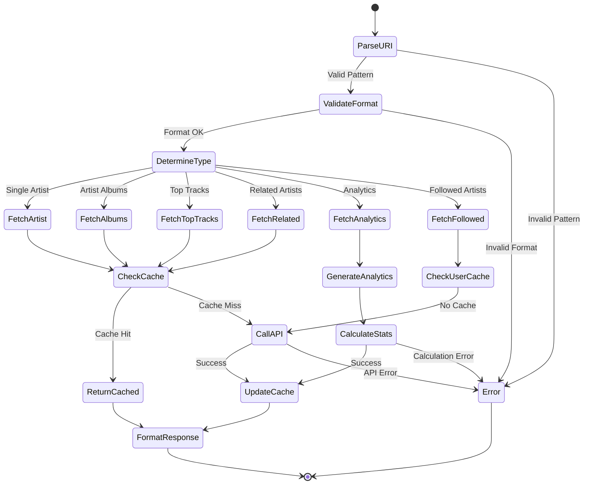

# Artist Resource Specification

## Purpose & Responsibility

The Artist Resource provides read-only access to Spotify artist information through MCP resource URIs. It is responsible for:

- Fetching detailed artist metadata and discography
- Providing artist analytics and insights
- Supporting artist discovery and exploration
- Caching artist data for performance

## Resource Definition

### URI Patterns

```typescript
type ArtistResourceURI = 
  | `spotify://artists/${string}`              // Single artist
  | `spotify://artists/${string}/albums`       // Artist albums
  | `spotify://artists/${string}/top-tracks`   // Artist top tracks
  | `spotify://artists/${string}/related`      // Related artists
  | `spotify://artists/${string}/analytics`    // Artist analytics
  | `spotify://artists/followed`               // User's followed artists
```

### Resource Registration

```typescript
const artistResource: ResourceDefinition = {
  uri: 'spotify://artists/*',
  name: 'Spotify Artist',
  description: 'Access Spotify artist information and metadata',
  mimeType: 'application/json',
  handler: artistResourceHandler
}
```

## Interface Definition

### Handler Interface

```typescript
async function artistResourceHandler(
  uri: string,
  context: ResourceContext
): Promise<Result<ResourceResponse, ResourceError>>
```

### Type Definitions

```typescript
interface ArtistData {
  id: string
  name: string
  type: 'artist'
  uri: string
  followers: {
    total: number
  }
  genres: string[]
  images: Array<{
    url: string
    height: number
    width: number
  }>
  popularity: number
  external_urls: {
    spotify: string
  }
}

interface ArtistTopTracks {
  tracks: Array<{
    id: string
    name: string
    artists: Array<{
      id: string
      name: string
    }>
    album: {
      id: string
      name: string
      release_date: string
      images: Array<{
        url: string
        height: number
        width: number
      }>
    }
    duration_ms: number
    explicit: boolean
    popularity: number
    preview_url: string | null
    track_number: number
    uri: string
  }>
}

interface RelatedArtists {
  artists: ArtistData[]
}

interface ArtistAnalytics {
  follower_count: number
  popularity_score: number
  total_albums: number
  total_singles: number
  total_compilations: number
  career_span: {
    first_release: string
    latest_release: string
    years_active: number
  }
  genre_profile: Array<{
    genre: string
    relevance: number
  }>
  top_tracks_analysis: {
    average_popularity: number
    average_duration_ms: number
    explicit_content_ratio: number
    most_popular_track: {
      name: string
      popularity: number
    }
    audio_features_summary: {
      energy: { min: number; max: number; avg: number }
      valence: { min: number; max: number; avg: number }
      danceability: { min: number; max: number; avg: number }
      tempo: { min: number; max: number; avg: number }
    }
  }
  collaboration_network: Array<{
    artist_id: string
    artist_name: string
    collaboration_count: number
    recent_collaboration: string
  }>
  discography_evolution: Array<{
    year: number
    releases: number
    avg_popularity: number
  }>
}

interface FollowedArtists {
  artists: {
    items: ArtistData[]
    total: number
    limit: number
    next: string | null
    cursors: {
      after: string
    }
  }
}
```

## Dependencies

### External Dependencies
- Spotify Web API endpoints:
  - `GET /v1/artists/{id}`
  - `GET /v1/artists/{id}/albums`
  - `GET /v1/artists/{id}/top-tracks`
  - `GET /v1/artists/{id}/related-artists`
  - `GET /v1/me/following?type=artist`
  - `GET /v1/audio-features`

### Internal Dependencies
- `spotify-api-client` - API wrapper
- `token-manager` - Authentication
- `cache-manager` - Response caching
- `audio-features-analyzer` - Analytics calculation

## Behavior Specification

### URI Resolution Flow



### Implementation Details

#### Single Artist Fetch

```typescript
async function fetchArtistData(
  artistId: string,
  context: ResourceContext
): Promise<Result<ArtistData, SpotifyError>> {
  // Check cache first
  const cacheKey = `artist:${artistId}`
  const cached = await context.cache.get<ArtistData>(cacheKey)
  if (cached) {
    return ok(cached)
  }
  
  // Get access token
  const tokenResult = await context.tokenManager.getAccessToken()
  if (tokenResult.isErr()) {
    return err(tokenResult.error)
  }
  
  // Fetch artist data
  const artistResult = await context.spotifyApi.getArtist(artistId)
  if (artistResult.isErr()) {
    return err(artistResult.error)
  }
  
  // Cache result (12 hours for artists - moderately stable)
  await context.cache.set(cacheKey, artistResult.value, 43200)
  
  return ok(artistResult.value)
}
```

#### Artist Analytics Generation

```typescript
async function generateArtistAnalytics(
  artistId: string,
  context: ResourceContext
): Promise<Result<ArtistAnalytics, SpotifyError>> {
  // Get artist basic data
  const artistResult = await fetchArtistData(artistId, context)
  if (artistResult.isErr()) {
    return err(artistResult.error)
  }
  
  const artist = artistResult.value
  
  // Get discography
  const albumsResult = await fetchArtistAlbums(artistId, context, { include_groups: 'album,single,compilation' })
  if (albumsResult.isErr()) {
    return err(albumsResult.error)
  }
  
  // Get top tracks
  const topTracksResult = await fetchArtistTopTracks(artistId, context)
  if (topTracksResult.isErr()) {
    return err(topTracksResult.error)
  }
  
  const albums = albumsResult.value.items
  const topTracks = topTracksResult.value.tracks
  
  // Calculate career span
  const careerSpan = calculateCareerSpan(albums)
  
  // Calculate discography breakdown
  const albumTypes = {
    album: albums.filter(a => a.album_type === 'album').length,
    single: albums.filter(a => a.album_type === 'single').length,
    compilation: albums.filter(a => a.album_type === 'compilation').length
  }
  
  // Analyze top tracks
  const topTracksAnalysis = await analyzeTopTracks(topTracks, context)
  
  // Calculate collaboration network
  const collaborationNetwork = calculateCollaborationNetwork(albums, topTracks, artist)
  
  // Calculate discography evolution
  const discographyEvolution = calculateDiscographyEvolution(albums)
  
  const analytics: ArtistAnalytics = {
    follower_count: artist.followers.total,
    popularity_score: artist.popularity,
    total_albums: albumTypes.album,
    total_singles: albumTypes.single,
    total_compilations: albumTypes.compilation,
    career_span: careerSpan,
    genre_profile: artist.genres.map((genre, index) => ({
      genre,
      relevance: Math.max(0.1, 1 - (index * 0.1)) // Decreasing relevance
    })),
    top_tracks_analysis: topTracksAnalysis,
    collaboration_network: collaborationNetwork,
    discography_evolution: discographyEvolution
  }
  
  return ok(analytics)
}

function calculateCareerSpan(albums: any[]): ArtistAnalytics['career_span'] {
  if (albums.length === 0) {
    return {
      first_release: 'Unknown',
      latest_release: 'Unknown',
      years_active: 0
    }
  }
  
  const releaseDates = albums
    .map(album => album.release_date)
    .filter(date => date)
    .sort()
  
  const firstRelease = releaseDates[0]
  const latestRelease = releaseDates[releaseDates.length - 1]
  
  const firstYear = new Date(firstRelease).getFullYear()
  const latestYear = new Date(latestRelease).getFullYear()
  const yearsActive = latestYear - firstYear + 1
  
  return {
    first_release: firstRelease,
    latest_release: latestRelease,
    years_active: yearsActive
  }
}

async function analyzeTopTracks(
  tracks: any[],
  context: ResourceContext
): Promise<ArtistAnalytics['top_tracks_analysis']> {
  const trackIds = tracks.map(track => track.id)
  const audioFeaturesResult = await context.spotifyApi.getAudioFeatures(trackIds)
  const audioFeatures = audioFeaturesResult.isOk() ? audioFeaturesResult.value : []
  
  const averagePopularity = tracks.reduce((sum, track) => sum + track.popularity, 0) / tracks.length
  const averageDuration = tracks.reduce((sum, track) => sum + track.duration_ms, 0) / tracks.length
  const explicitCount = tracks.filter(track => track.explicit).length
  
  const mostPopularTrack = tracks.reduce((prev, current) => 
    current.popularity > prev.popularity ? current : prev
  )
  
  // Calculate audio features summary
  const audioFeaturesSummary = calculateTopTracksAudioFeatures(audioFeatures)
  
  return {
    average_popularity: averagePopularity,
    average_duration_ms: averageDuration,
    explicit_content_ratio: explicitCount / tracks.length,
    most_popular_track: {
      name: mostPopularTrack.name,
      popularity: mostPopularTrack.popularity
    },
    audio_features_summary: audioFeaturesSummary
  }
}

function calculateCollaborationNetwork(
  albums: any[],
  topTracks: any[],
  mainArtist: ArtistData
): ArtistAnalytics['collaboration_network'] {
  const collaborations = new Map<string, {
    name: string
    count: number
    recentDate: string
  }>()
  
  // Analyze albums for collaborations
  albums.forEach(album => {
    album.artists?.forEach(artist => {
      if (artist.id !== mainArtist.id) {
        const existing = collaborations.get(artist.id)
        collaborations.set(artist.id, {
          name: artist.name,
          count: (existing?.count || 0) + 1,
          recentDate: album.release_date || existing?.recentDate || 'Unknown'
        })
      }
    })
  })
  
  // Analyze top tracks for additional collaborations
  topTracks.forEach(track => {
    track.artists?.forEach(artist => {
      if (artist.id !== mainArtist.id) {
        const existing = collaborations.get(artist.id)
        if (existing) {
          existing.count += 1
        }
      }
    })
  })
  
  return Array.from(collaborations.entries())
    .map(([artistId, data]) => ({
      artist_id: artistId,
      artist_name: data.name,
      collaboration_count: data.count,
      recent_collaboration: data.recentDate
    }))
    .sort((a, b) => b.collaboration_count - a.collaboration_count)
    .slice(0, 10) // Top 10 collaborators
}

function calculateDiscographyEvolution(albums: any[]): ArtistAnalytics['discography_evolution'] {
  const yearData = new Map<number, { releases: number; totalPopularity: number; count: number }>()
  
  albums.forEach(album => {
    if (album.release_date) {
      const year = new Date(album.release_date).getFullYear()
      const existing = yearData.get(year) || { releases: 0, totalPopularity: 0, count: 0 }
      
      yearData.set(year, {
        releases: existing.releases + 1,
        totalPopularity: existing.totalPopularity + (album.popularity || 0),
        count: existing.count + 1
      })
    }
  })
  
  return Array.from(yearData.entries())
    .map(([year, data]) => ({
      year,
      releases: data.releases,
      avg_popularity: data.count > 0 ? data.totalPopularity / data.count : 0
    }))
    .sort((a, b) => a.year - b.year)
}

function calculateTopTracksAudioFeatures(features: AudioFeatures[]): ArtistAnalytics['top_tracks_analysis']['audio_features_summary'] {
  if (features.length === 0) {
    return {
      energy: { min: 0, max: 0, avg: 0 },
      valence: { min: 0, max: 0, avg: 0 },
      danceability: { min: 0, max: 0, avg: 0 },
      tempo: { min: 0, max: 0, avg: 0 }
    }
  }
  
  const calculateStats = (values: number[]) => ({
    min: Math.min(...values),
    max: Math.max(...values),
    avg: values.reduce((sum, val) => sum + val, 0) / values.length
  })
  
  return {
    energy: calculateStats(features.map(f => f.energy)),
    valence: calculateStats(features.map(f => f.valence)),
    danceability: calculateStats(features.map(f => f.danceability)),
    tempo: calculateStats(features.map(f => f.tempo))
  }
}
```

### Response Formatting

```typescript
function formatArtistResponse(
  uri: string,
  data: ArtistData | ArtistAnalytics | ArtistTopTracks | any
): ResourceResponse {
  const type = determineArtistResponseType(uri)
  const name = generateArtistResponseName(type, data)
  const description = generateArtistResponseDescription(type, data)
  
  return {
    uri,
    name,
    description,
    mimeType: 'application/json',
    text: JSON.stringify(data, null, 2)
  }
}

function determineArtistResponseType(uri: string): string {
  if (uri.includes('/analytics')) return 'Artist Analytics'
  if (uri.includes('/albums')) return 'Artist Albums'
  if (uri.includes('/top-tracks')) return 'Top Tracks'
  if (uri.includes('/related')) return 'Related Artists'
  if (uri.includes('followed')) return 'Followed Artists'
  return 'Artist'
}

function generateArtistResponseName(type: string, data: any): string {
  switch (type) {
    case 'Artist':
      return data.name
    case 'Artist Analytics':
      return `${data.follower_count.toLocaleString()} followers • ${data.total_albums + data.total_singles} releases`
    case 'Top Tracks':
      return `Top ${data.tracks.length} tracks`
    case 'Related Artists':
      return `${data.artists.length} related artists`
    case 'Followed Artists':
      return `${data.artists.items.length} followed artists`
    default:
      return type
  }
}

function generateArtistResponseDescription(type: string, data: any): string {
  switch (type) {
    case 'Artist':
      const genres = data.genres.slice(0, 3).join(', ')
      return `${data.followers.total.toLocaleString()} followers • Popularity: ${data.popularity}% • ${genres}`
    case 'Artist Analytics':
      return `Career: ${data.career_span.years_active} years • Genres: ${data.genre_profile.length} • Top track: ${data.top_tracks_analysis.most_popular_track.name}`
    case 'Top Tracks':
      const avgPopularity = Math.round(data.tracks.reduce((sum, t) => sum + t.popularity, 0) / data.tracks.length)
      return `Average popularity: ${avgPopularity}% • Most popular: ${data.tracks[0]?.name}`
    case 'Related Artists':
      return 'Artists similar to this artist'
    default:
      return ''
  }
}
```

## Testing Requirements

### Unit Tests

```typescript
describe('Artist Resource', () => {
  describe('URI Parsing', () => {
    it('should parse single artist URI')
    it('should parse artist albums URI')
    it('should parse top tracks URI')
    it('should parse related artists URI')
    it('should reject invalid URIs')
  })
  
  describe('Data Fetching', () => {
    it('should fetch artist data from API')
    it('should return cached data when available')
    it('should handle artists with no albums')
    it('should respect rate limits')
  })
  
  describe('Analytics Generation', () => {
    it('should calculate career span correctly')
    it('should analyze collaboration network')
    it('should calculate discography evolution')
    it('should handle artists with limited data')
  })
  
  describe('Response Formatting', () => {
    it('should format artist data correctly')
    it('should generate descriptive names')
    it('should handle missing genres gracefully')
  })
})
```

## Performance Constraints

### Response Time Targets
- Cached responses: < 10ms
- Simple artist fetch: < 300ms
- Analytics generation: < 4s
- Top tracks: < 500ms

### Cache Configuration
- Artist metadata: 12 hours TTL
- Top tracks: 6 hours TTL
- Related artists: 24 hours TTL
- Analytics: 12 hours TTL

### Resource Limits
- Maximum albums for analytics: 500
- Batch audio features: 50 tracks
- Memory usage: < 40MB per request

## Security Considerations

### Access Control
- Verify OAuth token has required scopes
- Handle followed artists privacy
- Respect artist content availability
- Check regional restrictions

### Data Privacy
- Don't cache user-specific data
- Respect followed artists privacy
- Filter sensitive information
- Log access appropriately

### Input Validation
- Validate artist ID format
- Sanitize search parameters
- Prevent injection attacks
- Rate limit resource access