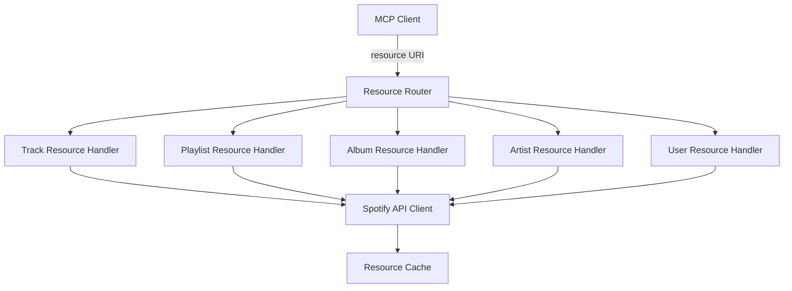

# MCP Resources Overview

## Purpose

MCP Resources provide URI-based access to Spotify data, enabling clients to fetch and monitor music information through a standardized interface. Resources complement tools by offering read-only access to data that can be referenced and monitored.

## Resource Categories

### 1. Track Resources
- Individual track information
- Audio features and analysis
- Track recommendations

### 2. Playlist Resources
- User playlists
- Playlist tracks
- Collaborative playlists

### 3. Album Resources
- Album information
- Album tracks
- New releases

### 4. Artist Resources
- Artist profiles
- Top tracks
- Related artists

### 5. User Resources
- User profile
- Saved tracks/albums
- Following/followers

## Resource URI Patterns

```
spotify://tracks/{id}
spotify://playlists/{id}
spotify://albums/{id}
spotify://artists/{id}
spotify://users/{id}
spotify://users/me
```

## Implementation Architecture



## Resource Response Format

All resources return data in a consistent format:

```typescript
interface ResourceResponse {
  uri: string
  name: string
  description?: string
  mimeType: 'application/json'
  text?: string  // JSON stringified data
}
```

## Caching Strategy

- Track/Album/Artist data: 24 hours
- Playlist data: 5 minutes
- User data: 1 minute
- Playing state: No cache

## Access Control

Resources respect Spotify OAuth scopes:
- Public data requires no special scope
- Private playlists require `playlist-read-private`
- User data requires `user-read-private`

## Error Handling

Resources return appropriate errors:
- 404: Resource not found
- 401: Authentication required
- 403: Insufficient permissions
- 429: Rate limit exceeded