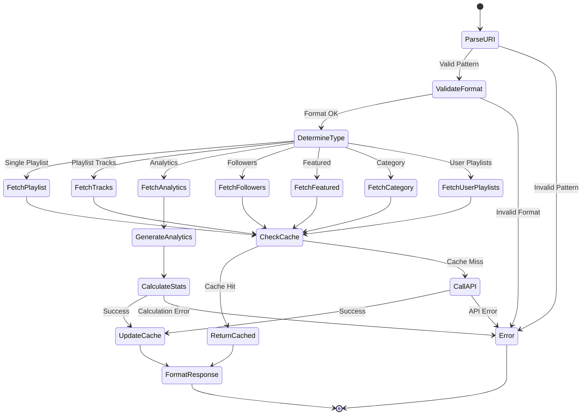

# Playlist Resource Specification

## Purpose & Responsibility

The Playlist Resource provides read-only access to Spotify playlist information through MCP resource URIs. It is responsible for:

- Fetching detailed playlist metadata and tracks
- Providing playlist analytics and insights
- Supporting playlist discovery and exploration
- Caching playlist data for performance

## Resource Definition

### URI Patterns

```typescript
type PlaylistResourceURI = 
  | `spotify://playlists/${string}`              // Single playlist
  | `spotify://playlists/${string}/tracks`       // Playlist tracks
  | `spotify://playlists/${string}/analytics`    // Playlist analytics
  | `spotify://playlists/${string}/followers`    // Playlist followers
  | `spotify://playlists/featured`               // Featured playlists
  | `spotify://playlists/categories/${string}`   // Category playlists
  | `spotify://users/${string}/playlists`        // User's playlists
```

### Resource Registration

```typescript
const playlistResource: ResourceDefinition = {
  uri: 'spotify://playlists/*',
  name: 'Spotify Playlist',
  description: 'Access Spotify playlist information and metadata',
  mimeType: 'application/json',
  handler: playlistResourceHandler
}
```

## Interface Definition

### Handler Interface

```typescript
async function playlistResourceHandler(
  uri: string,
  context: ResourceContext
): Promise<Result<ResourceResponse, ResourceError>>
```

### Type Definitions

```typescript
interface PlaylistData {
  id: string
  name: string
  description: string | null
  public: boolean
  collaborative: boolean
  owner: {
    id: string
    display_name: string
    type: 'user'
  }
  tracks: {
    total: number
    items: PlaylistTrack[]
  }
  followers: {
    total: number
  }
  images: Array<{
    url: string
    height: number | null
    width: number | null
  }>
  snapshot_id: string
  uri: string
  external_urls: {
    spotify: string
  }
}

interface PlaylistTrack {
  added_at: string
  added_by: {
    id: string
    type: 'user'
  }
  is_local: boolean
  track: {
    id: string
    name: string
    artists: Array<{
      id: string
      name: string
    }>
    album: {
      id: string
      name: string
    }
    duration_ms: number
    explicit: boolean
    popularity: number
    uri: string
  }
}

interface PlaylistAnalytics {
  total_tracks: number
  total_duration_ms: number
  unique_artists: number
  unique_albums: number
  average_popularity: number
  explicit_content_ratio: number
  genre_distribution: Array<{
    genre: string
    count: number
    percentage: number
  }>
  decade_distribution: Array<{
    decade: string
    count: number
    percentage: number
  }>
  audio_features_summary: {
    energy: { min: number; max: number; avg: number }
    valence: { min: number; max: number; avg: number }
    danceability: { min: number; max: number; avg: number }
    tempo: { min: number; max: number; avg: number }
  }
}

interface FeaturedPlaylists {
  message: string
  playlists: {
    total: number
    items: PlaylistData[]
  }
}
```

## Dependencies

### External Dependencies
- Spotify Web API endpoints:
  - `GET /v1/playlists/{playlist_id}`
  - `GET /v1/playlists/{playlist_id}/tracks`
  - `GET /v1/users/{user_id}/playlists`
  - `GET /v1/browse/featured-playlists`
  - `GET /v1/browse/categories/{category_id}/playlists`
  - `GET /v1/audio-features` (for analytics)

### Internal Dependencies
- `spotify-api-client` - API wrapper
- `token-manager` - Authentication
- `cache-manager` - Response caching
- `audio-features-analyzer` - Analytics calculation

## Behavior Specification

### URI Resolution Flow



### Implementation Details

#### Single Playlist Fetch

```typescript
async function fetchPlaylistData(
  playlistId: string,
  context: ResourceContext
): Promise<Result<PlaylistData, SpotifyError>> {
  // Check cache first
  const cacheKey = `playlist:${playlistId}`
  const cached = await context.cache.get<PlaylistData>(cacheKey)
  if (cached) {
    return ok(cached)
  }
  
  // Get access token
  const tokenResult = await context.tokenManager.getAccessToken()
  if (tokenResult.isErr()) {
    return err(tokenResult.error)
  }
  
  // Fetch playlist with tracks
  const playlistResult = await context.spotifyApi.getPlaylist(
    playlistId,
    { 
      fields: 'id,name,description,public,collaborative,owner,tracks,followers,images,snapshot_id,uri,external_urls',
      additional_types: 'track'
    }
  )
  
  if (playlistResult.isErr()) {
    return err(playlistResult.error)
  }
  
  // Cache result (15 minutes for playlists)
  await context.cache.set(cacheKey, playlistResult.value, 900)
  
  return ok(playlistResult.value)
}
```

#### Playlist Analytics Generation

```typescript
async function generatePlaylistAnalytics(
  playlistId: string,
  context: ResourceContext
): Promise<Result<PlaylistAnalytics, SpotifyError>> {
  // Get playlist tracks
  const tracksResult = await fetchPlaylistTracks(playlistId, context)
  if (tracksResult.isErr()) {
    return err(tracksResult.error)
  }
  
  const tracks = tracksResult.value
  
  // Get audio features for all tracks
  const trackIds = tracks
    .filter(item => !item.track.is_local && item.track.id)
    .map(item => item.track.id)
  
  const audioFeaturesResult = await context.spotifyApi.getAudioFeatures(trackIds)
  const audioFeatures = audioFeaturesResult.isOk() ? audioFeaturesResult.value : []
  
  // Calculate analytics
  const analytics: PlaylistAnalytics = {
    total_tracks: tracks.length,
    total_duration_ms: tracks.reduce((sum, item) => sum + item.track.duration_ms, 0),
    unique_artists: new Set(tracks.flatMap(item => item.track.artists.map(a => a.id))).size,
    unique_albums: new Set(tracks.map(item => item.track.album.id)).size,
    average_popularity: tracks.reduce((sum, item) => sum + item.track.popularity, 0) / tracks.length,
    explicit_content_ratio: tracks.filter(item => item.track.explicit).length / tracks.length,
    genre_distribution: await calculateGenreDistribution(tracks, context),
    decade_distribution: calculateDecadeDistribution(tracks),
    audio_features_summary: calculateAudioFeaturesSummary(audioFeatures)
  }
  
  return ok(analytics)
}

function calculateDecadeDistribution(tracks: PlaylistTrack[]): Array<{decade: string; count: number; percentage: number}> {
  const decadeCounts = new Map<string, number>()
  
  tracks.forEach(item => {
    // Try to extract year from album release date or other metadata
    // This is a simplified example - in practice you'd need album data
    const year = extractYearFromTrack(item.track)
    if (year) {
      const decade = `${Math.floor(year / 10) * 10}s`
      decadeCounts.set(decade, (decadeCounts.get(decade) || 0) + 1)
    }
  })
  
  const total = tracks.length
  return Array.from(decadeCounts.entries())
    .map(([decade, count]) => ({
      decade,
      count,
      percentage: (count / total) * 100
    }))
    .sort((a, b) => b.count - a.count)
}

function calculateAudioFeaturesSummary(features: AudioFeatures[]): PlaylistAnalytics['audio_features_summary'] {
  if (features.length === 0) {
    return {
      energy: { min: 0, max: 0, avg: 0 },
      valence: { min: 0, max: 0, avg: 0 },
      danceability: { min: 0, max: 0, avg: 0 },
      tempo: { min: 0, max: 0, avg: 0 }
    }
  }
  
  const calculateStats = (values: number[]) => ({
    min: Math.min(...values),
    max: Math.max(...values),
    avg: values.reduce((sum, val) => sum + val, 0) / values.length
  })
  
  return {
    energy: calculateStats(features.map(f => f.energy)),
    valence: calculateStats(features.map(f => f.valence)),
    danceability: calculateStats(features.map(f => f.danceability)),
    tempo: calculateStats(features.map(f => f.tempo))
  }
}
```

#### Featured Playlists Fetch

```typescript
async function fetchFeaturedPlaylists(
  context: ResourceContext,
  options: {
    country?: string
    limit?: number
    offset?: number
  } = {}
): Promise<Result<FeaturedPlaylists, SpotifyError>> {
  const cacheKey = `featured_playlists:${options.country || 'global'}:${options.limit || 20}:${options.offset || 0}`
  
  // Check cache (30 minutes for featured playlists)
  const cached = await context.cache.get<FeaturedPlaylists>(cacheKey)
  if (cached) {
    return ok(cached)
  }
  
  const tokenResult = await context.tokenManager.getAccessToken()
  if (tokenResult.isErr()) {
    return err(tokenResult.error)
  }
  
  const featuredResult = await context.spotifyApi.getFeaturedPlaylists({
    country: options.country,
    limit: options.limit || 20,
    offset: options.offset || 0
  })
  
  if (featuredResult.isErr()) {
    return err(featuredResult.error)
  }
  
  await context.cache.set(cacheKey, featuredResult.value, 1800)
  return ok(featuredResult.value)
}
```

### Response Formatting

```typescript
function formatPlaylistResponse(
  uri: string,
  data: PlaylistData | PlaylistAnalytics | FeaturedPlaylists | any
): ResourceResponse {
  const type = determineResponseType(uri)
  const name = generateResponseName(type, data)
  const description = generateResponseDescription(type, data)
  
  return {
    uri,
    name,
    description,
    mimeType: 'application/json',
    text: JSON.stringify(data, null, 2)
  }
}

function determineResponseType(uri: string): string {
  if (uri.includes('/analytics')) return 'Playlist Analytics'
  if (uri.includes('/tracks')) return 'Playlist Tracks'
  if (uri.includes('/followers')) return 'Playlist Followers'
  if (uri.includes('featured')) return 'Featured Playlists'
  if (uri.includes('categories')) return 'Category Playlists'
  if (uri.includes('/playlists')) return 'User Playlists'
  return 'Playlist'
}

function generateResponseName(type: string, data: any): string {
  switch (type) {
    case 'Playlist':
      return `${data.name} by ${data.owner.display_name}`
    case 'Playlist Analytics':
      return `Analytics: ${data.total_tracks} tracks, ${Math.round(data.total_duration_ms / 60000)} minutes`
    case 'Featured Playlists':
      return `Featured Playlists: ${data.playlists.items.length} playlists`
    case 'User Playlists':
      return `User Playlists: ${data.items.length} playlists`
    default:
      return type
  }
}

function generateResponseDescription(type: string, data: any): string {
  switch (type) {
    case 'Playlist':
      return `${data.tracks.total} tracks • ${data.followers.total} followers • ${data.public ? 'Public' : 'Private'}`
    case 'Playlist Analytics':
      return `${data.unique_artists} artists • ${data.unique_albums} albums • Avg popularity: ${Math.round(data.average_popularity)}%`
    case 'Featured Playlists':
      return data.message || 'Curated playlists from Spotify'
    default:
      return ''
  }
}
```

## Testing Requirements

### Unit Tests

```typescript
describe('Playlist Resource', () => {
  describe('URI Parsing', () => {
    it('should parse single playlist URI')
    it('should parse playlist tracks URI')
    it('should parse playlist analytics URI')
    it('should parse featured playlists URI')
    it('should reject invalid URIs')
  })
  
  describe('Data Fetching', () => {
    it('should fetch playlist data from API')
    it('should return cached data when available')
    it('should handle private playlists')
    it('should respect rate limits')
  })
  
  describe('Analytics Generation', () => {
    it('should calculate basic statistics')
    it('should analyze audio features')
    it('should handle playlists without features')
    it('should calculate genre distribution')
  })
  
  describe('Response Formatting', () => {
    it('should format playlist data correctly')
    it('should generate descriptive names')
    it('should handle missing data gracefully')
  })
})
```

## Performance Constraints

### Response Time Targets
- Cached responses: < 10ms
- Simple playlist fetch: < 500ms
- Analytics generation: < 3s
- Featured playlists: < 800ms

### Cache Configuration
- Playlist metadata: 15 minutes TTL
- Featured playlists: 30 minutes TTL
- User playlists: 5 minutes TTL
- Analytics: 1 hour TTL

### Resource Limits
- Maximum tracks per analytics: 1000
- Batch audio features: 100 tracks
- Memory usage: < 50MB per request

## Security Considerations

### Access Control
- Verify OAuth token has required scopes
- Respect private playlist permissions
- Handle collaborative playlist access
- Check user ownership for sensitive data

### Data Privacy
- Don't cache private playlist data
- Respect user privacy settings
- Filter sensitive information in responses
- Log access for audit trails

### Input Validation
- Validate playlist ID format
- Sanitize user inputs
- Prevent injection attacks
- Rate limit resource access