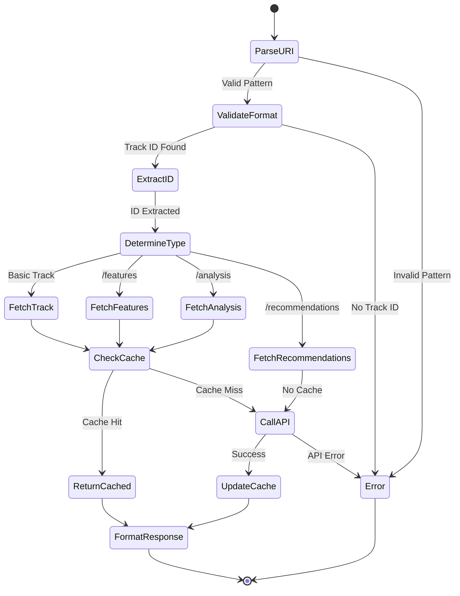

# Track Resource Specification

## Purpose & Responsibility

The Track Resource provides read-only access to Spotify track information through MCP resource URIs. It is responsible for:

- Fetching detailed track metadata
- Providing audio features and analysis
- Supporting track recommendations
- Caching track data for performance

## Resource Definition

### URI Patterns

```typescript
type TrackResourceURI = 
  | `spotify://tracks/${string}`           // Single track
  | `spotify://tracks/${string}/features`  // Audio features
  | `spotify://tracks/${string}/analysis`  // Audio analysis
  | `spotify://tracks/${string}/recommendations` // Related tracks
```

### Resource Registration

```typescript
const trackResource: ResourceDefinition = {
  uri: 'spotify://tracks/*',
  name: 'Spotify Track',
  description: 'Access Spotify track information and audio features',
  mimeType: 'application/json',
  handler: trackResourceHandler
}
```

## Interface Definition

### Handler Interface

```typescript
async function trackResourceHandler(
  uri: string,
  context: ResourceContext
): Promise<Result<ResourceResponse, ResourceError>>
```

### Type Definitions

```typescript
interface TrackData {
  id: string
  name: string
  artists: Array<{
    id: string
    name: string
    uri: string
  }>
  album: {
    id: string
    name: string
    uri: string
    images: Array<{
      url: string
      height: number
      width: number
    }>
  }
  duration_ms: number
  explicit: boolean
  popularity: number
  preview_url: string | null
  uri: string
  external_urls: {
    spotify: string
  }
}

interface AudioFeatures {
  acousticness: number      // 0.0 to 1.0
  danceability: number      // 0.0 to 1.0
  energy: number           // 0.0 to 1.0
  instrumentalness: number // 0.0 to 1.0
  key: number             // -1 to 11
  liveness: number        // 0.0 to 1.0
  loudness: number        // -60 to 0 dB
  mode: number           // 0 or 1 (minor/major)
  speechiness: number    // 0.0 to 1.0
  tempo: number         // BPM
  time_signature: number // 3 to 7
  valence: number       // 0.0 to 1.0 (mood)
}

interface ResourceResponse {
  uri: string
  name: string
  description?: string
  mimeType: 'application/json'
  text?: string
}
```

## Dependencies

### External Dependencies
- Spotify Web API endpoints:
  - `GET /v1/tracks/{id}`
  - `GET /v1/audio-features/{id}`
  - `GET /v1/audio-analysis/{id}`
  - `GET /v1/recommendations`

### Internal Dependencies
- `spotify-api-client` - API wrapper
- `token-manager` - Authentication
- `cache-manager` - Response caching

## Behavior Specification

### URI Parsing Flow



### Implementation Details

#### Basic Track Fetch

```typescript
async function fetchTrackData(
  trackId: string,
  context: ResourceContext
): Promise<Result<TrackData, SpotifyError>> {
  // 1. Check cache
  const cached = await cache.get(`track:${trackId}`)
  if (cached) {
    return ok(cached)
  }
  
  // 2. Get access token
  const tokenResult = await context.tokenManager.getAccessToken()
  if (tokenResult.isErr()) {
    return err(tokenResult.error)
  }
  
  // 3. Fetch from API
  const response = await spotifyApi.getTrack(trackId, tokenResult.value)
  if (response.isErr()) {
    return err(response.error)
  }
  
  // 4. Cache result (24 hours)
  await cache.set(`track:${trackId}`, response.value, 86400)
  
  return ok(response.value)
}
```

#### Audio Features Fetch

```typescript
async function fetchAudioFeatures(
  trackId: string,
  context: ResourceContext
): Promise<Result<AudioFeatures, SpotifyError>> {
  // Similar flow with different endpoint
  const response = await spotifyApi.getAudioFeatures(trackId, token)
  
  // Enrich with human-readable descriptions
  return ok({
    ...response.value,
    _descriptions: {
      energy: getEnergyDescription(response.value.energy),
      valence: getValenceDescription(response.value.valence),
      danceability: getDanceabilityDescription(response.value.danceability)
    }
  })
}
```

### Response Formatting

```typescript
function formatTrackResponse(
  uri: string,
  data: TrackData | AudioFeatures | any
): ResourceResponse {
  const type = uri.includes('/features') ? 'Audio Features' :
               uri.includes('/analysis') ? 'Audio Analysis' :
               uri.includes('/recommendations') ? 'Recommendations' :
               'Track'
  
  return {
    uri,
    name: `${type}: ${data.name || 'Unknown'}`,
    description: generateDescription(type, data),
    mimeType: 'application/json',
    text: JSON.stringify(data, null, 2)
  }
}

function generateDescription(type: string, data: any): string {
  switch (type) {
    case 'Track':
      return `${data.artists[0]?.name} • ${data.album.name} • ${formatDuration(data.duration_ms)}`
    case 'Audio Features':
      return `Energy: ${data.energy} • Valence: ${data.valence} • Tempo: ${data.tempo} BPM`
    default:
      return ''
  }
}
```

## Testing Requirements

### Unit Tests

```typescript
describe('Track Resource', () => {
  describe('URI Parsing', () => {
    it('should parse basic track URI')
    it('should parse features URI')
    it('should parse analysis URI')
    it('should parse recommendations URI')
    it('should reject invalid URIs')
  })
  
  describe('Data Fetching', () => {
    it('should fetch track data from API')
    it('should return cached data when available')
    it('should handle API errors gracefully')
    it('should refresh expired cache')
  })
  
  describe('Response Formatting', () => {
    it('should format track data correctly')
    it('should include human-readable descriptions')
    it('should handle missing fields')
  })
})
```

### Integration Tests

```typescript
describe('Track Resource Integration', () => {
  it('should fetch real track data')
  it('should handle rate limiting')
  it('should respect OAuth scopes')
  it('should update cache correctly')
})
```

## Performance Constraints

### Response Time Targets
- Cached responses: < 10ms
- API calls: < 500ms
- Audio analysis: < 2s

### Cache Configuration
- Track data: 24 hours TTL
- Audio features: 7 days TTL
- Audio analysis: 30 days TTL
- Recommendations: No cache (always fresh)

### Rate Limiting
- Respect Spotify rate limits
- Implement exponential backoff
- Cache aggressively to reduce API calls

## Security Considerations

### Access Control
- Verify OAuth token has required scopes
- No access to explicit content without user consent
- Respect market restrictions

### Data Privacy
- Don't cache user-specific data
- Strip personal information from responses
- Log only track IDs, not user activity

### Input Validation
- Validate track ID format (22 chars, alphanumeric)
- Sanitize URI parameters
- Prevent injection attacks