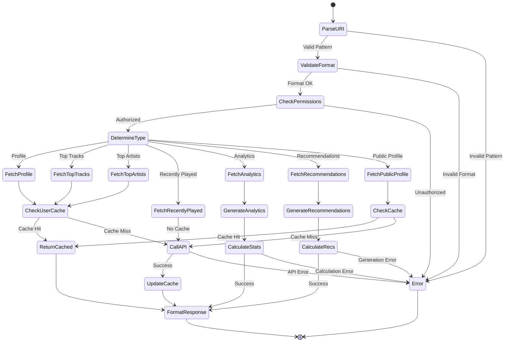

# User Resource Specification

## Purpose & Responsibility

The User Resource provides read-only access to Spotify user information through MCP resource URIs. It is responsible for:

- Fetching user profile and preferences
- Providing user listening analytics and insights
- Supporting user data exploration
- Respecting privacy and user permissions

## Resource Definition

### URI Patterns

```typescript
type UserResourceURI = 
  | `spotify://users/me`                       // Current user profile
  | `spotify://users/me/profile`               // Detailed profile
  | `spotify://users/me/top/tracks`            // User's top tracks
  | `spotify://users/me/top/artists`           // User's top artists
  | `spotify://users/me/recently-played`       // Recently played tracks
  | `spotify://users/me/analytics`             // User listening analytics
  | `spotify://users/me/recommendations`       // Personalized recommendations
  | `spotify://users/${string}/public`         // Public user profile
```

### Resource Registration

```typescript
const userResource: ResourceDefinition = {
  uri: 'spotify://users/*',
  name: 'Spotify User',
  description: 'Access Spotify user information and listening data',
  mimeType: 'application/json',
  handler: userResourceHandler
}
```

## Interface Definition

### Handler Interface

```typescript
async function userResourceHandler(
  uri: string,
  context: ResourceContext
): Promise<Result<ResourceResponse, ResourceError>>
```

### Type Definitions

```typescript
interface UserProfile {
  id: string
  display_name: string | null
  email?: string
  country: string
  explicit_content: {
    filter_enabled: boolean
    filter_locked: boolean
  }
  external_urls: {
    spotify: string
  }
  followers: {
    total: number
  }
  images: Array<{
    url: string
    height: number
    width: number
  }>
  product: 'premium' | 'free' | 'open'
  type: 'user'
  uri: string
}

interface UserTopItems<T> {
  items: T[]
  total: number
  limit: number
  offset: number
  next: string | null
  previous: string | null
  time_range: 'short_term' | 'medium_term' | 'long_term'
}

interface RecentlyPlayed {
  items: Array<{
    track: SpotifyTrack
    played_at: string
    context: {
      type: 'playlist' | 'album' | 'artist' | null
      uri: string | null
    } | null
  }>
  next: string | null
  cursors: {
    after: string
    before: string
  }
  limit: number
  total?: number
}

interface UserAnalytics {
  profile_summary: {
    account_type: string
    country: string
    listening_preferences: {
      explicit_content_allowed: boolean
    }
  }
  listening_patterns: {
    total_listening_time_ms: number
    average_session_duration_ms: number
    listening_diversity_score: number
    peak_listening_hours: Array<{
      hour: number
      play_count: number
    }>
  }
  music_taste_profile: {
    top_genres: Array<{
      genre: string
      score: number
      track_count: number
    }>
    audio_features_preferences: {
      energy: number
      valence: number
      danceability: number
      acousticness: number
      instrumentalness: number
      tempo: number
    }
    era_preferences: Array<{
      decade: string
      percentage: number
    }>
  }
  discovery_patterns: {
    new_vs_familiar_ratio: number
    playlist_vs_album_ratio: number
    average_tracks_per_artist: number
    exploration_score: number
  }
  social_listening: {
    followed_artists_count: number
    public_playlists_count: number
    collaborative_playlists_count: number
    followers_count: number
  }
  recommendations_context: {
    recently_played_genres: string[]
    current_mood_indicators: {
      energy_trend: 'increasing' | 'decreasing' | 'stable'
      valence_trend: 'increasing' | 'decreasing' | 'stable'
    }
    optimal_recommendation_params: {
      target_energy: number
      target_valence: number
      target_danceability: number
    }
  }
}

interface PersonalizedRecommendations {
  tracks: SpotifyTrack[]
  seed_context: {
    based_on: 'top_tracks' | 'recent_listening' | 'followed_artists'
    time_range: string
    genres: string[]
  }
  recommendation_reasoning: Array<{
    track_id: string
    reason: string
    confidence: number
  }>
}
```

## Dependencies

### External Dependencies
- Spotify Web API endpoints:
  - `GET /v1/me`
  - `GET /v1/me/top/tracks`
  - `GET /v1/me/top/artists`
  - `GET /v1/me/player/recently-played`
  - `GET /v1/users/{user_id}`
  - `GET /v1/recommendations`
  - `GET /v1/audio-features`

### Internal Dependencies
- `spotify-api-client` - API wrapper
- `token-manager` - Authentication
- `cache-manager` - Response caching (limited for user data)
- `analytics-engine` - User analytics calculation
- `recommendations-engine` - Personalized recommendations

## Behavior Specification

### URI Resolution Flow



### Implementation Details

#### User Profile Fetch

```typescript
async function fetchUserProfile(
  context: ResourceContext,
  userId?: string
): Promise<Result<UserProfile, SpotifyError>> {
  const isCurrentUser = !userId || userId === 'me'
  const cacheKey = isCurrentUser ? 'user:me:profile' : `user:${userId}:profile`
  
  // For current user, check short cache (5 minutes)
  // For public profiles, check longer cache (1 hour)
  const cacheTTL = isCurrentUser ? 300 : 3600
  const cached = await context.cache.get<UserProfile>(cacheKey)
  if (cached) {
    return ok(cached)
  }
  
  // Get access token
  const tokenResult = await context.tokenManager.getAccessToken()
  if (tokenResult.isErr()) {
    return err(tokenResult.error)
  }
  
  // Fetch user profile
  const endpoint = isCurrentUser ? '/v1/me' : `/v1/users/${userId}`
  const profileResult = await context.spotifyApi.makeRequest('GET', endpoint)
  
  if (profileResult.isErr()) {
    return err(profileResult.error)
  }
  
  // Cache result with appropriate TTL
  await context.cache.set(cacheKey, profileResult.value, cacheTTL)
  
  return ok(profileResult.value)
}
```

#### User Analytics Generation

```typescript
async function generateUserAnalytics(
  context: ResourceContext
): Promise<Result<UserAnalytics, SpotifyError>> {
  // Get user profile
  const profileResult = await fetchUserProfile(context)
  if (profileResult.isErr()) {
    return err(profileResult.error)
  }
  
  const profile = profileResult.value
  
  // Get top tracks and artists for different time ranges
  const [shortTermTracks, mediumTermTracks, longTermTracks] = await Promise.all([
    fetchUserTopTracks(context, 'short_term', 50),
    fetchUserTopTracks(context, 'medium_term', 50),
    fetchUserTopTracks(context, 'long_term', 50)
  ])
  
  const [shortTermArtists, mediumTermArtists, longTermArtists] = await Promise.all([
    fetchUserTopArtists(context, 'short_term', 50),
    fetchUserTopArtists(context, 'medium_term', 50),
    fetchUserTopArtists(context, 'long_term', 50)
  ])
  
  // Get recently played tracks
  const recentlyPlayedResult = await fetchRecentlyPlayed(context, 50)
  
  // Combine all data for analysis
  const allTracks = [
    ...(shortTermTracks.isOk() ? shortTermTracks.value.items : []),
    ...(mediumTermTracks.isOk() ? mediumTermTracks.value.items : []),
    ...(longTermTracks.isOk() ? longTermTracks.value.items : [])
  ]
  
  const allArtists = [
    ...(shortTermArtists.isOk() ? shortTermArtists.value.items : []),
    ...(mediumTermArtists.isOk() ? mediumTermArtists.value.items : []),
    ...(longTermArtists.isOk() ? longTermArtists.value.items : [])
  ]
  
  const recentTracks = recentlyPlayedResult.isOk() ? recentlyPlayedResult.value.items : []
  
  // Calculate analytics
  const analytics: UserAnalytics = {
    profile_summary: {
      account_type: profile.product,
      country: profile.country,
      listening_preferences: {
        explicit_content_allowed: !profile.explicit_content.filter_enabled
      }
    },
    listening_patterns: await calculateListeningPatterns(recentTracks, allTracks),
    music_taste_profile: await calculateMusicTasteProfile(allTracks, allArtists, context),
    discovery_patterns: calculateDiscoveryPatterns(allTracks, allArtists, recentTracks),
    social_listening: await calculateSocialListening(profile, context),
    recommendations_context: calculateRecommendationsContext(recentTracks, allTracks)
  }
  
  return ok(analytics)
}

async function calculateListeningPatterns(
  recentTracks: any[],
  topTracks: any[]
): Promise<UserAnalytics['listening_patterns']> {
  // Calculate total listening time from recent tracks
  const totalDuration = recentTracks.reduce(
    (sum, item) => sum + (item.track?.duration_ms || 0), 0
  )
  
  // Estimate session duration (simplified calculation)
  const sessions = groupTracksBySessions(recentTracks)
  const averageSessionDuration = sessions.length > 0 
    ? sessions.reduce((sum, session) => sum + session.duration, 0) / sessions.length
    : 0
  
  // Calculate diversity score (unique artists / total tracks)
  const uniqueArtists = new Set(
    topTracks.flatMap(track => track.artists?.map(a => a.id) || [])
  ).size
  const diversityScore = topTracks.length > 0 ? uniqueArtists / topTracks.length : 0
  
  // Calculate peak listening hours from recent tracks
  const hourCounts = new Map<number, number>()
  recentTracks.forEach(item => {
    if (item.played_at) {
      const hour = new Date(item.played_at).getHours()
      hourCounts.set(hour, (hourCounts.get(hour) || 0) + 1)
    }
  })
  
  const peakListeningHours = Array.from(hourCounts.entries())
    .map(([hour, count]) => ({ hour, play_count: count }))
    .sort((a, b) => b.play_count - a.play_count)
    .slice(0, 5)
  
  return {
    total_listening_time_ms: totalDuration,
    average_session_duration_ms: averageSessionDuration,
    listening_diversity_score: diversityScore,
    peak_listening_hours: peakListeningHours
  }
}

async function calculateMusicTasteProfile(
  tracks: any[],
  artists: any[],
  context: ResourceContext
): Promise<UserAnalytics['music_taste_profile']> {
  // Get audio features for top tracks
  const trackIds = tracks.map(track => track.id).filter(Boolean)
  const audioFeaturesResult = await context.spotifyApi.getAudioFeatures(trackIds)
  const audioFeatures = audioFeaturesResult.isOk() ? audioFeaturesResult.value : []
  
  // Calculate genre preferences from artists
  const genreCounts = new Map<string, number>()
  artists.forEach(artist => {
    artist.genres?.forEach(genre => {
      genreCounts.set(genre, (genreCounts.get(genre) || 0) + 1)
    })
  })
  
  const topGenres = Array.from(genreCounts.entries())
    .map(([genre, count]) => ({
      genre,
      score: count / artists.length,
      track_count: count
    }))
    .sort((a, b) => b.score - a.score)
    .slice(0, 10)
  
  // Calculate average audio features preferences
  const audioFeaturesPreferences = audioFeatures.length > 0 ? {
    energy: audioFeatures.reduce((sum, f) => sum + f.energy, 0) / audioFeatures.length,
    valence: audioFeatures.reduce((sum, f) => sum + f.valence, 0) / audioFeatures.length,
    danceability: audioFeatures.reduce((sum, f) => sum + f.danceability, 0) / audioFeatures.length,
    acousticness: audioFeatures.reduce((sum, f) => sum + f.acousticness, 0) / audioFeatures.length,
    instrumentalness: audioFeatures.reduce((sum, f) => sum + f.instrumentalness, 0) / audioFeatures.length,
    tempo: audioFeatures.reduce((sum, f) => sum + f.tempo, 0) / audioFeatures.length
  } : {
    energy: 0.5, valence: 0.5, danceability: 0.5,
    acousticness: 0.5, instrumentalness: 0.5, tempo: 120
  }
  
  // Calculate era preferences (simplified - would need album data)
  const eraPreferences = calculateEraPreferences(tracks)
  
  return {
    top_genres: topGenres,
    audio_features_preferences: audioFeaturesPreferences,
    era_preferences: eraPreferences
  }
}

function calculateRecommendationsContext(
  recentTracks: any[],
  topTracks: any[]
): UserAnalytics['recommendations_context'] {
  // Extract recent genres (simplified)
  const recentGenres = extractGenresFromTracks(recentTracks.slice(0, 10))
  
  // Calculate mood trends from recent listening
  const moodTrends = calculateMoodTrends(recentTracks)
  
  // Calculate optimal recommendation parameters
  const optimalParams = calculateOptimalParams(topTracks, recentTracks)
  
  return {
    recently_played_genres: recentGenres,
    current_mood_indicators: moodTrends,
    optimal_recommendation_params: optimalParams
  }
}
```

### Response Formatting

```typescript
function formatUserResponse(
  uri: string,
  data: UserProfile | UserAnalytics | PersonalizedRecommendations | any
): ResourceResponse {
  const type = determineUserResponseType(uri)
  const name = generateUserResponseName(type, data)
  const description = generateUserResponseDescription(type, data)
  
  return {
    uri,
    name,
    description,
    mimeType: 'application/json',
    text: JSON.stringify(data, null, 2)
  }
}

function determineUserResponseType(uri: string): string {
  if (uri.includes('/analytics')) return 'User Analytics'
  if (uri.includes('/top/tracks')) return 'Top Tracks'
  if (uri.includes('/top/artists')) return 'Top Artists'
  if (uri.includes('/recently-played')) return 'Recently Played'
  if (uri.includes('/recommendations')) return 'Personalized Recommendations'
  if (uri.includes('/public')) return 'Public Profile'
  return 'User Profile'
}
```

## Testing Requirements

### Unit Tests

```typescript
describe('User Resource', () => {
  describe('URI Parsing', () => {
    it('should parse current user URI')
    it('should parse top tracks URI')
    it('should parse analytics URI')
    it('should parse public profile URI')
    it('should reject invalid URIs')
  })
  
  describe('Data Fetching', () => {
    it('should fetch user profile from API')
    it('should respect privacy for public profiles')
    it('should handle premium vs free accounts')
    it('should cache appropriately')
  })
  
  describe('Analytics Generation', () => {
    it('should calculate listening patterns')
    it('should analyze music taste profile')
    it('should calculate discovery patterns')
    it('should generate recommendation context')
  })
  
  describe('Privacy & Security', () => {
    it('should not cache sensitive user data')
    it('should respect explicit content settings')
    it('should handle private profiles')
  })
})
```

## Performance Constraints

### Response Time Targets
- Profile fetch: < 400ms
- Analytics generation: < 5s
- Top tracks/artists: < 800ms
- Recently played: < 500ms

### Cache Configuration
- Current user profile: 5 minutes TTL
- Public profiles: 1 hour TTL
- Top tracks/artists: 1 hour TTL
- Recently played: No cache
- Analytics: 30 minutes TTL

### Resource Limits
- Maximum tracks for analytics: 200
- Memory usage: < 50MB per request
- Batch processing for large datasets

## Security Considerations

### Access Control
- Verify OAuth token scopes for user data
- Respect private profile settings
- Handle user data permissions carefully
- Check explicit content filter settings

### Data Privacy
- **Never cache personal user data long-term**
- Respect user privacy preferences
- Filter sensitive information appropriately
- Comply with data protection regulations

### Input Validation
- Validate user ID format
- Sanitize time range parameters
- Prevent unauthorized data access
- Rate limit user data requests