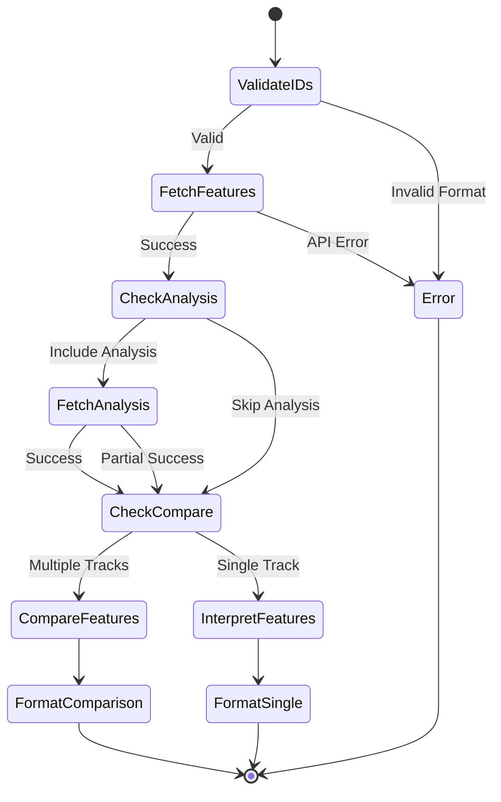

# Audio Features Tool Specification

## Purpose & Responsibility

The Audio Features tool provides detailed audio analysis for Spotify tracks. It is responsible for:

- Fetching audio characteristics for single or multiple tracks
- Interpreting technical features into human-readable insights
- Comparing tracks based on audio properties
- Supporting music discovery through audio analysis

## Interface Definition

### Tool Definition

```typescript
const audioFeaturesTool: ToolDefinition = {
  name: 'audio_features',
  description: 'Get detailed audio features and characteristics for tracks',
  category: 'analysis',
  inputSchema: {
    type: 'object',
    properties: {
      track_ids: {
        type: 'array',
        items: {
          type: 'string',
          pattern: '^[a-zA-Z0-9]{22}$'
        },
        minItems: 1,
        maxItems: 100,
        description: 'Spotify track IDs to analyze'
      },
      include_analysis: {
        type: 'boolean',
        default: false,
        description: 'Include detailed audio analysis (slower)'
      },
      compare: {
        type: 'boolean',
        default: false,
        description: 'Compare tracks if multiple provided'
      }
    },
    required: ['track_ids']
  }
}
```

### Handler Interface

```typescript
async function audioFeaturesHandler(
  input: AudioFeaturesInput,
  context: ToolContext
): Promise<Result<ToolResult, ToolError>>
```

### Type Definitions

```typescript
interface AudioFeaturesInput {
  track_ids: string[]
  include_analysis?: boolean
  compare?: boolean
}

interface AudioFeatures {
  // Basic identifiers
  id: string
  uri: string
  track_href: string
  analysis_url: string
  
  // Perceptual features (0.0 to 1.0)
  acousticness: number      // Confidence the track is acoustic
  danceability: number      // How suitable for dancing
  energy: number           // Perceptual intensity and activity
  instrumentalness: number // Predicts if track contains no vocals
  liveness: number        // Presence of audience in recording
  speechiness: number     // Presence of spoken words
  valence: number        // Musical positivity (mood)
  
  // Technical features
  duration_ms: number     // Track length in milliseconds
  key: number            // Key the track is in (-1 to 11)
  loudness: number       // Overall loudness in dB
  mode: number          // Modality (0 = minor, 1 = major)
  tempo: number         // Estimated tempo in BPM
  time_signature: number // Time signature (3 to 7)
}

interface AudioAnalysis {
  // Summary statistics
  bars: Array<{ start: number; duration: number; confidence: number }>
  beats: Array<{ start: number; duration: number; confidence: number }>
  sections: Array<{
    start: number
    duration: number
    confidence: number
    loudness: number
    tempo: number
    key: number
    mode: number
  }>
  segments: Array<{
    start: number
    duration: number
    pitches: number[]
    timbre: number[]
  }>
  tatums: Array<{ start: number; duration: number; confidence: number }>
}

interface TrackComparison {
  tracks: Array<{
    id: string
    name: string
    features: AudioFeatures
  }>
  similarities: {
    overall: number
    by_feature: Record<string, number>
  }
  differences: {
    most_different: string[]
    insights: string[]
  }
}
```

## Dependencies

### External Dependencies
- Spotify Web API endpoints:
  - `GET /v1/audio-features` (batch endpoint)
  - `GET /v1/audio-features/{id}` (single track)
  - `GET /v1/audio-analysis/{id}` (detailed analysis)

### Internal Dependencies
- `spotify-api-client` - API wrapper
- `token-manager` - Authentication
- `feature-interpreter` - Human-readable insights

## Behavior Specification

### Analysis Flow



### Implementation

```typescript
async function handleAudioFeatures(
  input: AudioFeaturesInput,
  context: ToolContext
): Promise<Result<AudioFeaturesResult, SpotifyError>> {
  // 1. Batch fetch audio features
  const featuresResult = await context.spotifyApi.getAudioFeatures(
    input.track_ids
  )
  
  if (featuresResult.isErr()) {
    return err(featuresResult.error)
  }
  
  const features = featuresResult.value
  
  // 2. Optionally fetch detailed analysis
  let analyses: Record<string, AudioAnalysis> = {}
  if (input.include_analysis) {
    const analysisPromises = input.track_ids.map(id =>
      context.spotifyApi.getAudioAnalysis(id)
        .then(result => ({ id, result }))
    )
    
    const analysisResults = await Promise.all(analysisPromises)
    
    for (const { id, result } of analysisResults) {
      if (result.isOk()) {
        analyses[id] = result.value
      }
    }
  }
  
  // 3. Compare tracks if requested
  if (input.compare && input.track_ids.length > 1) {
    return ok(generateComparison(features, analyses))
  }
  
  // 4. Generate insights
  return ok(generateInsights(features, analyses))
}
```

### Feature Interpretation

```typescript
function interpretAudioFeatures(features: AudioFeatures): FeatureInsights {
  const insights: FeatureInsights = {
    mood: interpretMood(features.valence, features.energy),
    danceability: interpretDanceability(features.danceability, features.tempo),
    energy: interpretEnergy(features.energy, features.loudness),
    characteristics: []
  }
  
  // Key insights
  const key = getKeyName(features.key, features.mode)
  insights.characteristics.push(`Key: ${key}`)
  
  // Tempo insights
  const tempoCategory = categorizeTempo(features.tempo)
  insights.characteristics.push(`Tempo: ${tempoCategory} (${Math.round(features.tempo)} BPM)`)
  
  // Special characteristics
  if (features.acousticness > 0.8) {
    insights.characteristics.push('Highly acoustic')
  }
  if (features.instrumentalness > 0.5) {
    insights.characteristics.push('Primarily instrumental')
  }
  if (features.liveness > 0.8) {
    insights.characteristics.push('Live recording')
  }
  if (features.speechiness > 0.66) {
    insights.characteristics.push('Spoken word content')
  }
  
  return insights
}

function interpretMood(valence: number, energy: number): string {
  if (valence > 0.7 && energy > 0.7) return '😊 Happy and energetic'
  if (valence > 0.7 && energy < 0.3) return '😌 Content and relaxed'
  if (valence < 0.3 && energy > 0.7) return '😤 Intense or aggressive'
  if (valence < 0.3 && energy < 0.3) return '😔 Melancholic or sad'
  if (valence > 0.5) return '🙂 Positive'
  return '😐 Neutral or complex'
}

const KEY_NAMES = ['C', 'C♯/D♭', 'D', 'D♯/E♭', 'E', 'F', 'F♯/G♭', 'G', 'G♯/A♭', 'A', 'A♯/B♭', 'B']

function getKeyName(key: number, mode: number): string {
  if (key === -1) return 'No key detected'
  const keyName = KEY_NAMES[key]
  const modeName = mode === 1 ? 'major' : 'minor'
  return `${keyName} ${modeName}`
}
```

### Track Comparison

```typescript
function compareAudioFeatures(
  tracks: Array<{ id: string; features: AudioFeatures }>
): TrackComparison {
  const features = [
    'energy', 'valence', 'danceability', 'acousticness',
    'instrumentalness', 'liveness', 'speechiness'
  ]
  
  // Calculate feature similarities
  const similarities: Record<string, number> = {}
  
  for (const feature of features) {
    const values = tracks.map(t => t.features[feature])
    const mean = values.reduce((a, b) => a + b) / values.length
    const variance = values.reduce((sum, val) => 
      sum + Math.pow(val - mean, 2), 0) / values.length
    
    // Similarity as inverse of variance (0-1 scale)
    similarities[feature] = 1 - Math.sqrt(variance)
  }
  
  // Overall similarity
  const overallSimilarity = Object.values(similarities)
    .reduce((a, b) => a + b) / features.length
  
  // Find most different features
  const sortedDifferences = Object.entries(similarities)
    .sort(([, a], [, b]) => a - b)
    .slice(0, 3)
    .map(([feature]) => feature)
  
  // Generate insights
  const insights = generateComparisonInsights(tracks, similarities)
  
  return {
    tracks: tracks.map(t => ({
      id: t.id,
      name: t.name || 'Unknown',
      features: t.features
    })),
    similarities: {
      overall: overallSimilarity,
      by_feature: similarities
    },
    differences: {
      most_different: sortedDifferences,
      insights
    }
  }
}
```

### Result Formatting

```typescript
function formatAudioFeaturesResult(
  features: AudioFeatures[],
  insights: FeatureInsights[],
  comparison?: TrackComparison
): string {
  if (comparison) {
    return formatComparison(comparison)
  }
  
  // Single or multiple tracks without comparison
  const lines: string[] = []
  
  features.forEach((feature, index) => {
    const insight = insights[index]
    
    lines.push(`🎵 Track ${index + 1}`)
    lines.push(`Mood: ${insight.mood}`)
    lines.push(`Energy: ${(feature.energy * 100).toFixed(0)}%`)
    lines.push(`Danceability: ${(feature.danceability * 100).toFixed(0)}%`)
    lines.push(`Valence: ${(feature.valence * 100).toFixed(0)}%`)
    
    if (insight.characteristics.length > 0) {
      lines.push('Characteristics:')
      insight.characteristics.forEach(char => 
        lines.push(`  • ${char}`)
      )
    }
    
    if (index < features.length - 1) {
      lines.push('')
    }
  })
  
  return lines.join('\n')
}

function formatComparison(comparison: TrackComparison): string {
  const lines = [
    `📊 Comparing ${comparison.tracks.length} tracks`,
    `Overall similarity: ${(comparison.similarities.overall * 100).toFixed(0)}%`,
    '',
    'Feature similarities:'
  ]
  
  for (const [feature, similarity] of Object.entries(comparison.similarities.by_feature)) {
    const percentage = (similarity * 100).toFixed(0)
    const bar = '█'.repeat(Math.round(similarity * 10))
    lines.push(`  ${feature}: ${bar} ${percentage}%`)
  }
  
  if (comparison.differences.insights.length > 0) {
    lines.push('')
    lines.push('Key differences:')
    comparison.differences.insights.forEach(insight =>
      lines.push(`  • ${insight}`)
    )
  }
  
  return lines.join('\n')
}
```

## Testing Requirements

### Unit Tests

```typescript
describe('Audio Features Tool', () => {
  describe('Input Validation', () => {
    it('should validate track ID format')
    it('should enforce track limit')
    it('should handle empty array')
  })
  
  describe('Feature Analysis', () => {
    it('should fetch features for single track')
    it('should batch fetch for multiple tracks')
    it('should handle partial failures')
    it('should include analysis when requested')
  })
  
  describe('Feature Interpretation', () => {
    it('should categorize mood correctly')
    it('should identify key characteristics')
    it('should format key names properly')
  })
  
  describe('Track Comparison', () => {
    it('should calculate similarities')
    it('should identify differences')
    it('should generate meaningful insights')
  })
})
```

## Performance Constraints

### Response Times
- Feature fetch: < 300ms (batch)
- Audio analysis: < 2s per track
- Comparison calculation: < 100ms
- Total (100 tracks): < 5s

### Optimization
- Batch API requests (max 100)
- Parallel analysis fetching
- Cache audio features (7 days)
- Skip analysis for large batches

## Security Considerations

### Input Validation
- Validate all track IDs
- Enforce request limits
- Sanitize output
- Rate limit per user