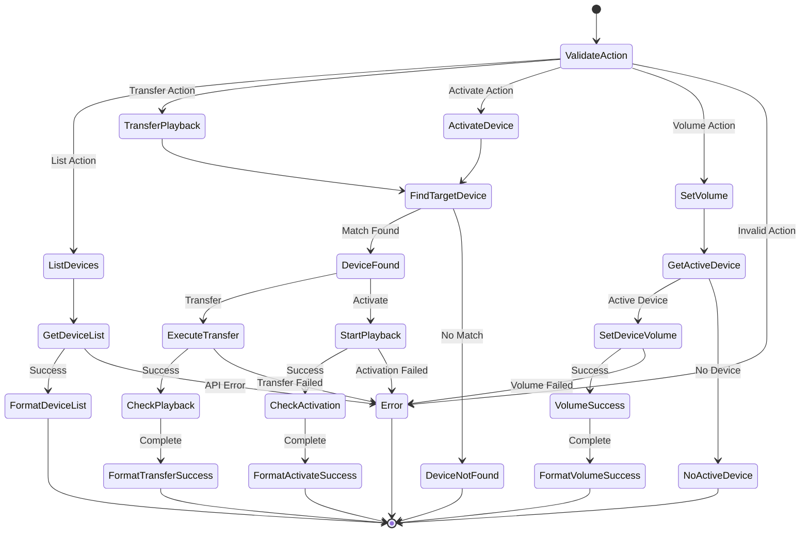

# Devices Tool Specification

## Purpose & Responsibility

The Devices tool enables users to manage Spotify playback devices and control where their music plays. It is responsible for:

- Listing available Spotify Connect devices
- Transferring playback between devices
- Getting device capabilities and status
- Managing device activation and volume
- Providing device-specific playback controls

## Interface Definition

### Tool Definition

```typescript
const devicesTool: ToolDefinition = {
  name: 'devices',
  description: 'Manage Spotify Connect devices and playback transfer',
  category: 'playback',
  inputSchema: {
    type: 'object',
    properties: {
      action: {
        type: 'string',
        enum: ['list', 'transfer', 'activate', 'set_volume'],
        description: 'Device management action to perform'
      },
      device_id: {
        type: 'string',
        description: 'Target device ID for transfer/volume actions'
      },
      device_name: {
        type: 'string',
        description: 'Device name for fuzzy matching'
      },
      volume_percent: {
        type: 'number',
        minimum: 0,
        maximum: 100,
        description: 'Volume level (0-100) for set_volume action'
      },
      ensure_playback: {
        type: 'boolean',
        default: false,
        description: 'Start playback after transfer if not already playing'
      },
      include_inactive: {
        type: 'boolean',
        default: false,
        description: 'Include inactive devices in list'
      }
    },
    required: ['action'],
    allOf: [
      {
        if: { properties: { action: { const: 'transfer' } } },
        then: { 
          anyOf: [
            { required: ['device_id'] },
            { required: ['device_name'] }
          ]
        }
      },
      {
        if: { properties: { action: { const: 'activate' } } },
        then: { 
          anyOf: [
            { required: ['device_id'] },
            { required: ['device_name'] }
          ]
        }
      },
      {
        if: { properties: { action: { const: 'set_volume' } } },
        then: { required: ['volume_percent'] }
      }
    ]
  }
}
```

### Handler Interface

```typescript
async function devicesHandler(
  input: DevicesInput,
  context: ToolContext
): Promise<Result<ToolResult, ToolError>>
```

### Type Definitions

```typescript
interface DevicesInput {
  action: 'list' | 'transfer' | 'activate' | 'set_volume'
  device_id?: string
  device_name?: string
  volume_percent?: number
  ensure_playback?: boolean
  include_inactive?: boolean
}

interface SpotifyDevice {
  id: string
  is_active: boolean
  is_private_session: boolean
  is_restricted: boolean
  name: string
  type: DeviceType
  volume_percent: number | null
  supports_volume: boolean
}

type DeviceType = 
  | 'Computer'
  | 'Smartphone' 
  | 'Speaker'
  | 'TV'
  | 'AVR'
  | 'STB'
  | 'AudioDongle'
  | 'GameConsole'
  | 'CastVideo'
  | 'CastAudio'
  | 'Automobile'
  | 'Unknown'

interface DevicesResult {
  action: string
  devices?: SpotifyDevice[]
  active_device?: SpotifyDevice
  target_device?: SpotifyDevice
  transfer_successful?: boolean
  volume_set?: number
  message: string
}
```

## Dependencies

### External Dependencies
- Spotify Web API endpoints:
  - `GET /v1/me/player/devices` (list devices)
  - `PUT /v1/me/player` (transfer playback)
  - `PUT /v1/me/player/volume` (set volume)

### Internal Dependencies
- `spotify-api-client` - API wrapper
- `token-manager` - Authentication
- `cache-manager` - Device list caching

## Behavior Specification

### Device Management Flow



### Action Implementations

#### List Devices Action

```typescript
async function handleListDevices(
  input: DevicesInput,
  context: ToolContext
): Promise<Result<DevicesResult, SpotifyError>> {
  const devicesResult = await context.spotifyApi.getDevices()
  
  if (devicesResult.isErr()) {
    return err(devicesResult.error)
  }
  
  let devices = devicesResult.value.devices
  
  // Filter inactive devices if requested
  if (!input.include_inactive) {
    devices = devices.filter(device => device.is_active || !device.is_restricted)
  }
  
  const activeDevice = devices.find(device => device.is_active)
  
  return ok({
    action: 'list',
    devices,
    active_device: activeDevice,
    message: formatDeviceList(devices, activeDevice)
  })
}

function formatDeviceList(devices: SpotifyDevice[], activeDevice?: SpotifyDevice): string {
  if (devices.length === 0) {
    return '📱 No Spotify devices found\n\n💡 To see devices:\n1. Open Spotify on your devices\n2. Start playing music\n3. Try the command again'
  }
  
  const lines = ['🎵 Available Spotify devices:']
  
  devices.forEach((device, index) => {
    const icon = getDeviceIcon(device.type)
    const status = device.is_active ? '▶️ ACTIVE' : '⏸️ Available'
    const volume = device.volume_percent !== null ? ` (${device.volume_percent}%)` : ''
    const restricted = device.is_restricted ? ' [Limited]' : ''
    
    lines.push(`${index + 1}. ${icon} ${device.name} - ${status}${volume}${restricted}`)
  })
  
  if (activeDevice) {
    lines.push('')
    lines.push(`🎯 Currently active: ${activeDevice.name}`)
  }
  
  return lines.join('\n')
}

function getDeviceIcon(type: DeviceType): string {
  const icons: Record<DeviceType, string> = {
    'Computer': '💻',
    'Smartphone': '📱', 
    'Speaker': '🔊',
    'TV': '📺',
    'AVR': '📻',
    'STB': '📦',
    'AudioDongle': '🔌',
    'GameConsole': '🎮',
    'CastVideo': '📽️',
    'CastAudio': '🔊',
    'Automobile': '🚗',
    'Unknown': '❓'
  }
  return icons[type] || '📱'
}
```

#### Transfer Playback Action

```typescript
async function handleTransferPlayback(
  input: DevicesInput,
  context: ToolContext
): Promise<Result<DevicesResult, SpotifyError>> {
  // Find target device
  const deviceResult = await findTargetDevice(input, context)
  if (deviceResult.isErr()) {
    return err(deviceResult.error)
  }
  
  const targetDevice = deviceResult.value
  
  // Check if already active
  if (targetDevice.is_active) {
    return ok({
      action: 'transfer',
      target_device: targetDevice,
      transfer_successful: true,
      message: `✅ ${targetDevice.name} is already the active device`
    })
  }
  
  // Transfer playback
  const transferResult = await context.spotifyApi.transferPlayback(
    [targetDevice.id],
    input.ensure_playback
  )
  
  if (transferResult.isErr()) {
    return err(transferResult.error)
  }
  
  return ok({
    action: 'transfer',
    target_device: targetDevice,
    transfer_successful: true,
    message: `🔄 Transferred playback to ${targetDevice.name}`
  })
}

async function findTargetDevice(
  input: DevicesInput,
  context: ToolContext
): Promise<Result<SpotifyDevice, SpotifyError>> {
  const devicesResult = await context.spotifyApi.getDevices()
  if (devicesResult.isErr()) {
    return err(devicesResult.error)
  }
  
  const devices = devicesResult.value.devices
  
  // Find by exact ID
  if (input.device_id) {
    const device = devices.find(d => d.id === input.device_id)
    if (device) {
      return ok(device)
    }
    return err({
      type: 'ValidationError',
      message: `Device with ID "${input.device_id}" not found`
    })
  }
  
  // Find by name (fuzzy matching)
  if (input.device_name) {
    const query = input.device_name.toLowerCase()
    
    // Exact match first
    let device = devices.find(d => d.name.toLowerCase() === query)
    
    // Partial match if no exact match
    if (!device) {
      device = devices.find(d => d.name.toLowerCase().includes(query))
    }
    
    // Fuzzy match if still no match
    if (!device) {
      device = devices.find(d => 
        levenshteinDistance(d.name.toLowerCase(), query) <= 2
      )
    }
    
    if (device) {
      return ok(device)
    }
    
    return err({
      type: 'ValidationError',
      message: `No device found matching "${input.device_name}". Available devices: ${devices.map(d => d.name).join(', ')}`
    })
  }
  
  return err({
    type: 'ValidationError',
    message: 'Device ID or name is required'
  })
}

function levenshteinDistance(a: string, b: string): number {
  const matrix = Array(b.length + 1).fill(null).map(() => Array(a.length + 1).fill(null))
  
  for (let i = 0; i <= a.length; i++) matrix[0][i] = i
  for (let j = 0; j <= b.length; j++) matrix[j][0] = j
  
  for (let j = 1; j <= b.length; j++) {
    for (let i = 1; i <= a.length; i++) {
      const indicator = a[i - 1] === b[j - 1] ? 0 : 1
      matrix[j][i] = Math.min(
        matrix[j][i - 1] + 1,     // deletion
        matrix[j - 1][i] + 1,     // insertion
        matrix[j - 1][i - 1] + indicator // substitution
      )
    }
  }
  
  return matrix[b.length][a.length]
}
```

#### Set Volume Action

```typescript
async function handleSetVolume(
  input: DevicesInput,
  context: ToolContext
): Promise<Result<DevicesResult, SpotifyError>> {
  const volume = input.volume_percent!
  
  let targetDevice: SpotifyDevice | undefined
  
  // If device specified, check it supports volume
  if (input.device_id || input.device_name) {
    const deviceResult = await findTargetDevice(input, context)
    if (deviceResult.isErr()) {
      return err(deviceResult.error)
    }
    
    targetDevice = deviceResult.value
    
    if (!targetDevice.supports_volume) {
      return err({
        type: 'ValidationError',
        message: `Device "${targetDevice.name}" does not support volume control`
      })
    }
    
    // If device is not active, transfer first
    if (!targetDevice.is_active) {
      const transferResult = await context.spotifyApi.transferPlayback([targetDevice.id])
      if (transferResult.isErr()) {
        return err(transferResult.error)
      }
    }
  }
  
  // Set volume
  const volumeResult = await context.spotifyApi.setVolume(
    volume,
    targetDevice?.id
  )
  
  if (volumeResult.isErr()) {
    return err(volumeResult.error)
  }
  
  const deviceName = targetDevice?.name || 'active device'
  
  return ok({
    action: 'set_volume',
    target_device: targetDevice,
    volume_set: volume,
    message: `🔊 Set volume to ${volume}% on ${deviceName}`
  })
}
```

### Error Handling

```typescript
function handleDevicesError(
  error: SpotifyError,
  input: DevicesInput
): ToolResult {
  const actionNames = {
    list: 'list devices',
    transfer: 'transfer playback',
    activate: 'activate device',
    set_volume: 'set volume'
  }
  
  const action = actionNames[input.action]
  
  const errorMessages: Record<string, string> = {
    '404': 'No active device found. Start Spotify on a device first.',
    '403': 'Device control requires Spotify Premium.',
    '401': 'Authentication expired. Please re-authenticate.',
    '429': 'Rate limit exceeded. Please try again later.',
    '502': 'Spotify Connect service temporarily unavailable.'
  }
  
  const suggestions: Record<string, string> = {
    list: 'Make sure Spotify is open and playing on at least one device.',
    transfer: 'Ensure the target device is online and has Spotify running.',
    activate: 'Check that the device name is correct and the device is available.',
    set_volume: 'Verify the device supports volume control and is active.'
  }
  
  const message = errorMessages[error.statusCode?.toString() || ''] || error.message
  const suggestion = suggestions[input.action]
  
  return {
    content: [{
      type: 'text',
      text: `❌ Failed to ${action}\n\n${message}\n\n💡 ${suggestion}`
    }],
    isError: true
  }
}
```

## Testing Requirements

### Unit Tests

```typescript
describe('Devices Tool', () => {
  describe('List Devices', () => {
    it('should list all available devices')
    it('should filter inactive devices when requested')
    it('should identify active device')
    it('should format device list with icons')
  })
  
  describe('Transfer Playback', () => {
    it('should transfer by device ID')
    it('should transfer by device name')
    it('should handle fuzzy name matching')
    it('should detect already active device')
  })
  
  describe('Device Finding', () => {
    it('should find device by exact ID')
    it('should find device by exact name')
    it('should find device by partial name')
    it('should use fuzzy matching for typos')
  })
  
  describe('Volume Control', () => {
    it('should set volume on active device')
    it('should set volume on specific device')
    it('should handle devices without volume support')
    it('should transfer if device not active')
  })
})
```

## Performance Constraints

### Response Times
- Device list: < 500ms
- Device transfer: < 1s
- Volume setting: < 200ms
- Device search: < 50ms

### Caching
- Device list: 30 seconds
- Device capabilities: 5 minutes
- Active device state: No cache

## Security Considerations

### Device Access
- Verify user owns/has access to devices
- Respect private sessions
- Don't expose device IDs to other users
- Validate device capabilities before actions