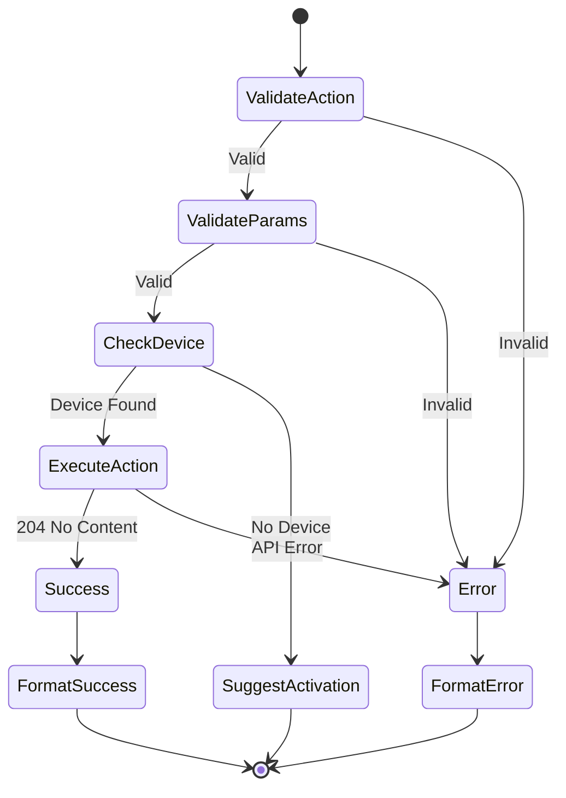

# Player Control Tool Specification

## Purpose & Responsibility

The Player Control tool provides comprehensive playback control for Spotify. It is responsible for:

- Starting, pausing, and resuming playback
- Skipping tracks (next/previous)
- Seeking to specific positions
- Controlling volume and playback modes
- Transferring playback between devices
- Playing specific tracks or contexts (albums, playlists)

This tool enables full control over Spotify playback through natural language commands.

## Interface Definition

### Tool Definition

```typescript
const playerControlTool: ToolDefinition = {
  name: 'player_control',
  description: 'Control Spotify playback (play, pause, skip, seek, volume, etc.)',
  category: 'playback',
  inputSchema: {
    type: 'object',
    properties: {
      action: {
        type: 'string',
        enum: ['play', 'pause', 'next', 'previous', 'seek', 
               'volume', 'repeat', 'shuffle', 'transfer'],
        description: 'Playback control action to perform'
      },
      // Action-specific parameters
      uri: {
        type: 'string',
        pattern: '^spotify:(track|album|playlist|show|episode):[a-zA-Z0-9]{22}$',
        description: 'Spotify URI to play (for play action)'
      },
      context_uri: {
        type: 'string',
        pattern: '^spotify:(album|playlist|show|artist):[a-zA-Z0-9]{22}$',
        description: 'Context URI (album/playlist) to play from'
      },
      offset: {
        type: 'object',
        properties: {
          position: { type: 'number', minimum: 0 },
          uri: { type: 'string' }
        },
        description: 'Starting position in context'
      },
      position_ms: {
        type: 'number',
        minimum: 0,
        description: 'Position in milliseconds (for seek) or start position (for play)'
      },
      volume_percent: {
        type: 'number',
        minimum: 0,
        maximum: 100,
        description: 'Volume level (0-100) for volume action'
      },
      state: {
        oneOf: [
          { type: 'string', enum: ['off', 'track', 'context'] },
          { type: 'boolean' }
        ],
        description: 'State for repeat (off/track/context) or shuffle (true/false)'
      },
      device_id: {
        type: 'string',
        description: 'Target device ID for transfer action'
      }
    },
    required: ['action']
  }
}
```

### Handler Interface

```typescript
async function playerControlHandler(
  input: PlayerControlInput,
  context: ToolContext
): Promise<Result<ToolResult, ToolError>>
```

### Type Definitions

```typescript
interface PlayerControlInput {
  action: PlaybackAction
  // Optional parameters based on action
  uri?: string
  context_uri?: string
  offset?: {
    position?: number
    uri?: string
  }
  position_ms?: number
  volume_percent?: number
  state?: RepeatState | boolean
  device_id?: string
}

type PlaybackAction = 
  | 'play' 
  | 'pause' 
  | 'next' 
  | 'previous' 
  | 'seek'
  | 'volume' 
  | 'repeat' 
  | 'shuffle' 
  | 'transfer'

type RepeatState = 'off' | 'track' | 'context'

interface PlaybackCommand {
  action: PlaybackAction
  parameters: Record<string, any>
}
```

## Dependencies

### External Dependencies
- Spotify Web API endpoints:
  - `PUT /v1/me/player/play`
  - `PUT /v1/me/player/pause`
  - `POST /v1/me/player/next`
  - `POST /v1/me/player/previous`
  - `PUT /v1/me/player/seek`
  - `PUT /v1/me/player/volume`
  - `PUT /v1/me/player/repeat`
  - `PUT /v1/me/player/shuffle`
  - `PUT /v1/me/player`

### Internal Dependencies
- `spotify-api-client` - API wrapper
- `token-manager` - Authentication

## Behavior Specification

### Action Execution Flow



### Action Implementations

#### Play Action

```typescript
async function handlePlay(input: PlayerControlInput): Promise<Result<void, SpotifyError>> {
  const body: any = {}
  
  // 1. Handle different play scenarios
  if (input.uri) {
    // Play specific track
    body.uris = [input.uri]
  } else if (input.context_uri) {
    // Play album/playlist
    body.context_uri = input.context_uri
    
    if (input.offset) {
      body.offset = input.offset
    }
  }
  // If neither, resume current playback
  
  // 2. Set start position if provided
  if (input.position_ms !== undefined) {
    body.position_ms = input.position_ms
  }
  
  // 3. Execute play command
  return spotifyApi.play(body)
}
```

#### Seek Action

```typescript
async function handleSeek(input: PlayerControlInput): Promise<Result<void, SpotifyError>> {
  if (input.position_ms === undefined) {
    return err({
      type: 'ValidationError',
      message: 'position_ms is required for seek action'
    })
  }
  
  return spotifyApi.seek(input.position_ms)
}
```

#### Volume Action

```typescript
async function handleVolume(input: PlayerControlInput): Promise<Result<void, SpotifyError>> {
  if (input.volume_percent === undefined) {
    return err({
      type: 'ValidationError',
      message: 'volume_percent is required for volume action'
    })
  }
  
  // Validate range
  if (input.volume_percent < 0 || input.volume_percent > 100) {
    return err({
      type: 'ValidationError',
      message: 'volume_percent must be between 0 and 100'
    })
  }
  
  return spotifyApi.setVolume(input.volume_percent)
}
```

### Success Message Formatting

```typescript
function formatSuccessMessage(action: PlaybackAction, input: PlayerControlInput): string {
  const messages: Record<PlaybackAction, () => string> = {
    play: () => {
      if (input.uri) {
        return '▶️ Started playing track'
      } else if (input.context_uri) {
        const type = input.context_uri.split(':')[1]
        return `▶️ Started playing ${type}`
      }
      return '▶️ Resumed playback'
    },
    pause: () => '⏸️ Paused playback',
    next: () => '⏭️ Skipped to next track',
    previous: () => '⏮️ Skipped to previous track',
    seek: () => {
      const time = formatTime(input.position_ms!)
      return `⏩ Seeked to ${time}`
    },
    volume: () => `🔊 Volume set to ${input.volume_percent}%`,
    repeat: () => {
      const modes = {
        'off': '🔁 Repeat turned off',
        'track': '🔂 Repeat track enabled',
        'context': '🔁 Repeat all enabled'
      }
      return modes[input.state as RepeatState]
    },
    shuffle: () => input.state 
      ? '🔀 Shuffle enabled' 
      : '➡️ Shuffle disabled',
    transfer: () => '📱 Transferred playback to new device'
  }
  
  return messages[action]()
}
```

### Error Handling

```typescript
function handlePlaybackError(error: SpotifyError, action: PlaybackAction): ToolResult {
  const errorMessages: Record<number, string> = {
    404: 'No active device found. Please start Spotify on a device first.',
    403: 'Premium account required for this action.',
    401: 'Authentication expired. Please re-authenticate.',
    429: 'Rate limit exceeded. Please try again later.',
    502: 'Spotify service temporarily unavailable.'
  }
  
  const suggestions: Record<PlaybackAction, string> = {
    play: 'Try opening Spotify on your device and playing something first.',
    pause: 'Playback may already be paused.',
    next: 'You may be at the end of the queue.',
    previous: 'You may be at the beginning of the playlist.',
    seek: 'The track may not support seeking.',
    volume: 'Some devices don\'t support remote volume control.',
    repeat: 'This playlist/context may not support repeat.',
    shuffle: 'This context may not support shuffle.',
    transfer: 'Make sure the target device is online.'
  }
  
  const message = errorMessages[error.statusCode] || error.message
  const suggestion = suggestions[action]
  
  return {
    content: [{
      type: 'text',
      text: `❌ ${message}\n\n💡 ${suggestion}`
    }],
    isError: true
  }
}
```

### Device Activation Helper

```typescript
function formatNoDeviceMessage(): ToolResult {
  return {
    content: [{
      type: 'text',
      text: [
        '❌ No active Spotify device found.',
        '',
        'To activate a device:',
        '1. Open Spotify on your preferred device:',
        '   • 💻 Desktop app',
        '   • 📱 Mobile app',
        '   • 🔊 Smart speaker',
        '   • 🌐 Web player (open.spotify.com)',
        '',
        '2. Start playing any song',
        '',
        '3. Try your command again',
        '',
        'Note: The device needs to be actively playing or recently active.'
      ].join('\n')
    }],
    isError: true
  }
}
```

## Testing Requirements

### Unit Tests

```typescript
describe('Player Control Tool', () => {
  describe('Action Validation', () => {
    it('should validate required action parameter')
    it('should reject invalid actions')
    it('should validate action-specific parameters')
  })
  
  describe('Play Action', () => {
    it('should resume playback with no parameters')
    it('should play specific track by URI')
    it('should play album with offset')
    it('should play from specific position')
  })
  
  describe('Control Actions', () => {
    it('should pause playback')
    it('should skip to next track')
    it('should skip to previous track')
    it('should seek to position')
  })
  
  describe('Settings Actions', () => {
    it('should set volume')
    it('should set repeat modes')
    it('should toggle shuffle')
  })
  
  describe('Error Handling', () => {
    it('should handle no active device')
    it('should handle premium-only features')
    it('should handle rate limiting')
    it('should provide helpful suggestions')
  })
})
```

### Integration Tests

```typescript
describe('Player Control Integration', () => {
  it('should control real playback')
  it('should handle device switching')
  it('should respect rate limits')
  it('should work with different account types')
})
```

## Performance Constraints

### Latency Requirements
- Parameter validation: < 1ms
- API call: < 200ms (simple actions)
- API call: < 500ms (play with context)
- Response formatting: < 1ms
- Total: < 600ms (p95)

### Resource Limits
- Request size: < 10KB
- Memory usage: < 1MB
- No response body (204)

### Rate Limits
- Spotify limits (undocumented)
- Graceful backoff on 429
- User notification of limits

## Security Considerations

### Input Validation
- URI format validation
- Parameter range checks
- Injection prevention
- Command sanitization

### Authorization
- Scope verification
- Device ownership
- Premium features
- Rate limit enforcement

### Privacy
- No logging of played content
- No storing of device IDs
- Respect private sessions
- Minimal error details