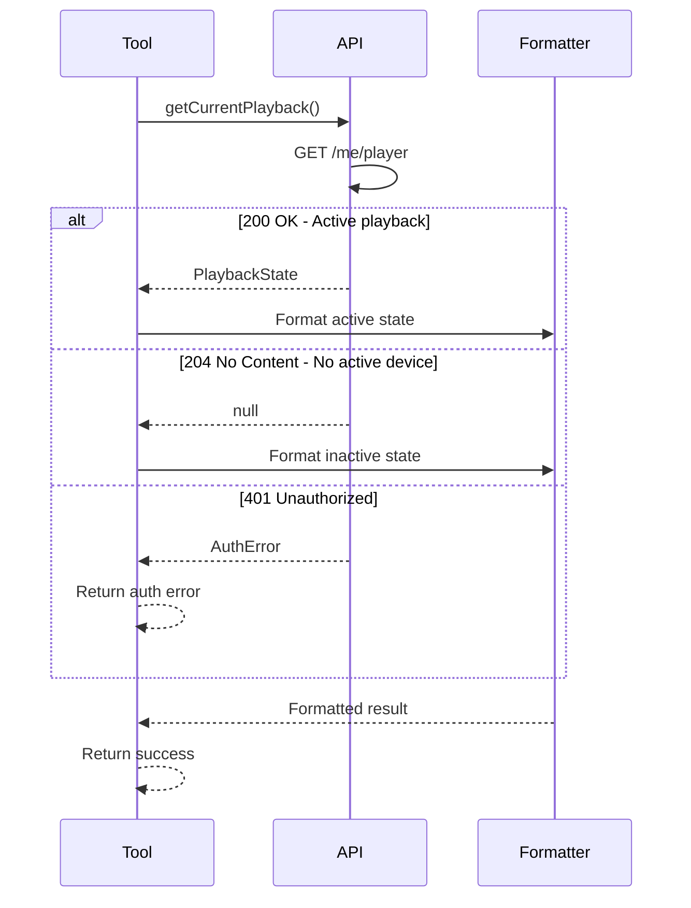

# Player State Tool Specification

## Purpose & Responsibility

The Player State tool retrieves the current playback state from Spotify, providing comprehensive information about what's playing. It is responsible for:

- Fetching current playback information
- Detecting active devices and their status
- Providing track metadata and progress
- Reporting playback settings (shuffle, repeat)
- Handling "no active device" scenarios gracefully

This tool enables AI assistants to understand the current music context and make informed decisions about playback control.

## Interface Definition

### Tool Definition

```typescript
const playerStateTool: ToolDefinition = {
  name: 'player_state',
  description: 'Get current Spotify playback state including track, device, and progress information',
  category: 'playback',
  inputSchema: {
    type: 'object',
    properties: {
      market: {
        type: 'string',
        description: 'ISO 3166-1 alpha-2 country code for track relinking',
        pattern: '^[A-Z]{2}$'
      },
      additional_types: {
        type: 'array',
        items: {
          type: 'string',
          enum: ['track', 'episode']
        },
        description: 'Types of currently playing items to return'
      }
    }
  }
}
```

### Handler Interface

```typescript
async function playerStateHandler(
  input: PlayerStateInput,
  context: ToolContext
): Promise<Result<ToolResult, ToolError>>
```

### Type Definitions

```typescript
interface PlayerStateInput {
  market?: string
  additional_types?: Array<'track' | 'episode'>
}

interface PlaybackState {
  // Playback Status
  is_playing: boolean
  timestamp: number
  progress_ms: number | null
  
  // Current Item
  currently_playing_type: 'track' | 'episode' | 'ad' | 'unknown'
  item: Track | Episode | null
  
  // Device Information
  device: {
    id: string | null
    name: string
    type: DeviceType
    is_active: boolean
    is_private_session: boolean
    is_restricted: boolean
    volume_percent: number | null
  } | null
  
  // Playback Settings
  repeat_state: 'off' | 'track' | 'context'
  shuffle_state: boolean
  
  // Context
  context: {
    type: 'album' | 'artist' | 'playlist' | 'show' | 'collection'
    href: string
    external_urls: { spotify: string }
    uri: string
  } | null
  
  // Actions
  actions: {
    disallows: {
      pausing?: boolean
      resuming?: boolean
      seeking?: boolean
      skipping_next?: boolean
      skipping_prev?: boolean
      toggling_repeat_context?: boolean
      toggling_repeat_track?: boolean
      toggling_shuffle?: boolean
      transferring_playback?: boolean
    }
  }
}

type DeviceType = 
  | 'Computer' 
  | 'Smartphone' 
  | 'Speaker' 
  | 'TV' 
  | 'AVR' 
  | 'STB' 
  | 'AudioDongle' 
  | 'GameConsole' 
  | 'CastVideo' 
  | 'CastAudio' 
  | 'Automobile' 
  | 'Unknown'
```

## Dependencies

### External Dependencies
- Spotify Web API `/v1/me/player` endpoint

### Internal Dependencies
- `spotify-api-client` - API wrapper
- `token-manager` - Authentication

## Behavior Specification

### State Retrieval Flow



### Response Processing

```typescript
async function processPlaybackState(
  state: PlaybackState | null
): Promise<ToolResult> {
  // 1. Handle no active playback
  if (!state) {
    return {
      content: [{
        type: 'text',
        text: formatNoActivePlayback()
      }]
    }
  }
  
  // 2. Handle different playing types
  switch (state.currently_playing_type) {
    case 'track':
      return formatTrackPlayback(state)
    case 'episode':
      return formatEpisodePlayback(state)
    case 'ad':
      return formatAdPlayback(state)
    default:
      return formatUnknownPlayback(state)
  }
}
```

### Output Formatting

```typescript
function formatTrackPlayback(state: PlaybackState): ToolResult {
  const track = state.item as Track
  const status = state.is_playing ? '▶️ Playing' : '⏸️ Paused'
  const progress = formatProgress(state.progress_ms, track.duration_ms)
  const device = formatDevice(state.device)
  const context = formatContext(state.context)
  const settings = formatSettings(state)
  
  const lines = [
    `${status}:`,
    `🎵 "${track.name}" by ${track.artists.map(a => a.name).join(', ')}`,
    `💿 Album: ${track.album.name}`,
    `📱 Device: ${device}`,
    `⏱️ Progress: ${progress}`,
    settings,
    context ? `📋 Playing from: ${context}` : null,
    '',
    formatActions(state.actions)
  ].filter(Boolean)
  
  return {
    content: [{
      type: 'text',
      text: lines.join('\n')
    }]
  }
}

function formatNoActivePlayback(): string {
  return [
    '⏹️ No active Spotify playback detected.',
    '',
    'To start playback:',
    '1. Open Spotify on any device',
    '2. Play something to activate the device',
    '3. Try this command again',
    '',
    'Available actions:',
    '• Use "search" to find music',
    '• Use "player_control" with action "play" to resume on last device'
  ].join('\n')
}

function formatProgress(current: number | null, total: number): string {
  if (current === null) return 'Unknown'
  
  const currentTime = formatTime(current)
  const totalTime = formatTime(total)
  const percentage = Math.round((current / total) * 100)
  
  // Progress bar
  const barLength = 20
  const filled = Math.round((percentage / 100) * barLength)
  const bar = '█'.repeat(filled) + '░'.repeat(barLength - filled)
  
  return `${currentTime} ${bar} ${totalTime} (${percentage}%)`
}

function formatTime(ms: number): string {
  const minutes = Math.floor(ms / 60000)
  const seconds = Math.floor((ms % 60000) / 1000)
  return `${minutes}:${seconds.toString().padStart(2, '0')}`
}

function formatDevice(device: Device | null): string {
  if (!device) return 'Unknown device'
  
  const icons = {
    Computer: '💻',
    Smartphone: '📱',
    Speaker: '🔊',
    TV: '📺',
    Automobile: '🚗',
    GameConsole: '🎮'
  }
  
  const icon = icons[device.type] || '📱'
  const volume = device.volume_percent !== null 
    ? ` (${device.volume_percent}% volume)` 
    : ''
  
  return `${icon} ${device.name}${volume}`
}

function formatSettings(state: PlaybackState): string {
  const repeat = {
    off: '🔁 Repeat: Off',
    track: '🔂 Repeat: Track',
    context: '🔁 Repeat: All'
  }[state.repeat_state]
  
  const shuffle = state.shuffle_state 
    ? '🔀 Shuffle: On' 
    : '➡️ Shuffle: Off'
  
  return `${repeat} | ${shuffle}`
}

function formatActions(actions: PlaybackActions): string {
  const disallowed = Object.entries(actions.disallows || {})
    .filter(([_, value]) => value)
    .map(([action]) => action.replace(/_/g, ' '))
  
  if (disallowed.length === 0) {
    return '✅ All playback actions available'
  }
  
  return `⚠️ Restricted actions: ${disallowed.join(', ')}`
}
```

### Special Cases

1. **Private Session**
   ```typescript
   if (state.device?.is_private_session) {
     lines.push('🔒 Private session active')
   }
   ```

2. **Restricted Playback**
   ```typescript
   if (state.device?.is_restricted) {
     lines.push('⚠️ Playback restricted (free account limitations)')
   }
   ```

3. **Ad Playing**
   ```typescript
   function formatAdPlayback(state: PlaybackState): ToolResult {
     return {
       content: [{
         type: 'text',
         text: '📢 Advertisement playing\n\nPlayback will resume shortly...'
       }]
     }
   }
   ```

## Error Handling

### Error Scenarios

1. **No Active Device (204)**
   - Not an error - return helpful message
   - Suggest how to activate device
   - List available actions

2. **Authentication Error (401)**
   ```typescript
   return err({
     type: 'AuthError',
     message: 'Spotify authentication expired. Please re-authenticate.',
     reason: 'expired'
   })
   ```

3. **Forbidden (403)**
   ```typescript
   return err({
     type: 'SpotifyError',
     message: 'Access forbidden. Check your Spotify account status.',
     statusCode: 403
   })
   ```

4. **API Unavailable (503)**
   ```typescript
   return err({
     type: 'NetworkError',
     message: 'Spotify service temporarily unavailable. Try again later.',
     statusCode: 503
   })
   ```

## Testing Requirements

### Unit Tests

```typescript
describe('Player State Tool', () => {
  describe('State Processing', () => {
    it('should handle active playback')
    it('should handle paused state')
    it('should handle no active device')
    it('should handle different device types')
  })
  
  describe('Formatting', () => {
    it('should format track information')
    it('should format progress correctly')
    it('should show device with volume')
    it('should display shuffle/repeat states')
    it('should show playback restrictions')
  })
  
  describe('Special Cases', () => {
    it('should handle ads')
    it('should handle episodes')
    it('should handle private sessions')
    it('should handle restricted playback')
  })
  
  describe('Error Handling', () => {
    it('should handle auth errors')
    it('should handle network errors')
    it('should handle API errors')
  })
})
```

### Integration Tests

```typescript
describe('Player State Integration', () => {
  it('should get state when playing')
  it('should handle no active device')
  it('should work with different markets')
  it('should reflect real-time changes')
})
```

## Performance Constraints

### Latency Requirements
- API call: < 300ms (typical)
- Response processing: < 5ms
- Formatting: < 2ms
- Total: < 400ms (p95)

### Resource Limits
- Response size: ~2KB typical
- Memory usage: < 1MB
- No caching (real-time data)

### Optimization
- Minimal data transformation
- Efficient string building
- Lazy evaluation

## Security Considerations

### Data Privacy
- No logging of track names
- No storing playback history
- Respect private sessions
- Hide sensitive metadata

### Output Sanitization
- Escape special characters
- Limit field lengths
- Remove internal IDs
- Validate URLs