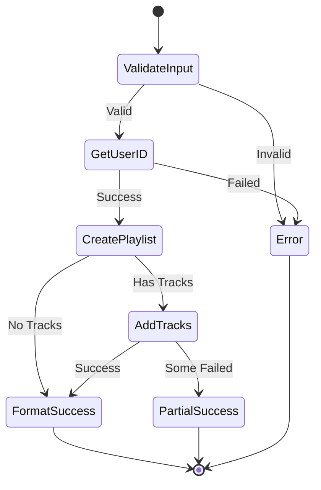

# Playlist Create Tool Specification

## Purpose & Responsibility

The Playlist Create tool enables users to create new Spotify playlists programmatically. It is responsible for:

- Creating public or private playlists
- Setting playlist metadata (name, description, image)
- Adding initial tracks during creation
- Handling collaborative playlist settings

## Interface Definition

### Tool Definition

```typescript
const playlistCreateTool: ToolDefinition = {
  name: 'playlist_create',
  description: 'Create a new Spotify playlist',
  category: 'playlist',
  inputSchema: {
    type: 'object',
    properties: {
      name: {
        type: 'string',
        minLength: 1,
        maxLength: 100,
        description: 'Playlist name'
      },
      description: {
        type: 'string',
        maxLength: 300,
        description: 'Playlist description (optional)'
      },
      public: {
        type: 'boolean',
        default: true,
        description: 'Whether playlist is public'
      },
      collaborative: {
        type: 'boolean',
        default: false,
        description: 'Whether playlist is collaborative'
      },
      tracks: {
        type: 'array',
        items: {
          type: 'string',
          pattern: '^spotify:track:[a-zA-Z0-9]{22}$'
        },
        maxItems: 100,
        description: 'Initial tracks to add (Spotify URIs)'
      }
    },
    required: ['name']
  }
}
```

### Handler Interface

```typescript
async function playlistCreateHandler(
  input: PlaylistCreateInput,
  context: ToolContext
): Promise<Result<ToolResult, ToolError>>
```

### Type Definitions

```typescript
interface PlaylistCreateInput {
  name: string
  description?: string
  public?: boolean
  collaborative?: boolean
  tracks?: string[]
}

interface PlaylistCreateResult {
  id: string
  name: string
  description: string | null
  uri: string
  external_urls: {
    spotify: string
  }
  owner: {
    id: string
    display_name: string
  }
  public: boolean
  collaborative: boolean
  tracks: {
    total: number
  }
}
```

## Dependencies

### External Dependencies
- Spotify Web API endpoints:
  - `POST /v1/users/{user_id}/playlists`
  - `POST /v1/playlists/{playlist_id}/tracks`
  - `GET /v1/me` (for user ID)

### Internal Dependencies
- `spotify-api-client` - API wrapper
- `token-manager` - Authentication

## Behavior Specification

### Creation Flow



### Implementation

```typescript
async function handlePlaylistCreate(
  input: PlaylistCreateInput,
  context: ToolContext
): Promise<Result<PlaylistCreateResult, SpotifyError>> {
  // 1. Get user ID
  const userResult = await context.spotifyApi.getCurrentUser()
  if (userResult.isErr()) {
    return err(userResult.error)
  }
  
  // 2. Validate settings
  if (input.collaborative && input.public) {
    return err({
      type: 'ValidationError',
      message: 'Collaborative playlists cannot be public'
    })
  }
  
  // 3. Create playlist
  const createResult = await context.spotifyApi.createPlaylist(
    userResult.value.id,
    {
      name: input.name,
      description: input.description || '',
      public: input.public ?? true,
      collaborative: input.collaborative ?? false
    }
  )
  
  if (createResult.isErr()) {
    return err(createResult.error)
  }
  
  const playlist = createResult.value
  
  // 4. Add initial tracks if provided
  if (input.tracks && input.tracks.length > 0) {
    const addResult = await context.spotifyApi.addTracksToPlaylist(
      playlist.id,
      input.tracks
    )
    
    if (addResult.isErr()) {
      // Playlist created but tracks failed
      return ok({
        ...playlist,
        _warning: `Playlist created but failed to add tracks: ${addResult.error.message}`
      })
    }
  }
  
  return ok(playlist)
}
```

### Success Message Formatting

```typescript
function formatPlaylistCreateSuccess(
  result: PlaylistCreateResult,
  input: PlaylistCreateInput
): string {
  const visibility = input.collaborative ? '👥 Collaborative' :
                    input.public ? '🌍 Public' : '🔒 Private'
  
  let message = [
    `✅ Created ${visibility} playlist "${result.name}"`,
    `🔗 ${result.external_urls.spotify}`,
    ''
  ]
  
  if (result.description) {
    message.push(`📝 ${result.description}`)
    message.push('')
  }
  
  if (input.tracks?.length) {
    message.push(`🎵 Added ${input.tracks.length} tracks`)
  }
  
  if (result._warning) {
    message.push('')
    message.push(`⚠️ ${result._warning}`)
  }
  
  return message.join('\n')
}
```

## Error Handling

```typescript
function handlePlaylistCreateError(
  error: SpotifyError,
  input: PlaylistCreateInput
): ToolResult {
  const errorMessages: Record<string, string> = {
    '400': 'Invalid playlist configuration',
    '401': 'Authentication required',
    '403': 'Insufficient permissions to create playlists',
    '429': 'Too many playlists created recently'
  }
  
  const suggestions: Record<string, string> = {
    name_length: 'Playlist names must be between 1-100 characters',
    description_length: 'Descriptions cannot exceed 300 characters',
    track_limit: 'Cannot add more than 100 tracks at once',
    collaborative_public: 'Collaborative playlists must be private'
  }
  
  return {
    content: [{
      type: 'text',
      text: formatErrorMessage(error, errorMessages, suggestions)
    }],
    isError: true
  }
}
```

## Testing Requirements

### Unit Tests

```typescript
describe('Playlist Create Tool', () => {
  describe('Input Validation', () => {
    it('should require playlist name')
    it('should validate name length')
    it('should validate track URI format')
    it('should reject collaborative public playlists')
  })
  
  describe('Playlist Creation', () => {
    it('should create basic playlist')
    it('should create playlist with description')
    it('should create private playlist')
    it('should create collaborative playlist')
  })
  
  describe('Track Addition', () => {
    it('should add initial tracks')
    it('should handle partial track failures')
    it('should validate track URIs')
    it('should respect track limit')
  })
})
```

## Performance Constraints

### Response Times
- User ID fetch: < 200ms
- Playlist creation: < 300ms
- Track addition: < 500ms
- Total: < 1s

### Limits
- Playlist name: 100 characters
- Description: 300 characters
- Initial tracks: 100 maximum
- API rate limits apply

## Security Considerations

### Authorization
- Requires `playlist-modify-public` scope for public playlists
- Requires `playlist-modify-private` scope for private playlists
- Verify user owns the account

### Input Validation
- Sanitize playlist name and description
- Validate track URIs to prevent injection
- Check for inappropriate content

### Privacy
- Default to private for sensitive names
- Don't expose user ID in errors
- Log playlist creation for audit