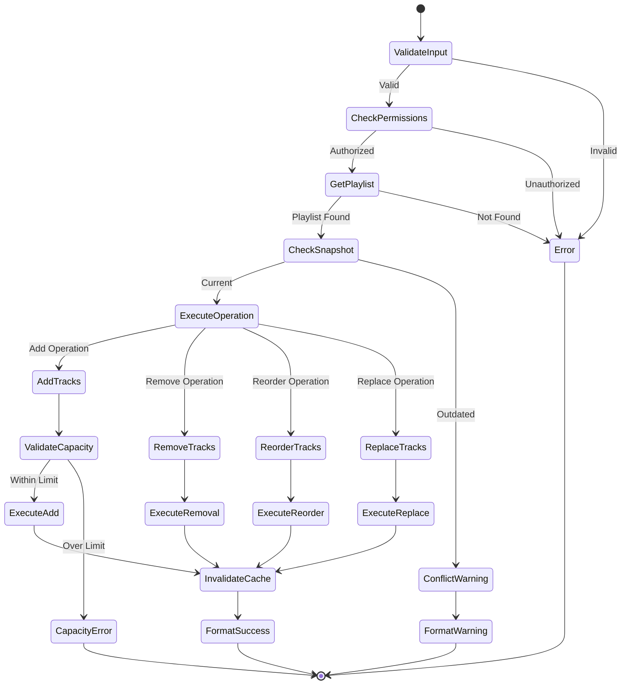

# Playlist Modify Tool Specification

## Purpose & Responsibility

The Playlist Modify tool enables users to modify existing Spotify playlists by adding or removing tracks. It is responsible for:

- Adding tracks to playlists (single or batch)
- Removing tracks from playlists by position or URI
- Reordering tracks within playlists
- Managing collaborative playlist permissions
- Handling playlist capacity limits

## Interface Definition

### Tool Definition

```typescript
const playlistModifyTool: ToolDefinition = {
  name: 'playlist_modify',
  description: 'Add, remove, or reorder tracks in Spotify playlists',
  category: 'playlist',
  inputSchema: {
    type: 'object',
    properties: {
      playlist_id: {
        type: 'string',
        pattern: '^[a-zA-Z0-9]{22}$',
        description: 'Spotify playlist ID'
      },
      operation: {
        type: 'string',
        enum: ['add', 'remove', 'reorder', 'replace'],
        description: 'Type of modification to perform'
      },
      tracks: {
        type: 'array',
        items: {
          type: 'string',
          pattern: '^spotify:track:[a-zA-Z0-9]{22}$'
        },
        maxItems: 100,
        description: 'Track URIs to add (for add/replace operations)'
      },
      positions: {
        type: 'array',
        items: {
          type: 'number',
          minimum: 0
        },
        description: 'Track positions to remove or reorder'
      },
      insert_position: {
        type: 'number',
        minimum: 0,
        description: 'Position to insert tracks (for add operation)'
      },
      range_start: {
        type: 'number',
        minimum: 0,
        description: 'Start position for range operations'
      },
      range_length: {
        type: 'number',
        minimum: 1,
        description: 'Number of tracks in range'
      },
      new_position: {
        type: 'number',
        minimum: 0,
        description: 'New position for reorder operation'
      },
      snapshot_id: {
        type: 'string',
        description: 'Playlist snapshot ID for conflict detection'
      }
    },
    required: ['playlist_id', 'operation'],
    allOf: [
      {
        if: { properties: { operation: { const: 'add' } } },
        then: { required: ['tracks'] }
      },
      {
        if: { properties: { operation: { const: 'remove' } } },
        then: { 
          anyOf: [
            { required: ['positions'] },
            { required: ['tracks'] }
          ]
        }
      },
      {
        if: { properties: { operation: { const: 'reorder' } } },
        then: { required: ['range_start', 'range_length', 'new_position'] }
      },
      {
        if: { properties: { operation: { const: 'replace' } } },
        then: { required: ['tracks'] }
      }
    ]
  }
}
```

### Handler Interface

```typescript
async function playlistModifyHandler(
  input: PlaylistModifyInput,
  context: ToolContext
): Promise<Result<ToolResult, ToolError>>
```

### Type Definitions

```typescript
interface PlaylistModifyInput {
  playlist_id: string
  operation: 'add' | 'remove' | 'reorder' | 'replace'
  tracks?: string[]
  positions?: number[]
  insert_position?: number
  range_start?: number
  range_length?: number
  new_position?: number
  snapshot_id?: string
}

interface PlaylistModifyResult {
  playlist_id: string
  operation: string
  tracks_modified: number
  new_snapshot_id: string
  total_tracks: number
  warnings?: string[]
}
```

## Dependencies

### External Dependencies
- Spotify Web API endpoints:
  - `POST /v1/playlists/{playlist_id}/tracks` (add tracks)
  - `DELETE /v1/playlists/{playlist_id}/tracks` (remove tracks)
  - `PUT /v1/playlists/{playlist_id}/tracks` (reorder/replace tracks)
  - `GET /v1/playlists/{playlist_id}` (get current state)

### Internal Dependencies
- `spotify-api-client` - API wrapper
- `token-manager` - Authentication
- `cache-manager` - Playlist cache invalidation

## Behavior Specification

### Modification Flow



### Operation Implementations

#### Add Tracks Operation

```typescript
async function handleAddTracks(
  input: PlaylistModifyInput,
  context: ToolContext
): Promise<Result<PlaylistModifyResult, SpotifyError>> {
  const { playlist_id, tracks, insert_position } = input
  
  // Validate tracks exist
  const trackValidation = await validateTracks(tracks!, context)
  if (trackValidation.isErr()) {
    return err(trackValidation.error)
  }
  
  // Check playlist capacity
  const playlist = await context.spotifyApi.getPlaylist(playlist_id)
  if (playlist.isErr()) {
    return err(playlist.error)
  }
  
  const currentCount = playlist.value.tracks.total
  const newCount = currentCount + tracks!.length
  
  if (newCount > 10000) { // Spotify playlist limit
    return err({
      type: 'ValidationError',
      message: `Playlist would exceed maximum size (${newCount}/10000 tracks)`
    })
  }
  
  // Add tracks
  const addResult = await context.spotifyApi.addTracksToPlaylist(
    playlist_id,
    tracks!,
    insert_position
  )
  
  if (addResult.isErr()) {
    return err(addResult.error)
  }
  
  return ok({
    playlist_id,
    operation: 'add',
    tracks_modified: tracks!.length,
    new_snapshot_id: addResult.value.snapshot_id,
    total_tracks: newCount
  })
}
```

#### Remove Tracks Operation

```typescript
async function handleRemoveTracks(
  input: PlaylistModifyInput,
  context: ToolContext
): Promise<Result<PlaylistModifyResult, SpotifyError>> {
  const { playlist_id, tracks, positions } = input
  
  let removeSpec: any
  
  if (tracks) {
    // Remove by URI
    removeSpec = {
      tracks: tracks.map(uri => ({ uri }))
    }
  } else if (positions) {
    // Remove by position - need to get current playlist
    const playlist = await context.spotifyApi.getPlaylist(playlist_id)
    if (playlist.isErr()) {
      return err(playlist.error)
    }
    
    removeSpec = {
      tracks: positions.map(position => ({
        uri: playlist.value.tracks.items[position]?.track.uri,
        positions: [position]
      })).filter(item => item.uri) // Filter out invalid positions
    }
  }
  
  if (!removeSpec.tracks.length) {
    return err({
      type: 'ValidationError',
      message: 'No valid tracks to remove'
    })
  }
  
  const removeResult = await context.spotifyApi.removeTracksFromPlaylist(
    playlist_id,
    removeSpec,
    input.snapshot_id
  )
  
  if (removeResult.isErr()) {
    return err(removeResult.error)
  }
  
  return ok({
    playlist_id,
    operation: 'remove',
    tracks_modified: removeSpec.tracks.length,
    new_snapshot_id: removeResult.value.snapshot_id,
    total_tracks: (playlist?.value?.tracks.total || 0) - removeSpec.tracks.length
  })
}
```

#### Reorder Tracks Operation

```typescript
async function handleReorderTracks(
  input: PlaylistModifyInput,
  context: ToolContext
): Promise<Result<PlaylistModifyResult, SpotifyError>> {
  const { playlist_id, range_start, range_length, new_position, snapshot_id } = input
  
  // Validate reorder parameters
  if (range_start! === new_position) {
    return err({
      type: 'ValidationError',
      message: 'Range start and new position cannot be the same'
    })
  }
  
  const reorderResult = await context.spotifyApi.reorderPlaylistTracks(
    playlist_id,
    range_start!,
    new_position!,
    {
      range_length: range_length!,
      snapshot_id
    }
  )
  
  if (reorderResult.isErr()) {
    return err(reorderResult.error)
  }
  
  return ok({
    playlist_id,
    operation: 'reorder',
    tracks_modified: range_length!,
    new_snapshot_id: reorderResult.value.snapshot_id,
    total_tracks: 0 // Will be updated by cache invalidation
  })
}
```

### Success Message Formatting

```typescript
function formatPlaylistModifySuccess(
  result: PlaylistModifyResult,
  input: PlaylistModifyInput
): string {
  const messages: Record<string, () => string> = {
    add: () => {
      const position = input.insert_position !== undefined 
        ? ` at position ${input.insert_position}`
        : ' to the end'
      return `✅ Added ${result.tracks_modified} track(s)${position} of playlist\n📊 Total tracks: ${result.total_tracks}`
    },
    
    remove: () => {
      const method = input.tracks ? 'by URI' : 'by position'
      return `✅ Removed ${result.tracks_modified} track(s) ${method} from playlist\n📊 Total tracks: ${result.total_tracks}`
    },
    
    reorder: () => {
      return `✅ Moved ${result.tracks_modified} track(s) from position ${input.range_start} to ${input.new_position}\n📊 Playlist reorganized`
    },
    
    replace: () => {
      return `✅ Replaced all tracks in playlist with ${result.tracks_modified} new track(s)\n📊 Total tracks: ${result.total_tracks}`
    }
  }
  
  let message = messages[result.operation]()
  
  if (result.warnings?.length) {
    message += '\n\n⚠️ Warnings:\n' + result.warnings.map(w => `• ${w}`).join('\n')
  }
  
  return message
}
```

### Error Handling

```typescript
function handlePlaylistModifyError(
  error: SpotifyError,
  input: PlaylistModifyInput
): ToolResult {
  const operationNames = {
    add: 'add tracks to',
    remove: 'remove tracks from', 
    reorder: 'reorder tracks in',
    replace: 'replace tracks in'
  }
  
  const operation = operationNames[input.operation]
  
  const errorMessages: Record<string, string> = {
    '403': `Insufficient permissions to ${operation} this playlist. You may need to be the owner or have collaborative access.`,
    '404': 'Playlist not found. It may have been deleted or made private.',
    '400': 'Invalid request. Check track URIs and positions.',
    '401': 'Authentication expired. Please re-authenticate.',
    '429': 'Rate limit exceeded. Please try again later.'
  }
  
  const suggestions: Record<string, string> = {
    add: 'Ensure the playlist exists and you have permission to modify it.',
    remove: 'Verify track positions or URIs are correct.',
    reorder: 'Check that the range and new position are valid.',
    replace: 'Ensure you have permission to modify this playlist.'
  }
  
  const message = errorMessages[error.statusCode?.toString() || ''] || error.message
  const suggestion = suggestions[input.operation]
  
  return {
    content: [{
      type: 'text',
      text: `❌ Failed to ${operation} playlist\n\n${message}\n\n💡 ${suggestion}`
    }],
    isError: true
  }
}
```

## Testing Requirements

### Unit Tests

```typescript
describe('Playlist Modify Tool', () => {
  describe('Input Validation', () => {
    it('should validate playlist ID format')
    it('should require tracks for add operation')
    it('should require positions or tracks for remove operation')
    it('should validate reorder parameters')
    it('should enforce track limits')
  })
  
  describe('Add Tracks', () => {
    it('should add tracks to end of playlist')
    it('should insert tracks at specific position')
    it('should handle playlist capacity limits')
    it('should validate track URIs exist')
  })
  
  describe('Remove Tracks', () => {
    it('should remove tracks by position')
    it('should remove tracks by URI')
    it('should handle invalid positions gracefully')
  })
  
  describe('Reorder Tracks', () => {
    it('should move track ranges correctly')
    it('should validate range boundaries')
    it('should handle edge cases (first/last positions)')
  })
  
  describe('Permissions', () => {
    it('should handle owned playlists')
    it('should handle collaborative playlists') 
    it('should reject unauthorized modifications')
  })
})
```

## Performance Constraints

### Response Times
- Input validation: < 10ms
- Permission check: < 200ms
- Playlist modification: < 1s
- Cache invalidation: < 100ms
- Total: < 2s

### Batch Limits
- Maximum tracks per operation: 100
- Spotify API limits apply
- Memory usage: < 10MB per operation

## Security Considerations

### Authorization
- Verify user can modify playlist
- Check collaborative permissions
- Validate playlist ownership
- Respect privacy settings

### Input Validation
- Validate all track URIs
- Check position boundaries
- Prevent injection attacks
- Sanitize user inputs