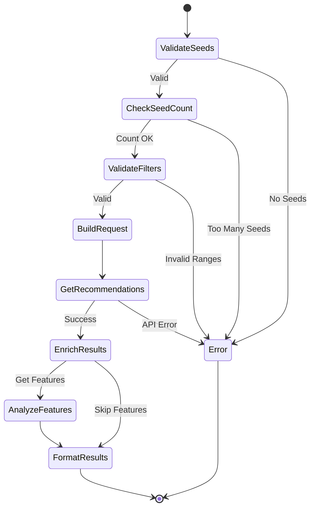

# Recommendations Tool Specification

## Purpose & Responsibility

The Recommendations tool provides personalized music suggestions based on seed tracks, artists, or genres. It is responsible for:

- Generating track recommendations from multiple seed types
- Applying audio feature filters for targeted results
- Supporting genre-based discovery
- Providing diverse yet cohesive suggestions

## Interface Definition

### Tool Definition

```typescript
const recommendationsTool: ToolDefinition = {
  name: 'recommendations',
  description: 'Get personalized track recommendations based on seeds and audio features',
  category: 'discovery',
  inputSchema: {
    type: 'object',
    properties: {
      seed_tracks: {
        type: 'array',
        items: { type: 'string' },
        maxItems: 5,
        description: 'Track IDs for recommendation seeds'
      },
      seed_artists: {
        type: 'array',
        items: { type: 'string' },
        maxItems: 5,
        description: 'Artist IDs for recommendation seeds'
      },
      seed_genres: {
        type: 'array',
        items: { type: 'string' },
        maxItems: 5,
        description: 'Genres for recommendation seeds'
      },
      limit: {
        type: 'number',
        minimum: 1,
        maximum: 100,
        default: 20,
        description: 'Number of recommendations'
      },
      // Audio feature targets
      target_energy: { type: 'number', minimum: 0, maximum: 1 },
      target_danceability: { type: 'number', minimum: 0, maximum: 1 },
      target_valence: { type: 'number', minimum: 0, maximum: 1 },
      target_acousticness: { type: 'number', minimum: 0, maximum: 1 },
      target_instrumentalness: { type: 'number', minimum: 0, maximum: 1 },
      target_tempo: { type: 'number', minimum: 0, maximum: 300 },
      // Audio feature ranges
      min_energy: { type: 'number', minimum: 0, maximum: 1 },
      max_energy: { type: 'number', minimum: 0, maximum: 1 },
      min_danceability: { type: 'number', minimum: 0, maximum: 1 },
      max_danceability: { type: 'number', minimum: 0, maximum: 1 },
      min_valence: { type: 'number', minimum: 0, maximum: 1 },
      max_valence: { type: 'number', minimum: 0, maximum: 1 },
      min_popularity: { type: 'number', minimum: 0, maximum: 100 },
      max_popularity: { type: 'number', minimum: 0, maximum: 100 }
    },
    anyOf: [
      { required: ['seed_tracks'] },
      { required: ['seed_artists'] },
      { required: ['seed_genres'] }
    ]
  }
}
```

### Handler Interface

```typescript
async function recommendationsHandler(
  input: RecommendationsInput,
  context: ToolContext
): Promise<Result<ToolResult, ToolError>>
```

### Type Definitions

```typescript
interface RecommendationsInput {
  // Seeds (at least one required)
  seed_tracks?: string[]
  seed_artists?: string[]
  seed_genres?: string[]
  
  // Options
  limit?: number
  
  // Target features (Spotify will try to match)
  target_energy?: number
  target_danceability?: number
  target_valence?: number
  target_acousticness?: number
  target_instrumentalness?: number
  target_tempo?: number
  
  // Feature ranges (hard filters)
  min_energy?: number
  max_energy?: number
  min_danceability?: number
  max_danceability?: number
  min_valence?: number
  max_valence?: number
  min_popularity?: number
  max_popularity?: number
}

interface RecommendationTrack {
  id: string
  name: string
  artists: Array<{ name: string }>
  album: { name: string }
  uri: string
  preview_url: string | null
  audio_features?: {
    energy: number
    danceability: number
    valence: number
    acousticness: number
    tempo: number
  }
}

interface RecommendationResult {
  tracks: RecommendationTrack[]
  seeds: {
    tracks?: Array<{ id: string; name: string }>
    artists?: Array<{ id: string; name: string }>
    genres?: string[]
  }
  applied_filters: Record<string, number>
}
```

## Dependencies

### External Dependencies
- Spotify Web API endpoints:
  - `GET /v1/recommendations`
  - `GET /v1/recommendations/available-genre-seeds`
  - `GET /v1/audio-features` (for result enrichment)

### Internal Dependencies
- `spotify-api-client` - API wrapper
- `token-manager` - Authentication
- `audio-features-analyzer` - Feature analysis

## Behavior Specification

### Recommendation Flow



### Implementation

```typescript
async function handleRecommendations(
  input: RecommendationsInput,
  context: ToolContext
): Promise<Result<RecommendationResult, SpotifyError>> {
  // 1. Validate seed count (max 5 total)
  const seedCount = 
    (input.seed_tracks?.length || 0) +
    (input.seed_artists?.length || 0) +
    (input.seed_genres?.length || 0)
  
  if (seedCount === 0) {
    return err({
      type: 'ValidationError',
      message: 'At least one seed is required'
    })
  }
  
  if (seedCount > 5) {
    return err({
      type: 'ValidationError',
      message: 'Maximum 5 seeds allowed (tracks + artists + genres)'
    })
  }
  
  // 2. Validate audio feature ranges
  const rangeValidation = validateFeatureRanges(input)
  if (rangeValidation.isErr()) {
    return err(rangeValidation.error)
  }
  
  // 3. Build recommendation parameters
  const params = buildRecommendationParams(input)
  
  // 4. Get recommendations
  const recsResult = await context.spotifyApi.getRecommendations(params)
  if (recsResult.isErr()) {
    return err(recsResult.error)
  }
  
  // 5. Enrich with audio features (optional)
  const enrichedTracks = await enrichWithAudioFeatures(
    recsResult.value.tracks,
    context
  )
  
  return ok({
    tracks: enrichedTracks,
    seeds: recsResult.value.seeds,
    applied_filters: extractAppliedFilters(input)
  })
}

function validateFeatureRanges(
  input: RecommendationsInput
): Result<void, ValidationError> {
  const ranges = [
    ['energy', input.min_energy, input.max_energy],
    ['danceability', input.min_danceability, input.max_danceability],
    ['valence', input.min_valence, input.max_valence]
  ]
  
  for (const [feature, min, max] of ranges) {
    if (min !== undefined && max !== undefined && min > max) {
      return err({
        type: 'ValidationError',
        message: `Invalid range for ${feature}: min (${min}) > max (${max})`
      })
    }
  }
  
  return ok(undefined)
}

function buildRecommendationParams(input: RecommendationsInput): any {
  const params: any = {
    limit: input.limit || 20
  }
  
  // Add seeds
  if (input.seed_tracks?.length) {
    params.seed_tracks = input.seed_tracks.join(',')
  }
  if (input.seed_artists?.length) {
    params.seed_artists = input.seed_artists.join(',')
  }
  if (input.seed_genres?.length) {
    params.seed_genres = input.seed_genres.join(',')
  }
  
  // Add target features
  const targetFeatures = [
    'target_energy', 'target_danceability', 'target_valence',
    'target_acousticness', 'target_instrumentalness', 'target_tempo'
  ]
  
  for (const feature of targetFeatures) {
    if (input[feature] !== undefined) {
      params[feature] = input[feature]
    }
  }
  
  // Add range filters
  const rangeFeatures = [
    'min_energy', 'max_energy', 'min_danceability', 'max_danceability',
    'min_valence', 'max_valence', 'min_popularity', 'max_popularity'
  ]
  
  for (const feature of rangeFeatures) {
    if (input[feature] !== undefined) {
      params[feature] = input[feature]
    }
  }
  
  return params
}
```

### Result Formatting

```typescript
function formatRecommendationResults(
  result: RecommendationResult,
  input: RecommendationsInput
): string {
  const lines = ['🎵 Found ' + result.tracks.length + ' recommendations']
  
  // Show seeds used
  if (result.seeds.tracks?.length) {
    lines.push('Based on tracks: ' + 
      result.seeds.tracks.map(t => t.name).join(', '))
  }
  if (result.seeds.artists?.length) {
    lines.push('Based on artists: ' + 
      result.seeds.artists.map(a => a.name).join(', '))
  }
  if (result.seeds.genres?.length) {
    lines.push('Based on genres: ' + result.seeds.genres.join(', '))
  }
  
  // Show applied filters
  if (Object.keys(result.applied_filters).length > 0) {
    lines.push('')
    lines.push('Filters applied:')
    for (const [filter, value] of Object.entries(result.applied_filters)) {
      lines.push(`  • ${formatFilterName(filter)}: ${value}`)
    }
  }
  
  // List tracks
  lines.push('')
  lines.push('Recommendations:')
  result.tracks.forEach((track, i) => {
    const artists = track.artists.map(a => a.name).join(', ')
    lines.push(`${i + 1}. ${track.name} - ${artists}`)
    
    if (track.audio_features) {
      const features = [
        `energy: ${track.audio_features.energy.toFixed(2)}`,
        `mood: ${track.audio_features.valence.toFixed(2)}`,
        `tempo: ${Math.round(track.audio_features.tempo)}`
      ]
      lines.push(`   (${features.join(', ')})`)
    }
  })
  
  return lines.join('\n')
}
```

## Error Handling

```typescript
function handleRecommendationError(
  error: SpotifyError,
  input: RecommendationsInput
): ToolResult {
  const commonErrors: Record<string, string> = {
    'invalid_seed': 'One or more seed IDs are invalid',
    'invalid_genre': 'Invalid genre seed. Use available_genre_seeds endpoint',
    'too_many_seeds': 'Maximum 5 seeds allowed across all types',
    'invalid_market': 'Invalid market/country code'
  }
  
  const message = commonErrors[error.spotifyErrorCode || ''] || 
                  error.message
  
  return {
    content: [{
      type: 'text',
      text: `❌ ${message}\n\n💡 Try reducing the number of seeds or adjusting your filters.`
    }],
    isError: true
  }
}
```

## Testing Requirements

### Unit Tests

```typescript
describe('Recommendations Tool', () => {
  describe('Seed Validation', () => {
    it('should require at least one seed')
    it('should limit total seeds to 5')
    it('should validate seed ID formats')
    it('should validate genre seeds')
  })
  
  describe('Filter Validation', () => {
    it('should validate feature ranges')
    it('should ensure min <= max')
    it('should validate feature values 0-1')
  })
  
  describe('Recommendation Generation', () => {
    it('should build correct API parameters')
    it('should handle multiple seed types')
    it('should apply audio feature filters')
    it('should enrich with audio features')
  })
})
```

## Performance Constraints

### Response Times
- API call: < 800ms
- Feature enrichment: < 500ms
- Total: < 1.5s

### Optimization
- Batch audio feature requests
- Cache genre seeds
- Limit enrichment for large results

## Security Considerations

### Input Validation
- Validate all seed IDs
- Sanitize genre names
- Validate numeric ranges
- Prevent parameter injection