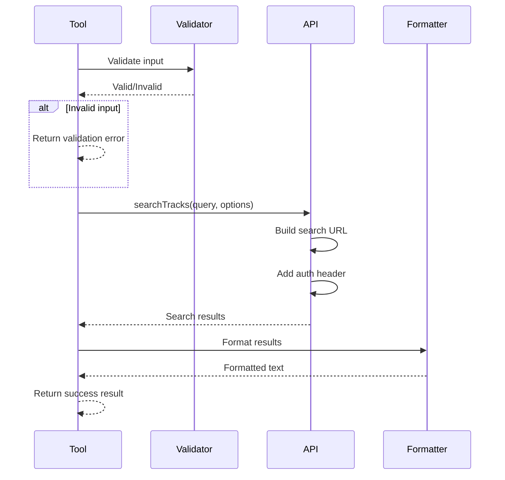

# Search Tool Specification

## Purpose & Responsibility

The Search tool enables searching Spotify's catalog for tracks, albums, artists, and playlists. It is responsible for:

- Processing natural language search queries
- Executing searches against Spotify's Web API
- Formatting search results for AI consumption
- Handling pagination for large result sets
- Providing relevant metadata for each result

This tool serves as the primary discovery mechanism for finding music content on Spotify.

## Interface Definition

### Tool Definition

```typescript
const searchTool: ToolDefinition = {
  name: 'search',
  description: 'Search for tracks, albums, artists, or playlists on Spotify',
  category: 'search',
  inputSchema: {
    type: 'object',
    properties: {
      query: {
        type: 'string',
        description: 'Search query (track name, artist, album, etc.)',
        minLength: 1,
        maxLength: 100
      },
      type: {
        type: 'string',
        enum: ['track', 'album', 'artist', 'playlist'],
        description: 'Type of content to search for',
        default: 'track'
      },
      limit: {
        type: 'number',
        description: 'Number of results to return',
        minimum: 1,
        maximum: 50,
        default: 10
      },
      offset: {
        type: 'number',
        description: 'Index of first result to return',
        minimum: 0,
        default: 0
      },
      market: {
        type: 'string',
        description: 'ISO 3166-1 alpha-2 country code',
        pattern: '^[A-Z]{2}$'
      }
    },
    required: ['query']
  }
}
```

### Handler Interface

```typescript
async function searchHandler(
  input: SearchInput,
  context: ToolContext
): Promise<Result<ToolResult, ToolError>>
```

### Type Definitions

```typescript
interface SearchInput {
  query: string
  type?: 'track' | 'album' | 'artist' | 'playlist'
  limit?: number
  offset?: number
  market?: string
}

interface SearchResult {
  tracks?: TrackSearchResult
  albums?: AlbumSearchResult
  artists?: ArtistSearchResult
  playlists?: PlaylistSearchResult
}

interface TrackSearchResult {
  items: TrackInfo[]
  total: number
  limit: number
  offset: number
  next: string | null
  previous: string | null
}

interface TrackInfo {
  id: string
  name: string
  artists: { id: string; name: string }[]
  album: {
    id: string
    name: string
    release_date: string
    images: { url: string; width: number; height: number }[]
  }
  duration_ms: number
  explicit: boolean
  popularity: number
  preview_url: string | null
  uri: string
  external_urls: {
    spotify: string
  }
}
```

## Dependencies

### External Dependencies
- Spotify Web API `/v1/search` endpoint

### Internal Dependencies
- `spotify-api-client` - API wrapper
- `token-manager` - Authentication

## Behavior Specification

### Search Execution Flow



### Query Processing

```typescript
function processQuery(input: SearchInput): SpotifySearchParams {
  // 1. Clean query
  let query = input.query.trim()
  
  // 2. Handle special operators
  // Support: artist:, album:, track:, year:, genre:
  const operators = {
    artist: /artist:"([^"]+)"|artist:(\S+)/gi,
    album: /album:"([^"]+)"|album:(\S+)/gi,
    track: /track:"([^"]+)"|track:(\S+)/gi,
    year: /year:(\d{4})-(\d{4})|year:(\d{4})/gi,
    genre: /genre:"([^"]+)"|genre:(\S+)/gi
  }
  
  // 3. Build Spotify query
  let spotifyQuery = query
  
  // 4. Add type-specific filters
  if (input.type === 'track' && !query.includes('track:')) {
    // Optimize for track search
    spotifyQuery = `track:${query}`
  }
  
  return {
    q: spotifyQuery,
    type: input.type || 'track',
    limit: input.limit || 10,
    offset: input.offset || 0,
    market: input.market
  }
}
```

### Result Formatting

```typescript
function formatSearchResults(
  results: SearchResult,
  type: string
): ToolResult {
  if (type === 'track') {
    return formatTrackResults(results.tracks)
  }
  // Similar for other types...
}

function formatTrackResults(tracks: TrackSearchResult): ToolResult {
  if (!tracks || tracks.items.length === 0) {
    return {
      content: [{
        type: 'text',
        text: 'No tracks found matching your search.'
      }]
    }
  }
  
  const header = `Found ${tracks.total} tracks${
    tracks.total > tracks.limit ? ` (showing ${tracks.items.length})` : ''
  }:\n\n`
  
  const trackList = tracks.items.map((track, i) => {
    const artists = track.artists.map(a => a.name).join(', ')
    const duration = formatDuration(track.duration_ms)
    const explicit = track.explicit ? ' 🅴' : ''
    
    return [
      `${i + 1}. "${track.name}" by ${artists}${explicit}`,
      `   Album: ${track.album.name} (${track.album.release_date?.substring(0, 4) || 'Unknown'})`,
      `   Duration: ${duration} | Popularity: ${track.popularity}/100`,
      `   URI: ${track.uri}`,
      track.preview_url ? `   Preview: ${track.preview_url}` : null
    ].filter(Boolean).join('\n')
  }).join('\n\n')
  
  const navigation = []
  if (tracks.previous) {
    navigation.push('← Previous page available')
  }
  if (tracks.next) {
    navigation.push('Next page available →')
  }
  
  const footer = navigation.length > 0 
    ? `\n\n${navigation.join(' | ')}` 
    : ''
  
  return {
    content: [{
      type: 'text',
      text: header + trackList + footer
    }]
  }
}

function formatDuration(ms: number): string {
  const minutes = Math.floor(ms / 60000)
  const seconds = Math.floor((ms % 60000) / 1000)
  return `${minutes}:${seconds.toString().padStart(2, '0')}`
}
```

### Search Strategies

1. **Exact Match**: Quotes for exact phrases
   ```
   "Bohemian Rhapsody" → Exact title match
   ```

2. **Field Search**: Specific field targeting
   ```
   artist:Queen track:Bohemian → Artist AND track
   ```

3. **Wildcard**: Partial matching
   ```
   Bohem* → Matches "Bohemian", "Bohemia", etc.
   ```

4. **Filters**: Additional constraints
   ```
   year:1975 genre:rock → Year and genre filters
   ```

## Error Handling

### Error Scenarios

1. **Empty Query**
   ```typescript
   if (!input.query?.trim()) {
     return err({
       type: 'ValidationError',
       message: 'Search query cannot be empty'
     })
   }
   ```

2. **Invalid Type**
   ```typescript
   const validTypes = ['track', 'album', 'artist', 'playlist']
   if (input.type && !validTypes.includes(input.type)) {
     return err({
       type: 'ValidationError',
       message: `Invalid type. Must be one of: ${validTypes.join(', ')}`
     })
   }
   ```

3. **API Errors**
   ```typescript
   if (apiResult.isErr()) {
     const error = apiResult.error
     if (error.statusCode === 401) {
       return err({
         type: 'AuthError',
         message: 'Authentication expired. Please re-authenticate.'
       })
     }
     // Handle other API errors...
   }
   ```

4. **No Results**
   - Not an error, return friendly message
   - Suggest query modifications

## Testing Requirements

### Unit Tests

```typescript
describe('Search Tool', () => {
  describe('Input Validation', () => {
    it('should reject empty query')
    it('should accept valid query')
    it('should validate type parameter')
    it('should validate limit bounds')
    it('should validate market code format')
  })
  
  describe('Query Processing', () => {
    it('should handle simple queries')
    it('should parse field operators')
    it('should handle quoted phrases')
    it('should escape special characters')
  })
  
  describe('Result Formatting', () => {
    it('should format track results')
    it('should handle empty results')
    it('should show pagination info')
    it('should format duration correctly')
    it('should indicate explicit content')
  })
  
  describe('Error Handling', () => {
    it('should handle auth errors')
    it('should handle network errors')
    it('should handle rate limits')
    it('should handle malformed responses')
  })
})
```

### Integration Tests

```typescript
describe('Search Integration', () => {
  it('should search for tracks successfully')
  it('should handle pagination')
  it('should respect market parameter')
  it('should handle special characters in queries')
})
```

## Performance Constraints

### Latency Requirements
- Query validation: < 1ms
- API call: < 500ms (depends on Spotify)
- Result formatting: < 10ms
- Total: < 600ms (p95)

### Resource Limits
- Max query length: 100 characters
- Max results: 50 per request
- Memory usage: < 5MB

### Optimization
- Query caching (5 minute TTL)
- Result pagination
- Field projection

## Security Considerations

### Input Sanitization
- Remove HTML/script tags
- Escape special characters
- Validate UTF-8 encoding
- Limit query complexity

### Output Security
- No raw HTML in responses
- Sanitize external URLs
- Hide sensitive metadata
- Limit response size

### Rate Limiting
- Per-user limits
- Global limits
- Backoff strategies