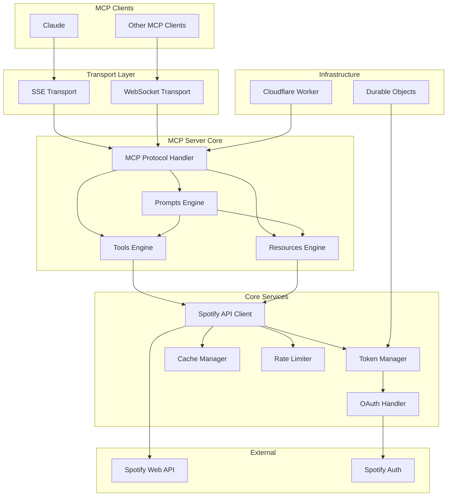
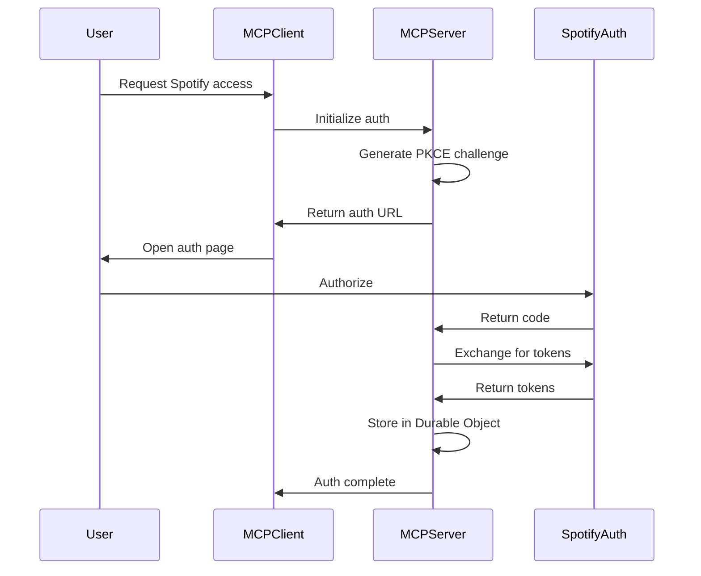
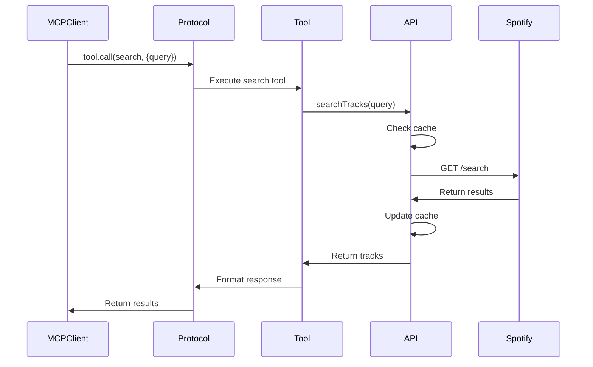

# Spotify MCP Server System Overview

## Introduction

The Spotify MCP Server is a Model Context Protocol (MCP) server that provides programmatic access to Spotify functionality. It enables AI assistants and other MCP clients to search music, control playback, manage playlists, and analyze musical preferences through a standardized protocol.

## System Architecture

## Key Components

### 1. MCP Implementation
The server implements the Model Context Protocol specification:
- **Tools**: Active capabilities for searching, controlling playback, and managing playlists
- **Resources**: URI-based access to Spotify data (tracks, playlists, albums, artists)
- **Prompts**: Pre-built interaction templates for common music workflows

### 2. Transport Layer
Multiple transport options for different client needs:
- **SSE (Server-Sent Events)**: Unidirectional streaming for web clients
- **WebSocket**: Bidirectional communication (planned)

### 3. Core Services
Foundation services that power the MCP implementation:
- **OAuth Handler**: Secure authentication using PKCE flow
- **Spotify API Client**: Type-safe wrapper with error handling
- **Token Manager**: Automatic token refresh and storage
- **Cache Manager**: Performance optimization
- **Rate Limiter**: API quota management

### 4. Infrastructure
Deployment on Cloudflare's edge platform:
- **Cloudflare Workers**: Serverless execution at the edge
- **Durable Objects**: Distributed state for token storage
- **Hono Framework**: Lightweight web framework

## Data Flow

### Authentication Flow

### Tool Execution Flow

## Design Decisions

### 1. Error Handling
- **neverthrow**: Type-safe error handling without exceptions
- **Result types**: All operations return Result<T, E>
- **Error categories**: Network, Auth, Validation, Spotify

### 2. Type Safety
- **TypeScript**: Strict mode with no any
- **Zod**: Runtime validation for external data
- **Interfaces**: Clear contracts between components

### 3. Performance
- **Edge deployment**: Low latency globally
- **Caching**: Reduce API calls
- **Batch operations**: Efficient data fetching

### 4. Security
- **PKCE OAuth**: No client secrets
- **Token isolation**: Per-user Durable Objects
- **Input validation**: Prevent injection attacks

## Integration Points

### MCP Protocol
The server implements the full MCP specification:
- Standard message format
- Tool discovery and execution
- Resource access patterns
- Prompt templates

### Spotify Web API
Integration with Spotify's REST API:
- Search endpoints
- Player control
- Playlist management
- User profile access

### Cloudflare Platform
Leveraging Cloudflare's infrastructure:
- Workers for compute
- Durable Objects for state
- KV for caching (future)

## Scalability Considerations

### Horizontal Scaling
- Stateless Workers scale automatically
- Durable Objects provide distributed state
- Cache layer reduces backend load

### Performance Optimization
- Edge deployment for global low latency
- Aggressive caching strategies
- Batch API operations

### Rate Limiting
- Per-user token buckets
- Graceful degradation
- Queue management for bursts

## Future Enhancements

### Protocol Extensions
- Custom resource types
- Advanced prompt templates
- Tool composition

### Features
- Offline support
- Multi-account management
- Advanced analytics

### Infrastructure
- WebSocket transport
- Regional caching
- Analytics pipeline