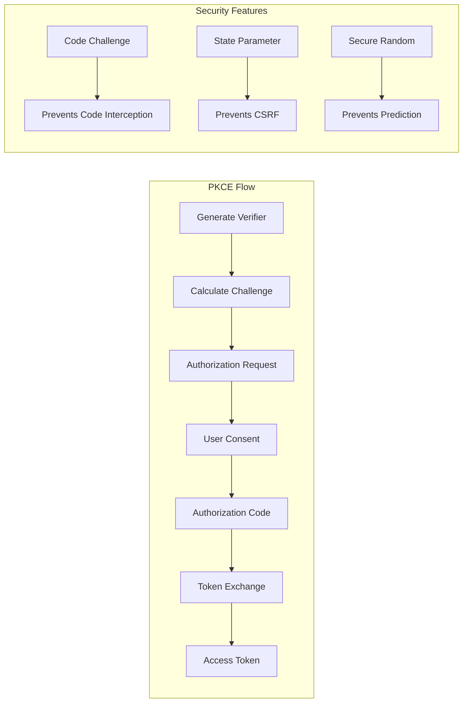
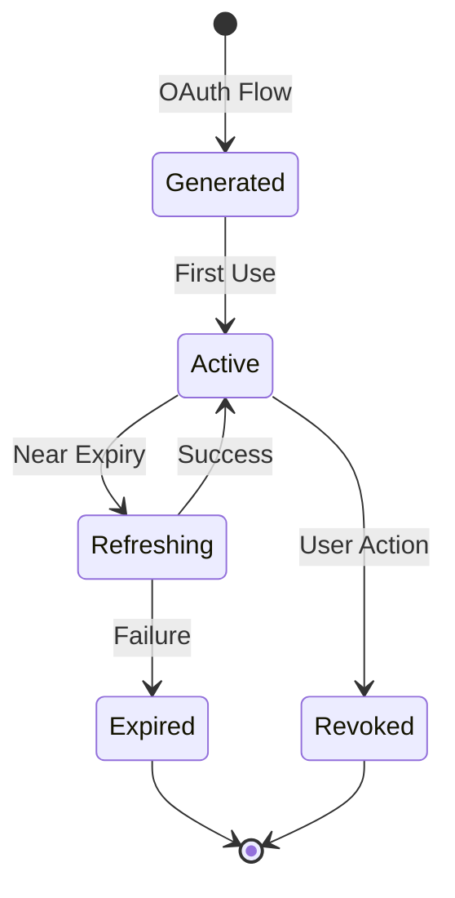
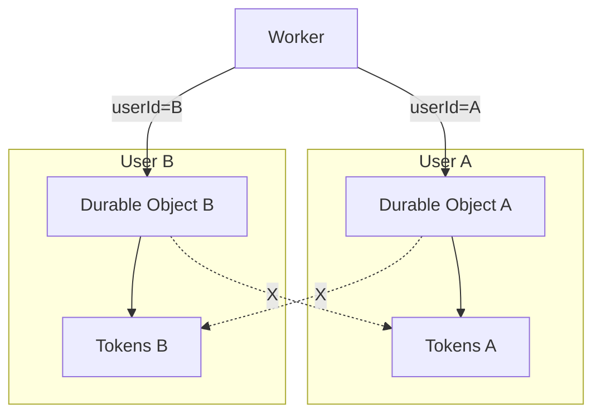
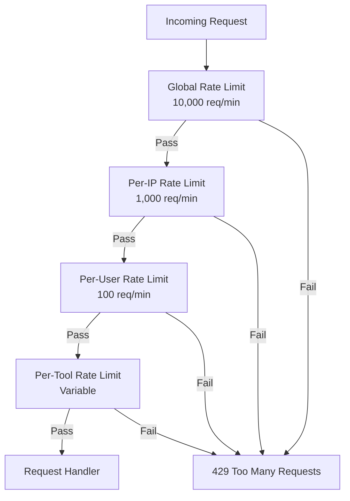
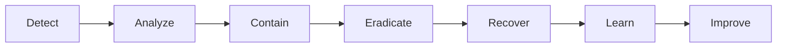

# Security Model

## Security Principles

The Spotify MCP Server follows these core security principles:

1. **Defense in Depth**: Multiple layers of security controls
2. **Least Privilege**: Minimal permissions for each component
3. **Zero Trust**: Verify every request, trust nothing implicitly
4. **Secure by Default**: Security enabled without configuration
5. **Fail Secure**: Errors default to denying access

## Threat Model

### Assets to Protect

1. **OAuth Tokens**
   - Access tokens (1-hour validity)
   - Refresh tokens (long-lived)
   - PKCE verifiers (temporary)

2. **User Data**
   - Spotify account access
   - Playback control
   - Library modifications

3. **System Integrity**
   - API availability
   - Data consistency
   - Service reputation

### Threat Actors

1. **External Attackers**
   - Unauthorized access attempts
   - Token theft
   - DoS attacks
   - Data exfiltration

2. **Malicious Users**
   - Account takeover
   - Privilege escalation
   - Resource abuse
   - API abuse

3. **Compromised Components**
   - Supply chain attacks
   - Dependency vulnerabilities
   - Infrastructure compromise

## Authentication Architecture

### OAuth 2.0 with PKCE



**Implementation Requirements:**

```typescript
// PKCE Generation
function generatePKCEChallenge(): PKCEChallenge {
  // MUST use cryptographically secure random
  const verifier = base64url(crypto.getRandomValues(new Uint8Array(96)))
  
  // MUST use SHA-256
  const challenge = base64url(sha256(verifier))
  
  return {
    codeVerifier: verifier,    // 128 characters
    codeChallenge: challenge,  // 43 characters
    challengeMethod: 'S256'    // MUST be S256
  }
}
```

### Token Security

#### Storage Security

```typescript
// Token Storage Requirements
interface SecureTokenStorage {
  // Encryption at rest
  algorithm: 'AES-256-GCM'
  
  // Key derivation
  keyDerivation: {
    algorithm: 'PBKDF2'
    iterations: 100000
    salt: string  // Per-user salt
  }
  
  // Access control
  isolation: 'per-user'  // Durable Object isolation
  
  // Automatic expiry
  ttl: 3600  // 1 hour for access tokens
}
```

#### Token Lifecycle



## Authorization Model

### Scope-Based Access Control

```typescript
// Required OAuth Scopes
const REQUIRED_SCOPES = [
  'user-read-playback-state',     // Read current playback
  'user-modify-playback-state',   // Control playback
  'user-read-currently-playing',  // Get current track
  'playlist-read-private',        // Read playlists
  'playlist-modify-public',       // Modify public playlists
  'playlist-modify-private'       // Modify private playlists
]

// Scope Validation
function validateScopes(token: Token, required: string[]): Result<void, AuthError> {
  const granted = token.scope.split(' ')
  const missing = required.filter(s => !granted.includes(s))
  
  if (missing.length > 0) {
    return err({
      type: 'AuthError',
      reason: 'insufficient_scope',
      message: `Missing scopes: ${missing.join(', ')}`
    })
  }
  
  return ok(undefined)
}
```

### User Isolation



## Network Security

### Transport Layer Security

```typescript
// TLS Requirements
const TLS_CONFIG = {
  minVersion: 'TLS 1.2',
  cipherSuites: [
    'TLS_ECDHE_RSA_WITH_AES_128_GCM_SHA256',
    'TLS_ECDHE_RSA_WITH_AES_256_GCM_SHA384',
    'TLS_ECDHE_RSA_WITH_CHACHA20_POLY1305_SHA256'
  ],
  certificatePinning: false,  // Cloudflare manages certs
  hsts: {
    maxAge: 31536000,
    includeSubDomains: true,
    preload: true
  }
}
```

### CORS Policy

```typescript
// CORS Configuration
const CORS_CONFIG = {
  // Development
  development: {
    origin: ['http://localhost:*', 'http://127.0.0.1:*'],
    credentials: true
  },
  
  // Production
  production: {
    origin: [
      'https://claude.ai',
      'https://*.claude.ai',
      // Add approved origins
    ],
    credentials: true,
    maxAge: 86400
  }
}
```

## Input Validation

### Request Validation

```typescript
// Input Validation Rules
const VALIDATION_RULES = {
  // Search query
  searchQuery: {
    type: 'string',
    minLength: 1,
    maxLength: 100,
    pattern: /^[^<>]*$/,  // No HTML tags
    sanitize: (s: string) => s.trim().replace(/[^\w\s-]/g, '')
  },
  
  // User ID
  userId: {
    type: 'string',
    pattern: /^[a-zA-Z0-9_-]{1,64}$/,
    required: true
  },
  
  // Spotify URI
  spotifyUri: {
    type: 'string',
    pattern: /^spotify:(track|album|playlist|artist):[a-zA-Z0-9]{22}$/,
    required: false
  }
}
```

### Output Sanitization

```typescript
// Output Sanitization
function sanitizeOutput(data: any): any {
  // Remove sensitive fields
  const sensitive = ['access_token', 'refresh_token', 'client_secret']
  
  if (typeof data === 'object' && data !== null) {
    const cleaned = { ...data }
    
    for (const key of sensitive) {
      delete cleaned[key]
    }
    
    // Recursively clean nested objects
    for (const [key, value] of Object.entries(cleaned)) {
      if (typeof value === 'object') {
        cleaned[key] = sanitizeOutput(value)
      }
    }
    
    return cleaned
  }
  
  return data
}
```

## Rate Limiting

### Multi-Layer Rate Limiting



### Implementation

```typescript
class RateLimiter {
  // Sliding window algorithm
  async checkLimit(
    key: string,
    limit: number,
    window: number
  ): Promise<RateLimitResult> {
    const now = Date.now()
    const windowStart = now - window
    
    // Get request history
    const requests = await this.storage.get<number[]>(key) || []
    
    // Filter to current window
    const current = requests.filter(t => t > windowStart)
    
    if (current.length >= limit) {
      const oldest = current[0]
      const resetAt = oldest + window
      
      return {
        allowed: false,
        limit,
        remaining: 0,
        resetAt,
        retryAfter: Math.ceil((resetAt - now) / 1000)
      }
    }
    
    // Add current request
    current.push(now)
    await this.storage.put(key, current)
    
    return {
      allowed: true,
      limit,
      remaining: limit - current.length,
      resetAt: now + window
    }
  }
}
```

## Cryptographic Controls

### Random Number Generation

```typescript
// Secure Random Generation
function secureRandom(bytes: number): Uint8Array {
  // MUST use crypto.getRandomValues
  // DO NOT use Math.random()
  
  const buffer = new Uint8Array(bytes)
  crypto.getRandomValues(buffer)
  return buffer
}

// Usage Examples
const stateParameter = base64url(secureRandom(32))   // 256 bits
const codeVerifier = base64url(secureRandom(96))     // 768 bits
const sessionId = base64url(secureRandom(16))        // 128 bits
```

### Cryptographic Standards

```typescript
// Approved Algorithms
const CRYPTO_STANDARDS = {
  hashing: {
    algorithm: 'SHA-256',
    usage: ['PKCE challenges', 'Token fingerprints']
  },
  
  encryption: {
    algorithm: 'AES-256-GCM',
    usage: ['Token storage', 'Sensitive data']
  },
  
  keyDerivation: {
    algorithm: 'PBKDF2',
    iterations: 100000,
    usage: ['Storage keys', 'API keys']
  },
  
  signatures: {
    algorithm: 'HMAC-SHA256',
    usage: ['Request signing', 'Webhooks']
  }
}
```

## Security Monitoring

### Audit Logging

```typescript
// Audit Event Types
enum AuditEventType {
  // Authentication
  AUTH_SUCCESS = 'auth.success',
  AUTH_FAILURE = 'auth.failure',
  TOKEN_REFRESH = 'token.refresh',
  TOKEN_REVOKE = 'token.revoke',
  
  // Authorization
  ACCESS_GRANTED = 'access.granted',
  ACCESS_DENIED = 'access.denied',
  SCOPE_VIOLATION = 'scope.violation',
  
  // Security
  RATE_LIMIT = 'security.rate_limit',
  INVALID_INPUT = 'security.invalid_input',
  SUSPICIOUS_ACTIVITY = 'security.suspicious'
}

// Audit Log Entry
interface AuditLogEntry {
  timestamp: number
  eventType: AuditEventType
  userId?: string
  clientId?: string
  ipAddress: string
  userAgent: string
  resource: string
  action: string
  result: 'success' | 'failure'
  details?: Record<string, any>
  riskScore?: number
}
```

### Security Metrics

```typescript
// Security Metrics Collection
interface SecurityMetrics {
  authentication: {
    successRate: number
    failureRate: number
    avgDuration: number
  }
  
  authorization: {
    deniedRequests: number
    scopeViolations: number
  }
  
  rateLimiting: {
    blockedRequests: number
    uniqueOffenders: number
  }
  
  threats: {
    suspiciousActivities: number
    blockedIPs: number
    anomalies: number
  }
}
```

## Incident Response

### Security Incident Handling



### Automated Responses

```typescript
// Automated Security Responses
class SecurityResponseHandler {
  async handleThreat(threat: SecurityThreat): Promise<void> {
    switch (threat.severity) {
      case 'CRITICAL':
        // Immediate action
        await this.blockSource(threat.source)
        await this.revokeTokens(threat.affectedUsers)
        await this.notifyAdmins(threat)
        break
        
      case 'HIGH':
        // Rapid response
        await this.increaseMonitoring(threat.source)
        await this.applyStricterLimits(threat.source)
        break
        
      case 'MEDIUM':
        // Enhanced monitoring
        await this.logThreat(threat)
        await this.updateRiskScore(threat.source)
        break
        
      case 'LOW':
        // Log and monitor
        await this.logThreat(threat)
        break
    }
  }
}
```

## Compliance

### Data Protection

1. **GDPR Compliance**
   - Right to erasure
   - Data portability
   - Privacy by design
   - Consent management

2. **Security Standards**
   - OWASP Top 10 mitigation
   - CWE/SANS Top 25 coverage
   - PCI DSS principles (where applicable)

### Security Testing

1. **Automated Testing**
   - Static analysis (SAST)
   - Dependency scanning
   - Container scanning
   - Infrastructure as Code scanning

2. **Manual Testing**
   - Penetration testing
   - Code review
   - Architecture review
   - Threat modeling updates