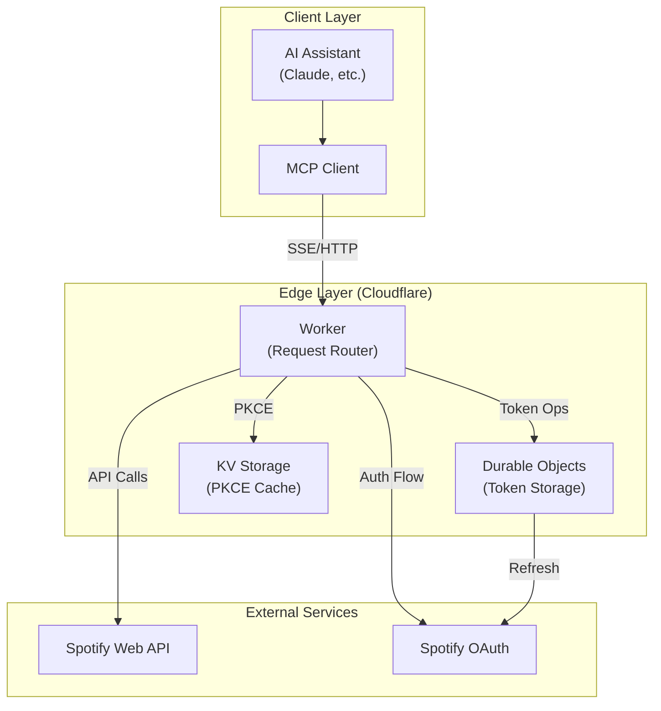
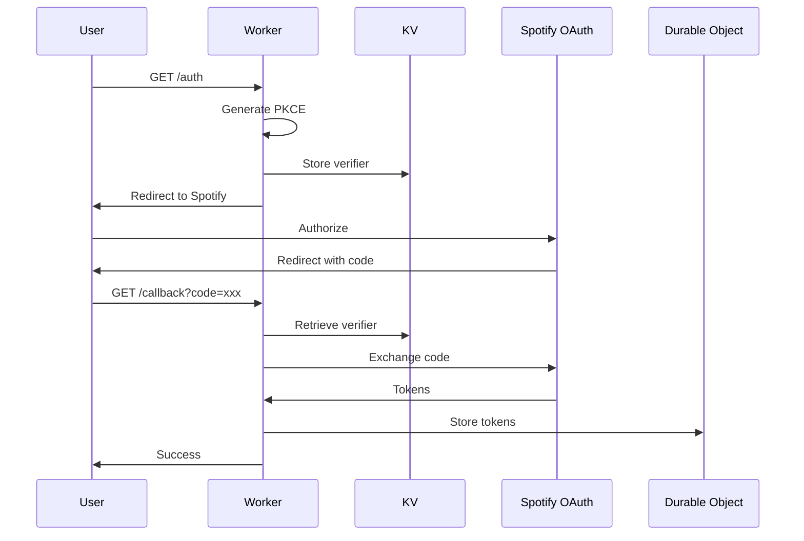
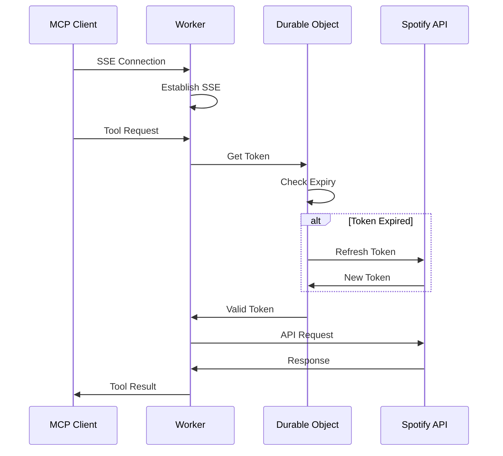

# System Overview

## Executive Summary

The Spotify MCP Server is a Model Context Protocol (MCP) server that enables AI assistants to control Spotify playback and search for music. Built on Cloudflare Workers with Durable Objects, it provides a globally distributed, serverless solution for Spotify integration.

### Key Features

- **Music Search**: Search Spotify's catalog with natural language
- **Playback Control**: Play, pause, skip, and control volume
- **Playback State**: Get current track and device information
- **Playlist Management**: Create and modify playlists (planned)
- **Recommendations**: Get personalized music recommendations (planned)
- **Global Distribution**: Runs on Cloudflare's edge network
- **Automatic Token Management**: Handles OAuth token refresh automatically

## Modular Architecture

The system follows a declarative, domain-driven design with clear separation of concerns:

### API Layer (Business Logic)
- **`external/spotify/`** - External Spotify Web API operations (使うAPI: search, player, playlists)
  - Public interface: `external/spotify/index.ts`
- **`auth/`** - Authentication domain logic (OAuth PKCE, token management)
  - Public interface: `auth/index.ts`
- **`mcp/`** - MCP protocol implementation (transport-agnostic)
  - Public interface: `mcp/index.ts`
  - Tools, resources, and prompts for Spotify control

### Infrastructure Layer  
- **`routes/`** - HTTP endpoint handlers
  - Public interface: `routes/index.ts`
  - `/auth`, `/callback` - OAuth PKCE flow
  - `/mcp` - JSON-RPC endpoint
  - `/health` - Health check
- **`middleware/`** - Request processing, authentication, error handling
  - Public interface: `middleware/index.ts`
- **`storage/`** - Durable Objects for token persistence
  - Public interface: `storage/index.ts`
- **`types/`** - Shared TypeScript definitions
  - Public interface: `types/index.ts`

### Platform Layer
- **`server.ts`** - Node.js/Hono HTTP server
- **`worker.ts`** - Cloudflare Workers entry point
- **`durableObjects.ts`** - Cloudflare persistent storage

## Architecture Overview

## System Components

### 1. Edge Runtime (Cloudflare Worker)

The Worker serves as the entry point for all requests, running globally on Cloudflare's edge network.

**Responsibilities:**
- Request routing and middleware
- OAuth flow coordination
- SSE connection management
- Security enforcement
- Rate limiting

**Key Features:**
- Zero cold starts
- Global distribution
- Automatic scaling
- Built-in DDoS protection

### 2. Token Management (Durable Objects)

Durable Objects provide strongly consistent, distributed storage for OAuth tokens.

**Responsibilities:**
- Secure token storage
- Automatic token refresh
- Per-user isolation
- Access control

**Key Features:**
- Strong consistency
- Automatic geographic placement
- Built-in coordination
- Persistent storage

### 3. MCP Protocol Server

Implements the Model Context Protocol to expose Spotify functionality as tools.

**Responsibilities:**
- Tool registration and discovery
- Request validation
- Response formatting
- Error handling

**Available Tools:**
- `search` - Search for tracks
- `player_state` - Get playback state
- `player_control` - Control playback

### 4. Spotify API Client

Type-safe wrapper around Spotify's Web API with comprehensive error handling.

**Responsibilities:**
- API request construction
- Response parsing
- Error transformation
- Rate limit handling

**Key Features:**
- No exceptions (Result types)
- Automatic retries
- Type safety
- Comprehensive logging

## Data Flow

### Authentication Flow

### MCP Request Flow

## Security Architecture

### Authentication & Authorization

1. **OAuth 2.0 with PKCE**
   - No client secret required
   - Secure for public clients
   - CSRF protection via state parameter

2. **Token Security**
   - Encrypted at rest
   - Automatic rotation
   - Scoped access
   - Per-user isolation

3. **Request Security**
   - HTTPS only
   - CORS configuration
   - Rate limiting
   - Input validation

### Data Protection

1. **No Sensitive Data Storage**
   - Only tokens stored
   - No user content cached
   - Minimal logging

2. **Isolation**
   - Per-user Durable Objects
   - No cross-user access
   - Resource limits enforced

## Performance Characteristics

### Latency

- **Edge Response**: < 50ms (p95)
- **Token Retrieval**: < 100ms (p95)
- **API Calls**: < 500ms (p95)
- **Global Reach**: 200+ locations

### Scalability

- **Horizontal**: Unlimited Workers
- **Vertical**: 128MB memory per request
- **Connections**: No hard limits
- **Storage**: 10GB per Durable Object

### Reliability

- **Availability**: 99.9% SLA
- **Durability**: Replicated storage
- **Recovery**: Automatic failover
- **Monitoring**: Built-in analytics

## System Constraints

### Technical Constraints

1. **Cloudflare Limits**
   - 50ms CPU time per request (paid plan)
   - 128MB memory per Worker
   - 6MB response size
   - 1000 subrequests per request

2. **Spotify API Limits**
   - Rate limiting (undocumented)
   - Token expiry (1 hour)
   - Scope requirements
   - Geographic restrictions

3. **MCP Protocol Limits**
   - Text-only responses
   - Synchronous tools only
   - No streaming responses

### Business Constraints

1. **Spotify Requirements**
   - Premium account for playback control
   - App approval for production
   - Compliance with ToS

2. **Cloudflare Requirements**
   - Paid plan for Durable Objects
   - Domain for custom URLs
   - Wrangler CLI for deployment

## Monitoring & Operations

### Metrics

1. **System Metrics**
   - Request rate
   - Error rate
   - Latency percentiles
   - Token refresh rate

2. **Business Metrics**
   - Active users
   - Tool usage
   - Search queries
   - Playback commands

### Logging

1. **Structured Logging**
   - JSON format
   - Correlation IDs
   - User context
   - Error details

2. **Log Aggregation**
   - Cloudflare Logpush
   - Real-time tail
   - Long-term storage

### Alerts

1. **System Alerts**
   - High error rate
   - Latency spike
   - Token refresh failures
   - Rate limit exceeded

2. **Business Alerts**
   - Unusual usage patterns
   - Authentication failures
   - API deprecations

## Future Architecture

### Planned Enhancements

1. **Additional Tools**
   - Playlist management
   - Recommendations
   - Audio analysis
   - User library

2. **Performance Improvements**
   - Response caching
   - Connection pooling
   - Batch operations
   - WebSocket support

3. **Security Enhancements**
   - mTLS for admin APIs
   - Hardware token support
   - Audit logging
   - Compliance reporting

### Scaling Strategy

1. **Geographic Expansion**
   - Multi-region tokens
   - Geo-routing
   - Data residency

2. **Load Management**
   - Adaptive rate limiting
   - Priority queues
   - Circuit breakers
   - Graceful degradation